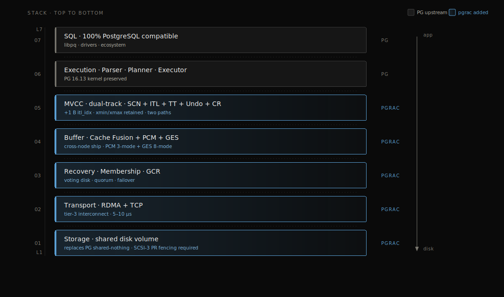

# pgrac

**I'm reimplementing Oracle RAC on PostgreSQL — in the open.**

PostgreSQL has never had a shared-disk, multi-active cluster (its HA is
shared-nothing replication). pgrac brings the Oracle RAC model — many nodes,
one shared database, Cache Fusion / SCN / GES — to PostgreSQL 16.13.

> ⚠️ **Early stage, built in public.**
>
> Per-feature status — working / scaffolded / planned — is tracked honestly at
> **[pgrac.dev/features](https://pgrac.dev/features/)**. The short version:
>
> **Running today:** the cluster substrate (TCP interconnect + 1 Hz LMON
> heartbeat, per-peer state in `pg_cluster_ic_peers`; SCN / ITL / dedicated-undo
> block format; multi-node `pgrac.conf` bootstrap), plus working code paths for
> Cache Fusion's 3-way block transfer, cross-node MVCC, the global SCN clock,
> cluster catalog invalidation, and a cluster-aware storage manager. Honest
> caveat: these run on real paths, but cross-node *behavioral* test coverage is
> still being built.
>
> **In progress / planned:** full cross-node GES enqueue locking and crash
> recovery (active); RDMA, Active Data Guard, rolling upgrade, FAN/TAF, and
> backup/DR (designed, not built).
>
> **Sanity anchor:** the `--disable-cluster` build is binary-identical to
> upstream PostgreSQL 16.13 and passes the full 219-test regression suite.
>
> ⭐ If "Postgres with RAC-style shared storage" is something you've wanted,
> star the repo to follow the build.

## See it run

Two PostgreSQL nodes, one cluster, a live TCP heartbeat interconnect — the
per-peer heartbeat counters climb in real time:


Reproduce it locally in about a minute — see
[Multi-node cluster](docs/user-guide/bootstrap.md#multi-node-cluster-tier1-tcp-interconnect)
in the bootstrap guide.

**Project site:** **[pgrac.dev](https://pgrac.dev)** — architecture deep-dives,
the full feature catalog, and a side-by-side comparison with Oracle RAC
(coming online).

## Architecture

pgrac targets the full Oracle RAC model. Part of it runs today; much is still
being built (see the status above) — these diagrams show the design.

**Cluster topology** — shared storage, interconnect, Cache Fusion, Active DG standby:



**The stack** — which layers are stock PostgreSQL vs. pgrac additions:



**Cache Fusion** — the 3-way GRD protocol *(scaffolded today)*:



**Cluster MVCC** — global-SCN visibility + per-node undo *(design)*:


More diagrams and deep-dives at **[pgrac.dev](https://pgrac.dev)**.

## Documentation

User-facing manual:

| Topic | File |
|---|---|
| Installation | [docs/user-guide/install.md](docs/user-guide/install.md) |
| Bootstrap a node | [docs/user-guide/bootstrap.md](docs/user-guide/bootstrap.md) |
| Configuration (`cluster.*` GUCs + `pgrac.conf`) | [docs/user-guide/configuration.md](docs/user-guide/configuration.md) |
| System views reference | [docs/reference/system-views.md](docs/reference/system-views.md) |
| Wait events reference | [docs/reference/wait-events.md](docs/reference/wait-events.md) |
| Architecture overview | [docs/architecture/overview.md](docs/architecture/overview.md) |

PostgreSQL upstream documentation lives under `doc/` and is shipped unchanged
from the upstream tree.

## Quick start

```bash
git clone https://github.com/sqlrush/pgrac.git
cd pgrac

./configure --prefix=$HOME/pgrac-install \
            --enable-cluster --enable-tap-tests \
            --with-openssl --with-icu --with-lz4 --with-zstd
make -j$(getconf _NPROCESSORS_ONLN 2>/dev/null || sysctl -n hw.ncpu)
make install

export PATH=$HOME/pgrac-install/bin:$PATH

pgrac-init -D /tmp/pgrac-demo --node-id=0 --cluster-name=demo
echo "port = 65433"                                  >> /tmp/pgrac-demo/postgresql.conf
echo "unix_socket_directories = '/tmp'"              >> /tmp/pgrac-demo/postgresql.conf
echo "listen_addresses = ''"                         >> /tmp/pgrac-demo/postgresql.conf

pgrac-start -D /tmp/pgrac-demo -l /tmp/pgrac-demo.log -w
psql -h /tmp -p 65433 -d postgres -c 'SELECT * FROM pg_cluster_nodes;'
```

See [docs/user-guide/bootstrap.md](docs/user-guide/bootstrap.md) for details.

## Building from source

The build follows the standard PostgreSQL `configure` + `make` + `make install`
flow. Two extra flags are pgrac-specific:

- `--enable-cluster` activates the cluster subsystem.
- `--enable-tap-tests` enables the TAP test suites (Perl).

See [docs/user-guide/install.md](docs/user-guide/install.md) for the complete
dependency list and step-by-step instructions on macOS and Linux.

## Contributing

pgrac is built in public and early — testing, feedback, and patches all help.
See [CONTRIBUTING.md](CONTRIBUTING.md) and the `good first issue` label.

## License

PostgreSQL License (BSD-style). See `LICENSE` and `COPYRIGHT`.

## Reporting issues

File issues at <https://github.com/sqlrush/pgrac/issues>.

## Upstream

Forked from PostgreSQL 16.13 (<https://www.postgresql.org>).
