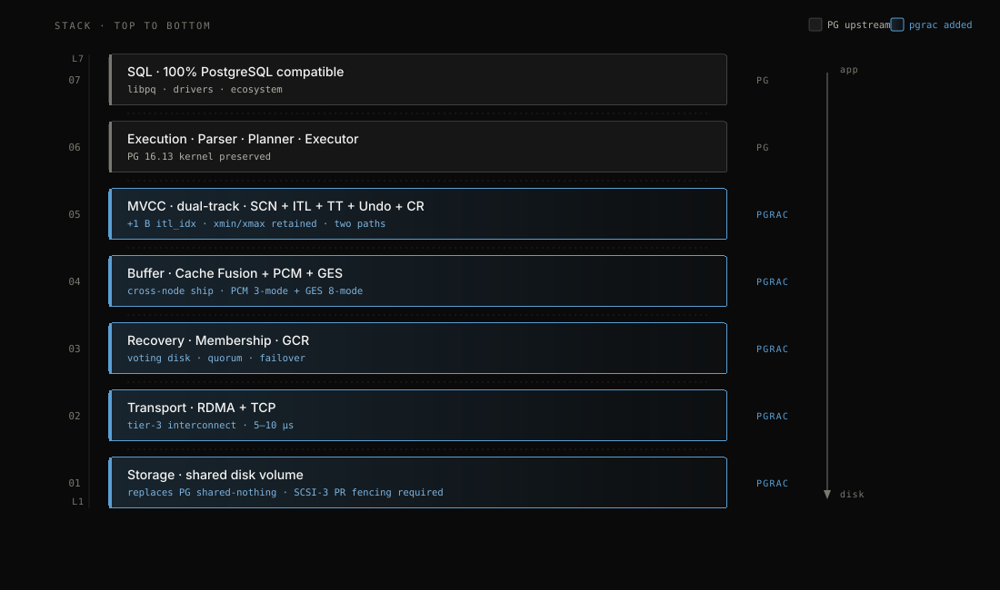
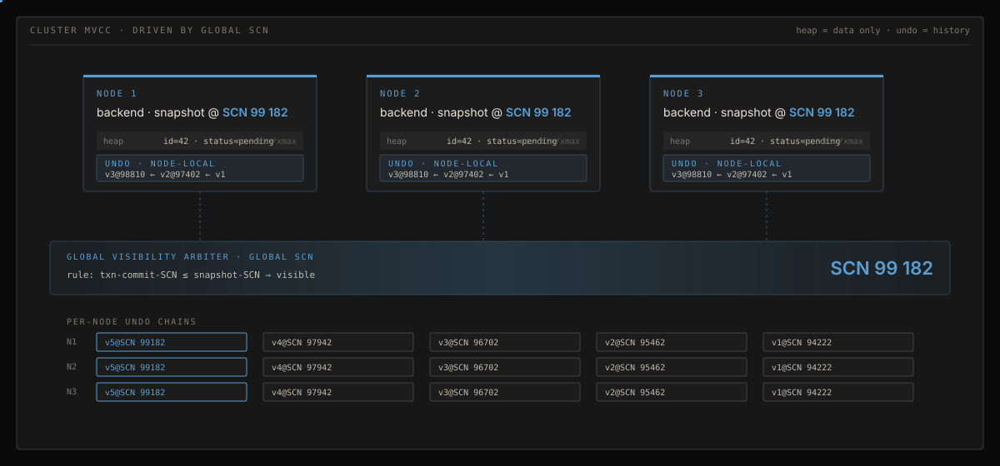

# pgrac

**I'm reimplementing Oracle RAC on PostgreSQL — in the open.**

PostgreSQL has never had a shared-disk, multi-active cluster (its HA is
shared-nothing replication). pgrac brings the Oracle RAC model — many nodes,
one shared database, Cache Fusion / SCN / GES — to PostgreSQL 16.13.

> **Current MVP source: [v0.131.0](docs/release-notes/v0.131.0.md).**
>
> This version improves undo-header resource locality, fixes qualification races,
> and adds optional UPDATE tracing. Stable publication requires four valid
> four-node correctness samples and complete CI on the exact release commit.
> The [GitHub Release](https://github.com/sqlrush/pgrac/releases/tag/v0.131.0)
> carries the final qualification results; a source label alone is not acceptance.
>
> **Stable within the tested MVP scope, not production certified.** This does not
> certify crash recovery, failover, rolling upgrades, all SQL features or
> performance targets. See the release notes for the exact scope and limitations.
>
> Releases use immutable annotated tags. Read the
> [version policy](docs/release-notes/README.md) to identify a build or select a
> frozen source baseline. Detailed feature status remains at
> [pgrac.dev/features](https://pgrac.dev/features/).

## See it run

Two PostgreSQL nodes, one cluster, a live TCP heartbeat interconnect — the
per-peer heartbeat counters climb in real time:


Reproduce it locally in about a minute — see
[Multi-node cluster](docs/user-guide/bootstrap.md#multi-node-cluster-tier1-tcp-interconnect)
in the bootstrap guide.

**Project site:** **[pgrac.dev](https://pgrac.dev)** — architecture deep-dives,
the full feature catalog, and a side-by-side comparison with Oracle RAC
(coming online).

## Architecture

pgrac targets the full Oracle RAC model. Part of it runs today; much is still
being built (see the status above) — these diagrams show the design.

**Cluster topology** — shared storage, interconnect, Cache Fusion, Active DG standby:



**The stack** — which layers are stock PostgreSQL vs. pgrac additions:



**Cache Fusion** — conceptual GRD/block-transfer flow; see the
[MVP capability guide](docs/mvp/v0.130.0-mvp.1/04-core-capabilities.md) for the current validated scope:



**Cluster MVCC** — conceptual global-SCN visibility and per-node undo:



More diagrams and deep-dives at **[pgrac.dev](https://pgrac.dev)**.

## Documentation

Start with the [MVP guide](docs/mvp/v0.131.0/README.md) and
[single-host Linux Quick Start](docs/mvp/v0.131.0/quickstart-linux-single-host.md).
The guide links the parameter, system-view and capability references, and
distinguishes tested single-host operation from unqualified multi-host/failover
deployment. The historical prerelease manual remains available unchanged.

User-facing manual:

| Topic | File |
|---|---|
| Installation | [docs/user-guide/install.md](docs/user-guide/install.md) |
| Four-VM GFS2 lab candidate (separate qualification) | [Operator-assisted installation](docs/deployment/pre1-quickstart.md), [scope and release requirements](docs/release-notes/pre1-arm64-lab.md) |
| Bootstrap a node | [docs/user-guide/bootstrap.md](docs/user-guide/bootstrap.md) |
| Configuration (`cluster.*` GUCs + `pgrac.conf`) | [docs/user-guide/configuration.md](docs/user-guide/configuration.md) |
| System views reference | [docs/reference/system-views.md](docs/reference/system-views.md) |
| Wait events reference | [docs/reference/wait-events.md](docs/reference/wait-events.md) |
| Cross-node transaction safety | [docs/reference/cluster-transaction-safety.md](docs/reference/cluster-transaction-safety.md) |
| Architecture overview | [docs/architecture/overview.md](docs/architecture/overview.md) |

PostgreSQL upstream documentation lives under `doc/` and is shipped unchanged
from the upstream tree.

## Quick start

For the stable MVP, follow the
[single-host Linux guide](docs/mvp/v0.131.0/quickstart-linux-single-host.md).
This is a source release, not a turnkey production installer.

```bash
git clone --branch v0.131.0 --single-branch \
  https://github.com/sqlrush/pgrac.git pgrac-mvp1
cd pgrac-mvp1
git rev-parse HEAD
cat PGRAC_VERSION
```

Follow the guide for compilation, initialization and the explicit
four-host deployment-validation boundary. Do not independently initialize four
databases or share one PGDATA among four postmasters.

## Building from source

The build follows the standard PostgreSQL `configure` + `make` + `make install`
flow. Two extra flags are pgrac-specific:

- `--enable-cluster` activates the cluster subsystem.
- `--enable-tap-tests` enables the TAP test suites (Perl).

See [docs/user-guide/install.md](docs/user-guide/install.md) for the complete
dependency list and step-by-step instructions on macOS and Linux.

## Contributing

pgrac is built in public and early — testing, feedback, and patches all help.
See [CONTRIBUTING.md](CONTRIBUTING.md) and the `good first issue` label.

## License

pgrac's cluster code is original work by WangYingJie <sqlrush@gmail.com>,
licensed under the **PostgreSQL License** (BSD-style) — the same terms as
PostgreSQL itself. See [`LICENSE`](LICENSE) and [`COPYRIGHT`](COPYRIGHT).

## Reporting issues

File issues at <https://github.com/sqlrush/pgrac/issues>.

## Upstream

Forked from PostgreSQL 16.13 (<https://www.postgresql.org>).
