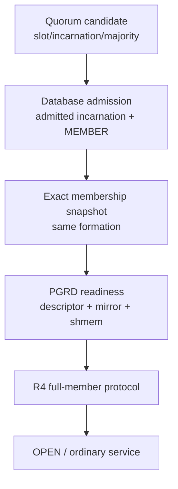
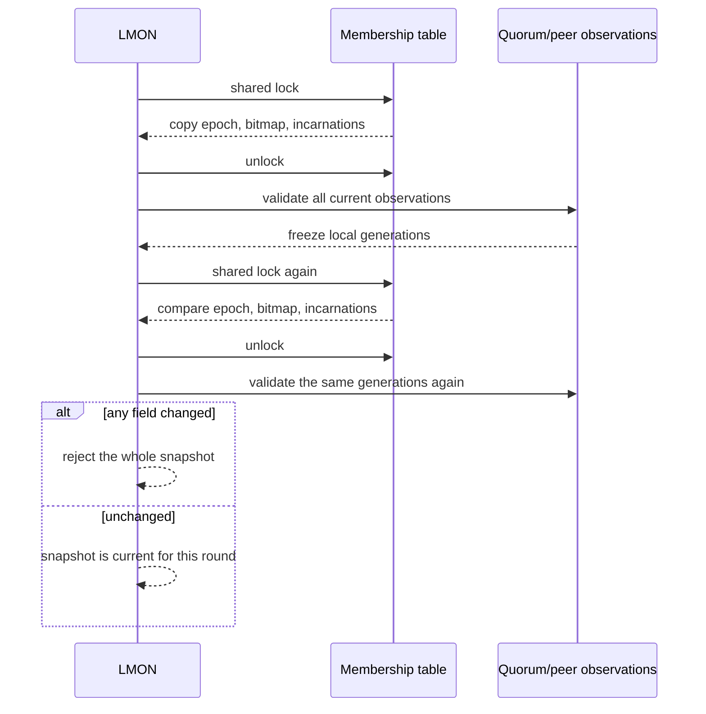
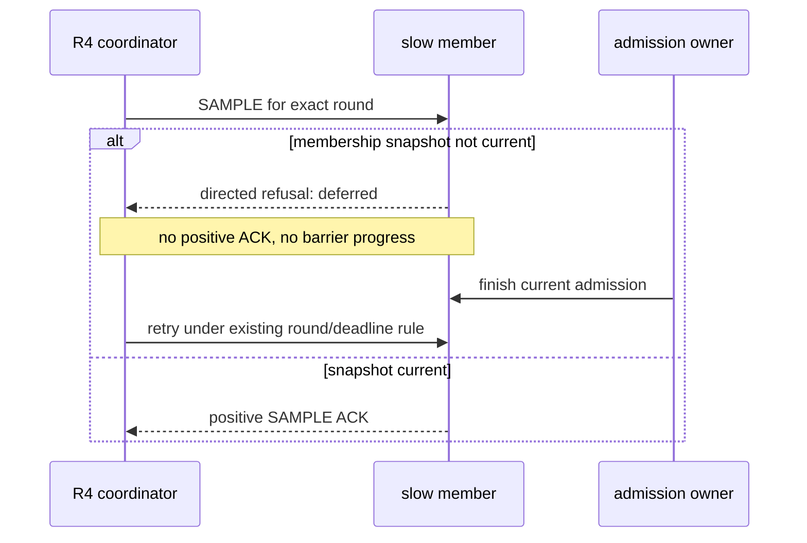
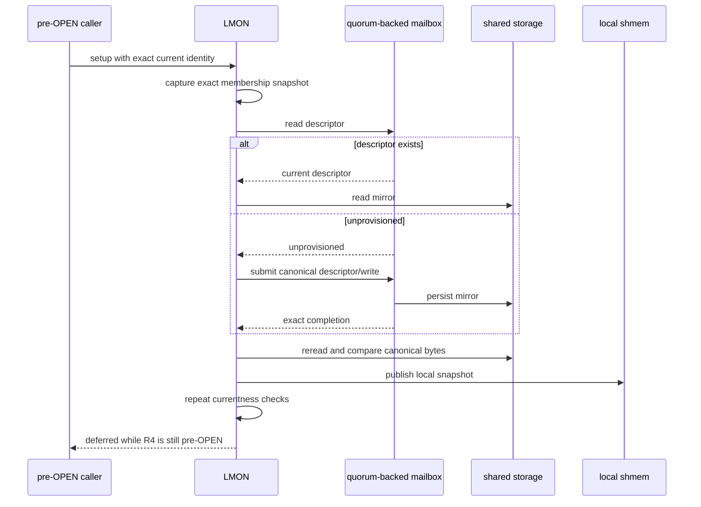
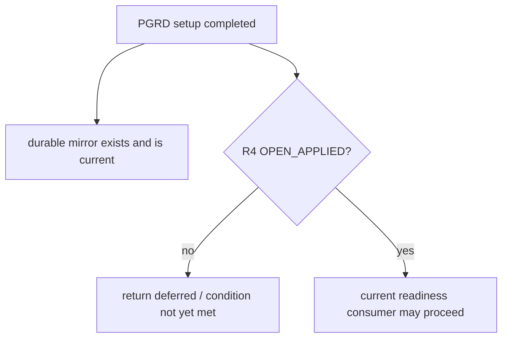
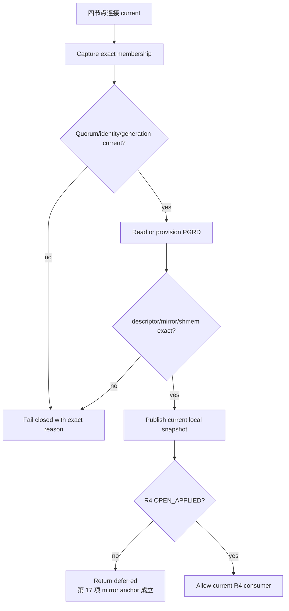
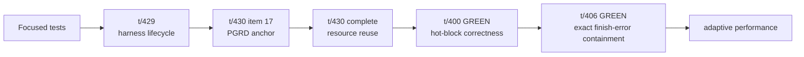
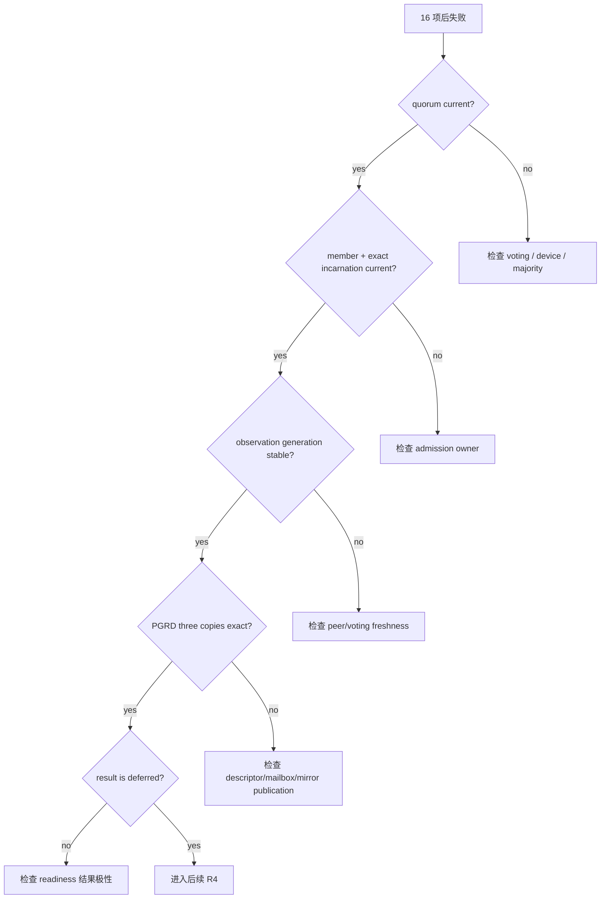

# Exact Membership 与 PGRD Readiness：第 17 项如何闭环

本文解释四节点测试在完成 12 条 peer 连接之后，如何建立可供 R4 使用的精确成员视图、共享
PGRD mirror 和 pre-OPEN readiness。它是[成员关系先于数据库服务](05-membership-before-service-readiness.md)
的实现篇。

本文面向代码维护者、测试执行者和运维人员，重点回答：

- 为什么“四个节点都能连接”仍不足以开放全局资源服务；
- 成员身份如何在锁内快照与锁外 freshness 检查之间保持一致；
- PGRD descriptor、共享 mirror 和本地内存副本为何必须逐字节一致；
- 为什么 PGRD 创建成功后，pre-OPEN 请求仍应返回“条件尚未满足”；
- 第 17 项通过究竟证明了什么，尚未证明什么。

> 名词提醒：本文的 PGRD 是 PGRAC 使用的共享 undo-root descriptor/mirror 控制面，不是
> Oracle 文档中 Global Resource Directory（GRD）的同一个内部结构。

## 1. 失败形状

四节点测试启动后的第一段检查是：


过去的典型失败发生在 `C → D`：四个 postmaster 存活、peer mesh 完整，但 pre-OPEN setup
持续返回 `QUORUM_HOLD`，PGRD mirror 没有生成。

这类失败不能通过调整下面这些参数修复：

- shared buffers；
- PCM/GRD capacity；
- workload 页面数量；
- client 数；
- Resource-X timeout；
- TAP 判官。

原因很直接：这些功能尚未开始运行。失败点属于 membership、持久控制面和 R4 readiness 的交界。

## 2. Oracle RAC 的公开行为边界

Oracle 公开资料确认：

- Cluster Synchronization Services 管理 cluster membership，并处理节点加入和离开；
- voting files 参与并保存 node membership 信息；
- LMON 监控全局资源，在成员变化时参与 GCS/GES recovery 和 reconfiguration；
- GCS、GES 与 GRD 管理跨实例缓存块、锁和全局资源状态。

因此，PGRAC 对外遵循相同的安全顺序：

```text
共享 voting / membership current
        ↓
数据库成员身份 current
        ↓
全局资源控制面 current
        ↓
普通数据库服务开放
```

Oracle 并未公开 PGRAC 采用的 snapshot 数据结构、generation 双采样、PGRD mirror 格式或 R4
消息编码。这些属于 PGRAC 的实现适配，不能描述成 Oracle RAC 的内部算法。

参考 Oracle 官方资料：

1. [Oracle Clusterware Administration and Deployment Guide](https://docs.oracle.com/en/database/oracle/oracle-database/23/cwadd/clusterware-administration-and-deployment-guide.pdf)
2. [Managing Oracle Cluster Registry and Voting Files](https://docs.oracle.com/en/database/oracle/oracle-database/21/cwadd/managing-oracle-cluster-registry-and-voting-files.html)
3. [Introduction to Oracle RAC](https://docs.oracle.com/en/database/oracle/oracle-database/21/racad/introduction-to-oracle-rac.html)
4. [Cache Fusion and the Global Cache Service](https://docs.oracle.com/cd/A97630_01/rac.920/a96597/pslkgdtl.htm)
5. [Recovery and Remastering](https://docs.oracle.com/cd/B10500_01/rac.920/a96597/pshavdtl.htm)

## 3. 四层证据不能互相替代



| 层次 | 能证明什么 | 不能证明什么 |
|---|---|---|
| quorum candidate | 当前 voting majority 和节点身份可读 | 节点已获得数据库成员资格 |
| database admission | 指定 incarnation 已被当前形成过程接纳 | PGRD 已持久化、R4 已完成 |
| exact snapshot | 本机同时看见同一 formation 的成员集合和 incarnation | 不能写入或创建 authority |
| PGRD readiness | descriptor、共享 mirror、本机副本完全一致 | R4 已 OPEN |
| R4 full-member | 当前成员对同一轮资源状态形成一致结果 | 不负责补写 membership |

必须禁止几种常见的错误推导：

```text
SQL 可执行        ≠ in quorum
peer connected    ≠ admitted member
member bitmap     ≠ exact incarnation set
mirror 文件存在   ≠ mirror 内容 current
PGRD ready        ≠ R4 OPEN
```

## 4. Exact membership snapshot

### 4.1 快照包含什么

R4 的 membership snapshot 是一次性的栈上对象，包含：

- current formation epoch；
- admitted member bitmap；
- bitmap 中每个节点的 admitted incarnation；
- 本机观察到每个节点时使用的 freshness generation；
- 本节点当前 boot incarnation。

其中 formation、bitmap 和 admitted incarnation 可以在不同节点之间比较；observation generation
只表示本机读到的连接/voting 观察是否在采样期间变化，不能作为跨节点 authority，也不会写入
wire 或持久文件。

### 4.2 每个成员必须同时满足的条件

```text
节点已配置
AND membership state = MEMBER
AND admitted incarnation 非零
AND observed incarnation = admitted incarnation
AND observed epoch = current formation epoch
AND observed generation 非零且前后不变
AND peer observation 仍 fresh/alive
```

本节点还必须满足：

```text
self bit 位于 admitted bitmap
AND self admitted incarnation = current boot incarnation
AND quorum state = READY
AND in_quorum = true
```

任一节点身份、epoch 或 generation 漂移，整份 snapshot 作废。实现不会只保留“未变化的几行”，
因为那会把两个时刻的成员视图拼接成一个从未真实存在过的视图。

### 4.3 为什么要两次锁内复制

membership table 由 Reconfig lock 保护，而 voting/transport freshness 来自锁外组件。实现采用：



这样做避免在 Reconfig lock 内等待 voting I/O 或网络事件，也避免将 membership writer 与 I/O
progress owner 组成新的死锁环。

## 5. 慢节点与 early SAMPLE

四节点并发启动时，coordinator 可能先完成 snapshot，而某个慢节点仍在完成本次 boot 的 admission。
慢节点收到 R4 SAMPLE 后不能给出正向 ACK，也不能悄悄推进状态。



安全拒绝具备以下属性：

- 复用现有消息 envelope，不增加新消息族；
- 原样绑定 request、round、formation 和 coordinator；
- positive fields 保持零；
- 不创建 member、authority 或 serving state；
- formation、incarnation 或 session 漂移时废弃整轮。

## 6. PGRD 的三份一致性

### 6.1 三个副本


只检查 mirror 路径存在是不够的。有效读取必须：

1. 复制本机 shmem snapshot；
2. 解码 current shared descriptor；
3. 从 descriptor 指定位置读取 durable mirror；
4. 比较 canonical bytes 完全相同；
5. 再复制一次 shmem snapshot；
6. 确认两次 snapshot 没有变化；
7. 重新确认 membership、formation 和 quorum 仍 current。

### 6.2 第一次创建 mirror



descriptor 已存在时不会盲目覆盖；未 provision 时也不能只在本地创建一个副本。写入、completion、
共享重读和本地发布必须绑定同一 formation、coordinator、request sequence 和 record generation。

## 7. 为什么成功后仍返回 deferred

第 17 项的关键不是把 pre-OPEN 变成成功，而是同时建立两条事实：



因此结果极性必须区分：

| 结果 | 含义 | 是否允许正向状态推进 |
|---|---|---:|
| deferred / condition not yet met | PGRD 已准备，但 R4 尚未 OPEN | 否 |
| quorum hold | 无法建立当前 quorum/admission basis | 否 |
| internal corruption | membership floor 或 canonical bytes 自相矛盾 | 否，停止该轮 |
| current/open | 全部前置协议已经完成 | 是 |

测试接受的是“mirror 已存在，同时普通服务仍关闭”。把 `QUORUM_HOLD` 改名为 deferred，或者把
PGRD ready 直接当成 OPEN，都会破坏这条边界。

## 8. 完整启动控制流



## 9. 代码导航

主要实现分布在：

| 功能 | 代码区域 |
|---|---|
| exact snapshot 类型和接口 | `src/include/cluster/cluster_reconfig.h` |
| membership 双采样和 currentness | `src/backend/cluster/cluster_reconfig.c` |
| R4 readiness、PGRD mirror、utility owner | `src/backend/cluster/cluster_semantic_activation.c` |
| late-start identity handoff | `src/backend/cluster/cluster_startup_phase.c` |
| 四节点热块验证 | `src/test/cluster_tap/t/400_pcm_x_queue_4node_liveness.pl` |
| 四节点资源回收验证 | `src/test/cluster_tap/t/430_pcm_grd_resource_reuse_4node.pl` |

维护代码时应保持：

- snapshot 仍为 stack-only；
- Reconfig lock 内无 voting/network I/O；
- receiver-local generation 不进入 cluster-global authority；
- PGRD 三份内容必须全字节一致；
- early SAMPLE refusal 零 positive progress；
- pre-OPEN setup 不提前开放普通服务。

## 10. 测试覆盖

### 10.1 Focused tests

至少应覆盖：

- `MEMBER` 但 admitted incarnation 为零；
- observed incarnation 与 admitted incarnation 不同；
- formation epoch 漂移；
- observation generation 在两次采样间变化；
- self boot incarnation 与 self admission 不同；
- membership table 在两次锁内复制间变化；
- descriptor 与 mirror 不一致；
- mirror 与 shmem snapshot 不一致；
- stale mailbox completion；
- early SAMPLE 的 directed deferred refusal；
- PGRD ready 但 R4 尚未 OPEN 的结果极性。

### 10.2 四节点验收



第 17 项通过只证明 `A`。完整 `t/400` GREEN 才证明该控制门之后的四节点热块协议也能走完；
完整 `t/430` 还要额外证明 buffer replacement、terminal retirement 和目录复用。性能门又是下一层，
不能从正确性测试的短工作负载推导。

## 11. 失败定位手册

当四节点测试在 16 项后停止时，按以下顺序检查：

1. 每节点 quorum state 是否 READY、`in_quorum=true`；
2. current formation epoch 是否一致；
3. 四节点 membership state 是否都是 `MEMBER`；
4. 每个 admitted incarnation 是否非零并匹配当前 observed incarnation；
5. self admitted incarnation 是否匹配本次 boot；
6. peer observation generation 是否在采样期间变化；
7. pre-OPEN utility request 是否绑定 current coordinator/session/record generation；
8. PGRD descriptor 是否 provisioned；
9. durable mirror 与本地 shmem snapshot 是否全字节一致；
10. 最终结果是 deferred、quorum hold 还是 corruption。



不要首先重跑、延长 timeout 或调整 workload。保存首个失败 gate 和四节点身份字段，比后续级联
错误更有诊断价值。

## 12. 安全与范围边界

本机制没有引入：

- 新 wire message family；
- 新 durable authority；
- 新全局 registry；
- 新后台 worker 或 timer；
- 独立 Clusterware 进程；
- 真实 BMC/IPMI 部署认证；
- 以测试特殊值伪造 membership 或 PGRD。

它只把当前四节点路径中已有的 membership、quorum、PGRD 和 R4 owner 连接为一个可重验证的
顺序。发生身份、formation、generation 或 canonical bytes 漂移时，仍然失败关闭。

## 13. 结论

第 17 项的突破不是“让测试接受一个新错误码”，而是让下面这条链第一次具备完整、精确且可重复
验证的实现：

```text
current voting identity
→ durable database admission
→ coherent exact membership snapshot
→ exact PGRD descriptor/mirror/shmem
→ R4 readiness
```

它解决了“进程和连接都已存在，但资源控制面没有合法成员基础”的启动断层。与此同时，pre-OPEN
仍保持关闭；只有既有 R4 full-member 流程真正完成后，普通服务才可以开放。
