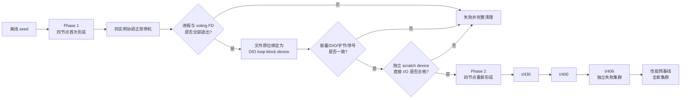

# 四节点两阶段验收基板

本系列说明 PGRAC 如何在一轮自动化测试中完成以下转换：

```text
普通文件上的首次集群形成
        ↓
四实例协调正常停机
        ↓
同一批 voting 数据原位映射为直接 I/O 块设备
        ↓
四实例重新形成集群
        ↓
资源生命周期、四节点事务与性能基线验证
```

这套基板解决的不是“把文件名换成设备名”，而是证明存储介质切换前后的成员关系、持久数据和实例生命周期没有被测试脚本伪造。它服务于 Stage 8 的四节点 happy path；生产裸盘部署、外部 Clusterware 和硬件 fencing 的完整认证属于后续部署范围。

## 阅读顺序

1. [生命周期与共享存储](01-lifecycle-and-storage.md)
   介绍 seed、首次形成、协调停机、块设备切换和第二次形成。
2. [启动、停机、消息乱序与故障收束](02-ordering-and-failure-handling.md)
   解释为什么节点必须按特定并发关系启动/停止，以及异常时如何不留进程或设备残骸。
3. [验证层次、可观测性与 Oracle RAC 边界](03-validation-observability-and-oracle-comparison.md)
   说明 focused test、`t/430`、正向 `t/400`、负向 `t/406` 和性能预基线分别验证什么。
4. [块设备预检与卡住 I/O 的安全收束](04-block-device-preflight-and-stuck-io-recovery.md)
   说明静态设备认证为何不等于可用 I/O、如何在不改 voting 数据的前提下预检，以及进程陷入不可中断 I/O 时如何留证和延迟回收。
5. [成员关系先于数据库服务](05-membership-before-service-readiness.md)
   解释 `t/430` 前 16 项与第 17 项的边界、合法准入顺序，以及如何区分 quorum/membership 启动失败和后续资源回收失败。
6. [Exact Membership 与 PGRD Readiness](06-exact-membership-and-pgrd-readiness.md)
   展开第 17 项的实现：成员快照双重验证、慢节点安全拒绝、PGRD 三份一致性、pre-OPEN 结果极性和四节点验收证据。

## 一张图看懂



## 设计底线

- 固定延时只控制启动发起顺序，不证明节点已经 ready；
- 四个原生启动/停机结果必须全部成功；
- 正常停机必须有真实 shutdown checkpoint 和当前启动周期的终止证据；
- 只有全部进程和 voting 文件描述符退出后，才能切换介质；
- 第二阶段只接受块设备路径，不能悄悄回退普通文件；
- 块设备的类型、容量和内容认证通过后，还必须用独立 scratch device 完成有界直接 I/O 预检；预检绝不写 voting 数据；
- 任一身份、容量、DIO 或字节内容漂移都失败关闭；
- 测试失败时先停止进程，再解绑设备，最后删除临时文件；
- 进程陷入不可中断 I/O 时保留设备和清理清单，等精确进程与 FD 消失后再由显式 reaper 回收；
- `t/400` 的正确性判官不能为适配基板而放宽。
- `t/406` 的精确目标、pending-pair、同 attempt 无 ACK 和 fail-closed 判官不能放宽，且其失败集群不得复用于 PRE。
