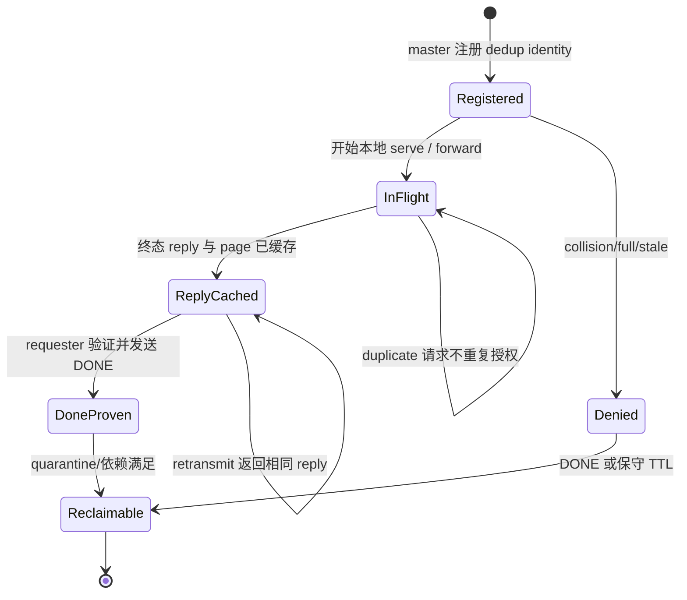
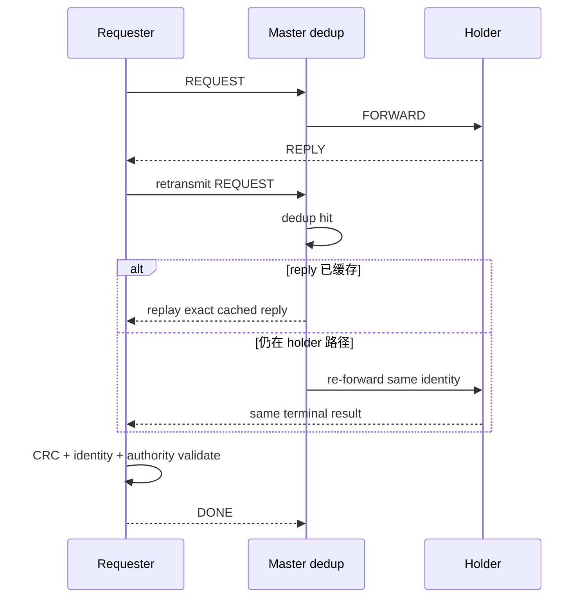
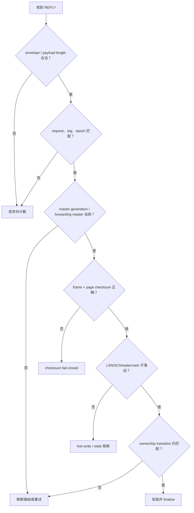

# 03：块传输、去重、重传与一致性保护

[上一篇：Current 与 CR](02-current-and-cr-blocks.md) · [返回索引](README.md) · [下一篇：恢复与运维](04-recovery-remaster-and-operations.md)

## 结论先行

可靠的 GCS 不是假定网络永不丢包，而是让重复、延迟、乱序、进程重启和部分完成都只能得到同一安全结果。PGRAC 用完整请求身份、master-side dedup、指数退避重传、checksum、DONE 证明与代际 fence 把这些异常压缩成“重放同一结果”或“明确拒绝”。

## 一次请求的生命周期

dedup key 不只是 `request_id`。它绑定 origin/requester、backend、epoch、resource/tag 与请求语义；同一个数字在不同 backend 或 epoch 下不是同一操作。若 key 相同但载荷身份冲突，master fail-closed，而不是猜哪个请求是真的。

## 回复丢失时发生什么

请求端用有限重试预算和退避等待；master 不因重传创建第二个 grant。达到预算仍无可验证终态时，请求返回 timeout/recovering，而不是继续无限占用资源。

## DONE 关闭了什么窗口

reply 已经发送不等于 requester 已经收到并安装。master 若立即回收 dedup entry，晚到的重传可能重新执行一次所有权变化。`GCS_BLOCK_DONE` 表示 requester 已经：

1. 收到与 request identity 匹配的终态回复；
2. 通过 frame/page checksum；
3. 消费该结果；
4. 将 DONE 发给原 master。

master 验证完整 identity 后才把条目标为 DONE-proven。对未协商 DONE capability 的旧 peer，PGRAC 继续保守 pin 到最大协议生命周期；混合版本不会因“旧端不会发 DONE”而过早回收。

## 一致性防线不是只有 CRC

- CRC 检测内容损坏；
- epoch 检测跨成员轮次的旧包；
- master generation 检测同一 epoch 内 LMS 重启或 remaster；
- forwarding identity 检测未经本次 master 授权的 holder 回复；
- watermark 检测内容虽完整但已经落后；
- ownership token 检测安装时资源已经进入另一轮转换。

## Invalidate 与 pending-X

X 请求可能需要让多个 S holder 失效，也可能要求旧 X holder 降级。master 先记录精确 pending-X，再向冲突 holder 广播/定向发送 invalidate：

master 并行通知冲突 holder；ACK 可以表示 released、PI note 或 retryable
busy。只有所需 ACK 全部收敛后才向 X requester grant/transfer；busy holder 以同一
identity 重试。

超时不会被解释为“对端大概释放了”；master 返回 invalidate-timeout 并保留足够状态供清理/重试。新的兼容请求也不能绕过 pending-X 无限插队。

## 竞态如何收敛

PGRAC 的公开三节点竞态测试覆盖冲突更新、拒绝重试、LMS 扰动、重复消息与 CRC 计数。安全目标是：

- 同一 tag 不出现两个稳定 X owner；
- duplicate 不重复推进 generation；
- holder moved 触发刷新，不把旧 reply 安装；
- 请求失败后 pending/reservation 可以精确清理；
- 数据读回最终一致，且没有隐藏的 checksum rejection。

代表性测试：[`t/390_gcs_block_race_convergence_3node.pl`](../../../src/test/cluster_tap/t/390_gcs_block_race_convergence_3node.pl)、[`t/397_pcm_ownership_convergence_2node.pl`](../../../src/test/cluster_tap/t/397_pcm_ownership_convergence_2node.pl)、[`t/400_pcm_x_queue_4node_liveness.pl`](../../../src/test/cluster_tap/t/400_pcm_x_queue_4node_liveness.pl) 和 [`t/406_resource_x_finish_flush_failclosed_4node.pl`](../../../src/test/cluster_tap/t/406_resource_x_finish_flush_failclosed_4node.pl)。t/400 是 retained finish-Flush 的四节点正向证据；t/406 使用精确 BufferTag 和非目标 decoy，隔离验证 pre-`smgrwrite` ERROR 的 pending-pair、无同 attempt ACK、fail-closed 与 BufferIO 清理。其他 fault injection 是否实际启用仍以每条 TAP 的运行条件为准。

## RDMA 与 TCP fallback

RDMA direct-land 优化的是数据搬运，不改变授权协议：reply header、请求身份、authority 与 checksum 仍需先验证。能力协商或 transport 不满足时，可按配置回落 TCP；如果配置禁止 fallback，则启动/请求失败闭锁。

**Oracle 已验证。** Oracle 公开 `gc current/cr block direct read`，表示通过 RDMA 直接读取远端缓存。公开资料没有说明 Oracle wire 与 PGRAC direct-land 字段相同。

## 常见故障与可观察结果

| 故障 | 安全结果 | 重点计数/等待 |
|---|---|---|
| request/reply 丢失 | retransmit；同 identity 重放 | retransmit wait / exhausted |
| duplicate | dedup hit，不二次授权 | dedup hit/replay |
| stale epoch/master | 丢弃或刷新 master | epoch stale retry |
| payload 损坏 | checksum fail-closed | checksum fail wait/counter |
| holder 忙 | 等待或 retryable busy | invalidate ACK wait |
| storage/page 落后 | lost-write 拒绝 | lost-write detected |
| resource 正在 remaster | recovering/短等待 | GCS block recovering |
| mixed-version 无 DONE | 保守 pin 到生命周期上限 | legacy pin / DONE counters |

下一篇把这些单资源机制放回节点变化场景：master 死亡、节点加入与 warm recovery 时，什么时候才能重新服务。
