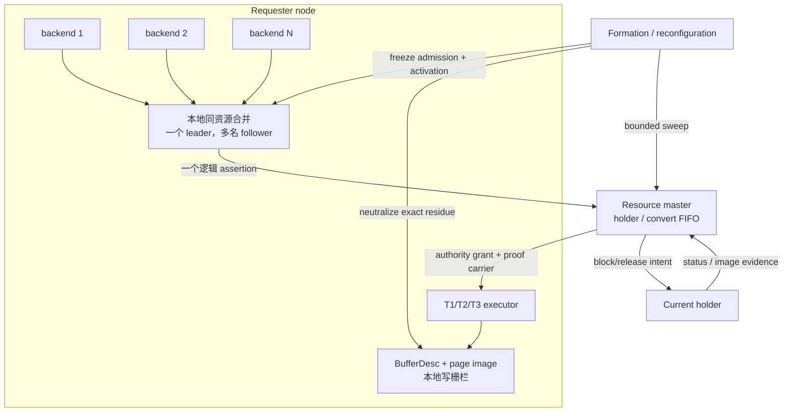

# Resource-X：从逻辑资源到可写 X 的完整链路

Resource-X 是 PGRAC 新一代全局数据块独占访问协议。它解决的不是“怎样再发一条锁消息”，而是下面这个更严格的问题：

> 多个本地 backend、跨节点 resource master、可能重复或重连的网络消息、当前块镜像、本地 BufferDesc，以及节点变化后的恢复动作，如何共同证明“这个节点现在可以安全写这个块”？

这组文档给出 Resource-X 的目标架构设计。当前版本是 **设计版 v1**：重点描述稳定的身份、权威、状态机、失败语义和切换边界；代码实现完成后，将按公开主线中的生产调用点、测试编号和实测结果修订为实现版 v2。

如果只想集中理解“为什么一次 acquisition 必须始终使用同一个请求代际，以及 duplicate、
retry、reconnect、successor 和 formation recovery 如何区分”，可先阅读独立专题
[Resource-X 请求代际：让重试、重连和恢复始终指向同一次获取](../resource-x-request-generation/README.md)。

如果要理解 resource master 只看到 `N + PI`、却没有可直接路由的 current holder 时，为什么
不能任选 PI，以及 exact last-current lineage、proof-image retained pair 和完整 grant 复核如何
形成一个窄的 fail-closed fast path，请阅读
[Resource-X Last-Current Carrier：从 N+PI 到唯一可写 X](../resource-x-last-current-carrier/README.md)。

## 阅读顺序

- [01：总体架构、资源模型与权威边界](01-architecture-and-resource-model.md)
- [02：逻辑身份、attempt witness 与 transport freshness](02-identity-attempt-and-transport.md)
- [03：同节点请求合并、master admission 与 FIFO](03-local-coalescing-and-master-admission.md)
- [04：有界重试、T1/T2/T3 执行器与本地写栅栏](04-retry-terminal-and-executor.md)
- [05：proof carrier、C-intent、单向释放与 requester 回收](05-proof-carrier-release-and-reclaim.md)
- [06：Formation freeze、bounded sweep、orphan 与零残留证明](06-reconfiguration-sweep-and-zero-residual.md)
- [07：R4 OPEN、双路径切换与旧 ticket 家族退役](07-r4-open-cutover-and-ticket-retirement.md)
- [08：Oracle RAC 行为对照、PGRAC 适配与公开边界](08-oracle-rac-comparison-and-boundaries.md)
- [09：终态参与者集合与源端写入排他窗口](09-terminal-participants-and-writer-exclusion.md)
- [10：Target Acquire 诊断与 target-only 切换验收](10-target-acquire-diagnostics-and-cutover-validation.md)
- [11：高并发下的 current block 安全交接](11-contention-safe-current-block-handoff.md)
- [12：PCM/GRD 容量观测、资源复用与 Resource-X 失败隔离](12-capacity-observability-and-failure-containment.md)
- [13：cached-X 安全驱逐、资源关闭与运维观察](13-safe-cached-x-eviction-and-operations.md)
- [14：Source Settlement 与 retained image 安全收尾](14-source-settlement-and-retained-image-lifecycle.md)

## 一张图定位 Resource-X

Resource-X 位于 GCS/PCM 的“块级 X 获取”路径中：

- GCS 决定一个数据块的 current/PI/image 如何在实例间流动；
- resource master 维护该块的 holder 与 convert 队列；
- Resource-X 把一次逻辑 X acquisition 的身份、排序、重试、grant、镜像安装和本地可写终态连起来；
- R4 只负责集群范围内的语义切换，不能替代 Resource-X 的逐资源正确性；
- formation/recovery 在成员变化时冻结新工作、分类旧工作，并且只有在零残留证据成立后才允许重新开放。

## 最重要的六条不变量

1. **逻辑资源身份不是 ticket。** 集群级断言由完整块资源标识和 requester node 组成；backend、事务、网络连接和临时 ticket 都不能成为第二套权威。
2. **重连不等于新请求。** session 或 connection generation 变化只影响消息新鲜度；只要逻辑 attempt 没变，它仍是同一次 acquisition。
3. **T1 grant 不等于可写。** requester 必须完成同一 generation 的当前镜像安装与本地 X 确认，再清除写栅栏并发布 T3，普通写入口才开放。
4. **重试不能改身份。** 重发只能更换 transport witness，不能重置绝对 deadline、篡改 FIFO，或把“可能已提交”的状态伪装成超时取消。
5. **formation 变化先冻结再扫描。** 新 admission 与 activation 都关闭；旧 formation 的每个 acquisition 必须被精确取消并由新 assertion 接棒，或者保留为 orphan 并继续 fail-closed。
6. **切换时绝不双开。** legacy source 与 Resource-X target 之间必须经过 both-closed；只有 R4 的集群级持久 OPEN 是语义切换线性化点。

## 文档中的证据标识

| 标识 | 含义 |
|---|---|
| **Oracle 已验证** | Oracle 官方公开文档明确描述了该外部行为或角色。 |
| **PGRAC 目标设计** | Resource-X 的稳定目标机制；不表示当前公开主线已经完成生产接线。 |
| **PGRAC 当前基线** | 公开主线中可以直接定位的旧 PCM-X、GCS、buffer 或测试锚点。 |
| **PGRAC 自研适配** | 为 PostgreSQL buffer、进程、shared memory 和 interconnect 语义设计的机制；不归因于 Oracle。 |
| **Oracle 未公开** | 官方资料不足以判断 Oracle 的内部结构、消息、generation、算法或锁序。 |

## 当前公开基线入口

Resource-X 将逐步替代旧 PCM-X 的 ticket 型正常路径。阅读代码时，应把以下文件视作**迁移基线**，而不是把其中所有旧结构都理解成目标架构：

- [`cluster_pcm_x_convert.h`](../../../src/include/cluster/cluster_pcm_x_convert.h)：旧 `PcmXWaitIdentity`、`PcmXTicketRef`、消息 payload 与队列结构。
- [`cluster_pcm_x_convert.c`](../../../src/backend/cluster/cluster_pcm_x_convert.c)：旧本地 join、master convert、terminal/drain/retire 实现。
- [`cluster_gcs_block.c`](../../../src/backend/cluster/cluster_gcs_block.c)：GCS block 请求、formation tick、master/requester 驱动与 interconnect 接线。
- [`cluster_pcm_lock.c`](../../../src/backend/cluster/cluster_pcm_lock.c)：块级本地/全局 PCM 状态。
- [`bufmgr.c`](../../../src/backend/storage/buffer/bufmgr.c)：PostgreSQL buffer content lock、dirty 发布与当前 PCM-X 接入点。
- [`t/400_pcm_x_queue_4node_liveness.pl`](../../../src/test/cluster_tap/t/400_pcm_x_queue_4node_liveness.pl)：四节点普通更新、Resource-X transfer/settlement 与 retained finish-Flush 正向基线。
- [`t/406_resource_x_finish_flush_failclosed_4node.pl`](../../../src/test/cluster_tap/t/406_resource_x_finish_flush_failclosed_4node.pl)：精确 retained source finish-Flush ERROR 的 pending-pair、同 attempt 无 ACK、fail-closed 与清理负向证据。

## Oracle 官方入口

- [Oracle RAC 架构：GCS、GES、GRD 与 Cache Fusion](https://docs.oracle.com/en/database/oracle/oracle-database/26/racad/introduction-to-oracle-rac.html)
- [Oracle RAC Cache Fusion 与 GCS resource recovery](https://docs.oracle.com/cd/A97630_01/rac.920/a96597/pslkgdtl.htm)
- [Oracle RAC resource coordination 与 GRD](https://docs.oracle.com/cd/A97630_01/rac.920/a96597/coord.htm)
- [Oracle `V$GES_RESOURCE`](https://docs.oracle.com/en/database/oracle/oracle-database/19/refrn/V-GES_RESOURCE.html)
- [Oracle `V$GES_ENQUEUE`](https://docs.oracle.com/en/database/oracle/oracle-database/19/refrn/V-GES_ENQUEUE.html)

> Oracle 没有公开名为 Resource-X 的 PGRAC 对象，也没有公开 PGRAC 的 witness、T1/T2/T3、BufferDesc sidecar、R4 token 或 ticket 退役算法。本文只把 Oracle 已公开的资源级 master、granted/convert queue、current block transfer 与 reconfiguration freeze 作为行为基准。
