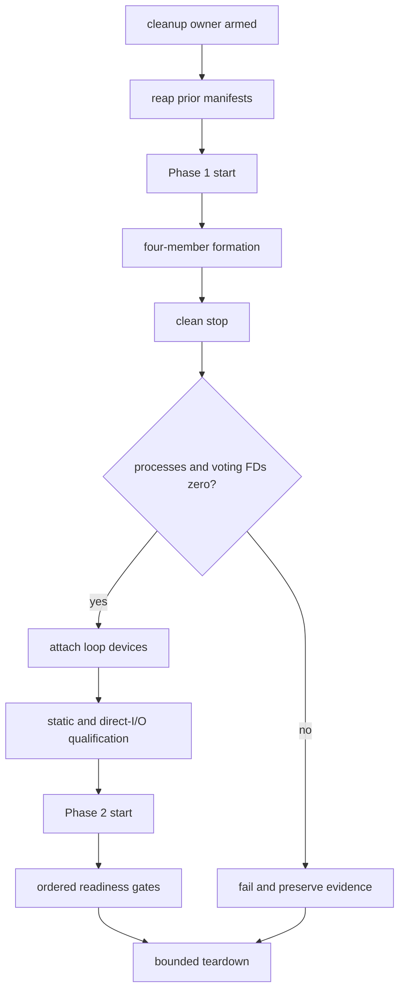
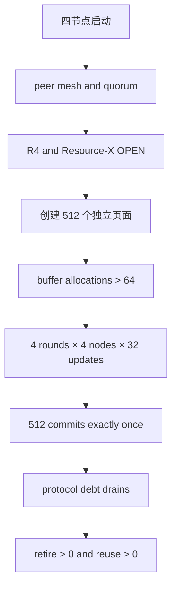
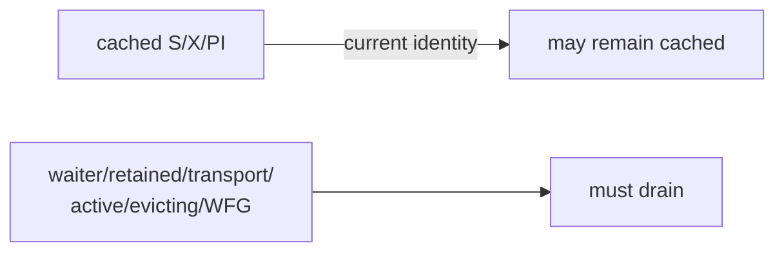
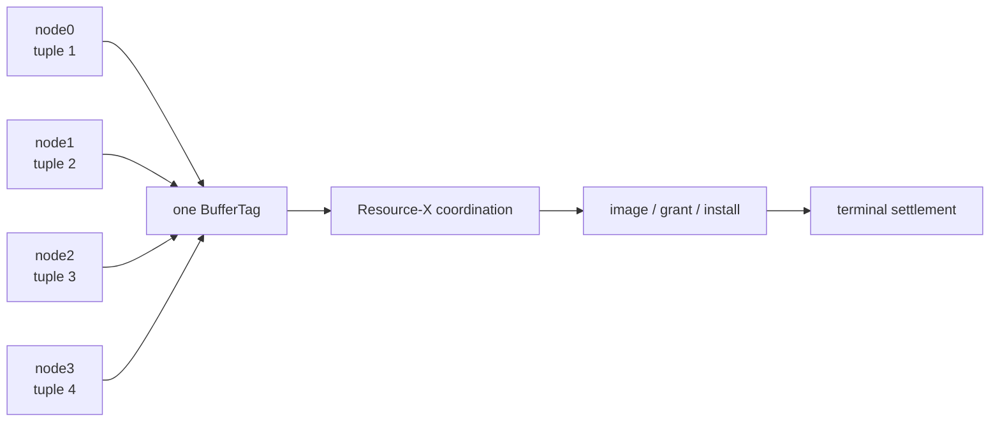

# t/429、t/430、t/400 与 t/406 四节点验证指南

本文说明四项 PGRAC TAP 测试分别验证什么、如何运行，以及失败时应查看哪一层证据：

- `t/429`：测试如何可靠地启动、停止和清理测试集群；
- `t/430`：测试资源数量增大后能否回收并复用 PCM/GRD 目录；
- `t/400`：测试四个节点竞争同一数据块时 Resource-X 与事务结果是否正确；
- `t/406`：隔离验证精确 retained source finish-Flush 错误的 fail-closed 行为。

> 运行命令要求当前源码版本已经包含对应 TAP 文件。若某个文件不存在，请使用包含该测试的源码版本。

## 1. 验证层次


| 测试 | 是否启动真实四节点 | 工作负载 | 主要结论 |
|---|:---:|---|---|
| `t/429_clusterquad_two_stage_lifecycle.pl` | 否，主要使用 mock | 无 SQL 负载 | harness 的启动、停机、设备与清理规则正确 |
| `t/430_pcm_grd_resource_reuse_4node.pl` | 是 | 512 个分散页面的点更新 | PCM/GRD entry 能够 terminal、retire、reuse |
| `t/400_pcm_x_queue_4node_liveness.pl` | 是 | 四节点同时更新同一 heap block | Resource-X 授权、块传输、安装与事务守恒正确 |
| `t/406_resource_x_finish_flush_failclosed_4node.pl` | 是 | decoy 后对精确 BufferTag 注入 retained finish-Flush ERROR | 非目标不消费 one-shot；目标保留 pending pair、无精确 ACK 并 fail closed |

断言数量不能直接比较测试强弱。`t/429` 即使有大量断言，也主要验证 harness；它不能代替真实四节点测试。

## 2. t/429：测试基板生命周期

### 2.1 测试目标

`t/429_clusterquad_two_stage_lifecycle.pl` 对 `PostgreSQL::Test::ClusterQuad` 的两阶段生命周期做 focused 验证。它主要检查：

```text
注册 cleanup owner
  → 清理旧 attempt
  → Phase 1 启动
  → 四成员 formation
  → 协调正常停机
  → 进程与 voting FD 全部退出
  → 绑定 loop block devices
  → direct-I/O 资格检查
  → Phase 2 重启
  → readiness gates
  → teardown
```

### 2.2 生命周期图



### 2.3 主要测试条目

| 类别 | 验证内容 |
|---|---|
| Cleanup owner | 必须在第一次 start 前注册；重复注册和 teardown 幂等 |
| Previous-attempt reaper | 只有 PID、starttime、FD 和 device mapping 全部精确匹配时才回收 |
| Concurrent start | 四个原生 start 结果全部收集，首个失败原因不会被覆盖 |
| Formation | Phase 1 和 Phase 2 都必须观察到四成员 current formation |
| Clean stop | shutdown checkpoint、STOPPED、成员确认与 completion 按顺序完成 |
| Device attach | 所有进程和 voting FD 退出后才允许绑定设备 |
| Device qualification | 类型、容量、DIO、字节内容、设备序号和直接 I/O 探针全部通过 |
| Phase 2 identity | 重新捕获 PID、starttime 和 formation；不能复用 Phase 1 身份 |
| Gate ordering | readiness gate 只能按顺序推进，不能跳门 |
| Failure cleanup | 先停进程，再关 FD，再解绑设备，最后删除临时文件 |
| Stuck I/O | PID reuse、活跃 FD 或不可中断 I/O 时保留清理清单，不强制 detach |

### 2.4 Phase 2 readiness gates


出现后一个 gate 的日志不能补偿前一个 gate 的失败。失败报告应保留首个未满足 gate。

### 2.5 运行命令

```bash
cd src/test/cluster_tap
make check PROVE_TESTS=t/429_clusterquad_two_stage_lifecycle.pl
```

通过 t/429 只表示测试基板行为符合预期，不表示真实四节点事务已经通过。

## 3. t/430：宽资源集合下的回收与复用

### 3.1 测试拓扑

`t/430_pcm_grd_resource_reuse_4node.pl` 启动四个真实实例，使用共享数据和三个 voting devices。

| 项目 | 测试值 |
|---|---:|
| 节点 | 4 |
| shared buffers | 64 个 8KiB buffer |
| PCM/GRD 最大 entry | 128 |
| heap resources | 512 |
| 更新轮数 | 4 |
| 每节点每轮更新 | 32 |
| 每节点总提交 | 128 |
| 集群总提交 | 512 |

512 个不同 heap page 大于 64 个 buffer，也大于 128 个 PCM/GRD entry，因此测试必须观察到真实 cache replacement、terminal retirement 和 entry reuse。

### 3.2 运行流程



在需要验证两阶段 voting-device 切换时使用：

```bash
cd src/test/cluster_tap
PGRAC_TEST_TWO_STAGE_VOTING_LOOP=1 \
  make check PROVE_TESTS=t/430_pcm_grd_resource_reuse_4node.pl
```

### 3.3 主要测试条目

| 类别 | 通过条件 |
|---|---|
| Four-node health | 四个节点都能查询，12 个有向 peer connection 全部 current |
| Quorum | 每个节点都观察到 voting majority |
| Activation | R4 与 Resource-X gate 均为 open |
| Configuration | shared buffers=64、PCM/GRD capacity=128 |
| Real replacement | `buffers_alloc` 增量严格大于 64 |
| Wide resource set | 至少 512 个不同 heap pages |
| Client result | 四节点零 error、零 timeout，每节点提交 128 次 |
| Data conservation | `sum(v)=512` |
| Protocol drain | waiter、transport、retained、active、evicting、convert、GCS outstanding 和 WFG 等债务归零 |
| Capacity | capacity failure 不增加，peak live entries 不超过 128 |
| Retirement | reclaim success 增量大于 0 |
| Reuse | reclaim reuse 增量大于 0 |
| Runtime health | 四节点日志没有 Resource-X runtime fail-closed |

### 3.4 缓存驻留不等于协议债务

测试结束时，仍然 current 的 cached S、cached X 或 PI 可以合法存在。必须归零的是尚未完成的协议义务：



因此，诊断 t/430 时应分别读取 residency 与 debt，不能把二者相加后简单要求全部为零。

### 3.5 如何解释 0 subtests

如果测试在 `start_quad` 或设备 gate 中失败，TAP 可能报告 0 subtests。这表示测试尚未到达第一条业务断言，常见检查顺序为：

1. failure evidence 中的 first named gate；
2. `pgrac_direct_io_probe` 是否已构建并可执行；
3. loop device 类型、容量和 DIO 状态；
4. 是否存在旧 postmaster、FD 或 cleanup manifest；
5. 四节点 Phase 1/Phase 2 日志边界。

不得把 cleanup 成功解释成 workload 成功。

### 3.6 如何解释“16 项通过后停止”

前 16 项只覆盖四节点 SQL alive 和 12 条有向 peer connection。下一条可见断言是
pre-OPEN durable mirror；在它之前还要通过每节点 quorum、membership admission 和
pre-OPEN fail-closed 检查。因此，16 项后停止应先按
[成员关系先于数据库服务](../four-node-two-stage-acceptance/05-membership-before-service-readiness.md)
检查启动控制面，不能先归因于 PCM capacity 或 512-page workload。

## 4. t/400：四节点热块协议正确性

### 4.1 测试拓扑

`t/400_pcm_x_queue_4node_liveness.pl` 启动四个真实实例，把四条不同 tuple 放在同一个 heap block 中。每个节点运行一个 pgbench writer，持续 15 秒更新属于自己的 tuple。



四个 writer 修改不同逻辑行，但它们共享同一个物理块，因此会触发真实的全局块状态转换和 Cache Fusion 传输。

### 4.2 测试责任

| 阶段 | 验证内容 |
|---|---|
| L1 | 四节点 alive、peer mesh、quorum、xid stripe、R4/Resource-X OPEN |
| L2 | 四节点关系路径一致，四 tuple 位于同一 BufferTag |
| L2S | requester 已持唯一 S 时完成 Resource-X S→X 转换 |
| L2F | dirty X source 正向完成物理 flush，并由远端 requester 安装正确页面 |
| L3 workload | 四个 pgbench writer 在 hard deadline 内零错误并持续提交 |
| L3 transfer | kind-9、holder transition、image、grant、remote install 和 settlement 正向发生 |
| L3 drain | GCS request slot、WFG edge、transport 和 terminal participant 全部闭合 |
| L3 source removal | 旧 ticket/wire/worker/build/source 路径保持不可达 |
| L4 | 每行 value 等于对应 writer 的提交数，聚合值等于总提交数 |

破坏性的 source-finish ERROR 不再属于 t/400；它由独立 t/406 验证，避免把合法的异步终态工作误当作 t/400 的全局清零前置条件。

### 4.3 运行命令

```bash
cd src/test/cluster_tap
PGRAC_STAGE8_HAPPY_PATH_ONLY=1 \
  make check PROVE_TESTS=t/400_pcm_x_queue_4node_liveness.pl
```

### 4.4 t/400 不是性能测试

每节点只有一个 writer，测试只要求四节点都能持续提交且事务结果精确。它不使用事务数或 TPS 作为得分门：

```text
t/400 GREEN
  = 四节点协议正确 + 数据守恒 + terminal drain + 旧路径不可达
  ≠ 最终性能达标
```

性能测试应在 t/400 正向门和独立 t/406 负向门都通过后，使用全新的固定四节点集群并逐步增加每节点持久连接数。

## 5. t/406：精确 retained finish-error 负向验证

t/406 先让非目标 decoy 完成一次原生 type-17 transfer，证明它到达同一 DATA worker 且没有消费 one-shot；随后仅对 catalog 解析出的目标 BufferTag 在 `smgrwrite` 前注入 ERROR。

通过条件包括：decoy 正常完成并产生 PI write；目标 writer 失败；精确 pending pair 保留；失败 assertion 没有 settlement ACK；Resource-X runtime fail closed；postmaster 仍可响应诊断查询；正常停机没有遗留 BufferIO owner。

```bash
cd src/test/cluster_tap
PGRAC_STAGE8_HAPPY_PATH_ONLY=1 \
  make check PROVE_TESTS=t/406_resource_x_finish_flush_failclosed_4node.pl
```

t/406 GREEN 是故障极性与清理证据，不是性能结果。它使用独立新集群；fail-closed 后不得复用该运行时继续正向测试。

## 6. 四项测试的故障定位表

| 现象 | 首先检查 | 不应首先修改 |
|---|---|---|
| 0 subtests、device gate 失败 | t/429 lifecycle、helper、device 与 cleanup evidence | Resource-X workload |
| 128 entries 后 NO_CAPACITY | t/430 reclaim/reuse 与 terminal debt | t/400 判官 |
| 四 writer 卡在 grant/install | t/400 Resource-X transfer/settlement | 增大目录容量 |
| t/406 decoy 触发错误或目标出现同 assertion ACK | 精确 target matcher、attempt identity 与 retained pair | 放宽负向断言或延长超时 |
| 测试退出仍有 loop/FD | t/429 cleanup/reaper | 延长 SQL timeout |
| 数据值与提交数不同 | t/400 L4 conservation | counter 白名单 |
| 数据正确但 debt 非零 | terminal owner、settlement、WFG drain | 忽略 drain |

## 7. 推荐执行顺序

```text
focused unit tests
  → clean product build
  → t/429 lifecycle
  → fresh two-stage t/430
  → unchanged t/400
  → fresh t/406 exact finish-error
  → four-node performance baseline
```

执行时遵守：

- t/429 未通过，不运行 t/430；
- t/430 未完整通过，不运行 t/400；
- t/400 未完整通过，不运行 t/406 或 PRE；
- t/406 的 fail-closed 集群只用于收集负向证据，结束后必须新建 PRE 集群；
- 新的 fresh attempt 必须保留之前的失败证据；
- 不修改 workload、判官、timeout、skip 或容量来制造绿色；
- 每次运行后检查零残留 postmaster、FD、loop mapping 和未处理 cleanup manifest。

## 8. 结果记录建议

每次真实四节点测试至少保留：

- 源码 revision 与构建身份；
- attempt ID；
- 四个节点的 PID/starttime；
- voting path/device identity；
- formation、session 与 incarnation；
- 每节点 start/stop rc；
- client rc、error、timeout 和 commit 数；
- resource/debt 前后快照；
- first named failure；
- cleanup manifest 与最终 cleanup 状态。

只有 TAP 全绿、数据守恒、协议债务闭合且 cleanup 完成，才能把该次 attempt 记录为有效 GREEN。

## 9. 一句话记忆

```text
t/429：harness lifecycle
t/430：resource lifecycle
t/400：contended-block protocol
t/406：exact finish-error containment
```

中文可以记成：

- t/429：测试“怎么可靠地启动和清理测试集群”；
- t/430：测试“资源多起来以后能不能回收复用”；
- t/400：测试“四节点抢同一资源时正向协议是否正确”；
- t/406：测试“精确 source-finish 失败时是否保留证据并安全关闭”。
