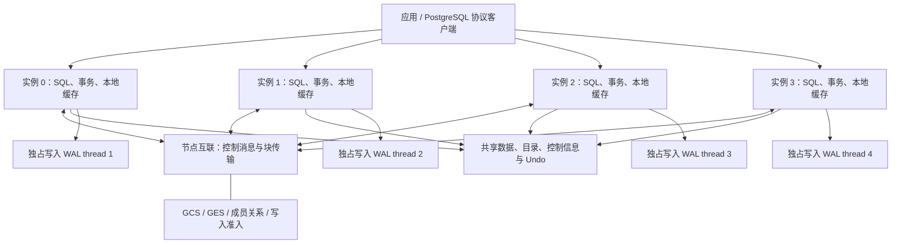
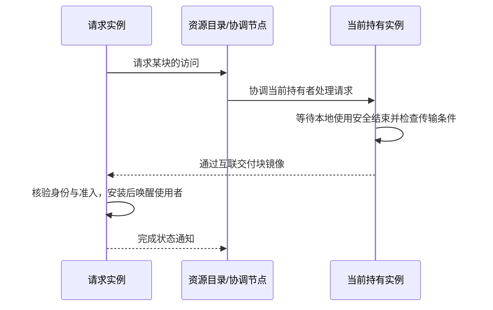
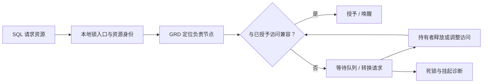
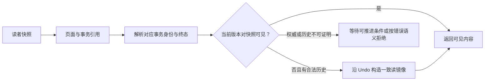
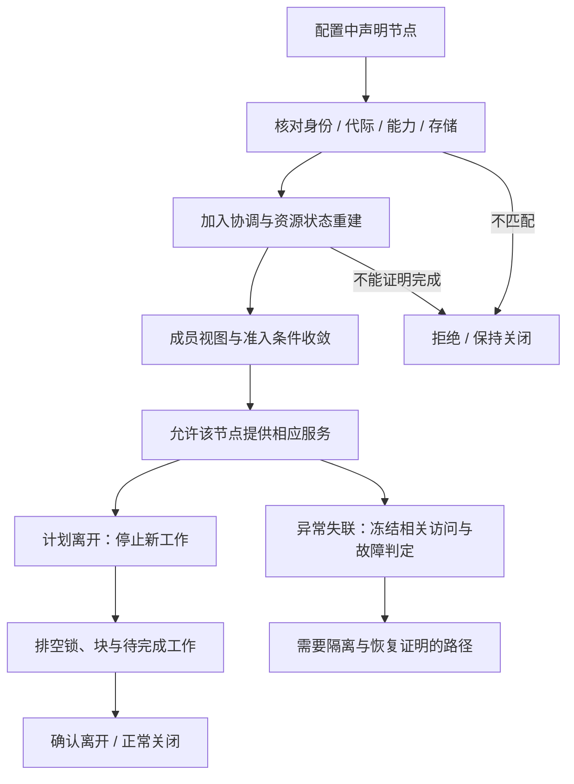

# 四、PGRAC 核心功能与运行机制

Author: SqlRush <sqlrush@gmail.com>

适用：`v0.130.0-mvp.1` / `c581f3835a4a9a76ce5a77c0937930f21765725a`。本文介绍用户可见能力与模块职责，不是生产高可用认证或 Oracle 内部实现复刻声明。

## 1. 一份数据，多个活动实例

原生 PostgreSQL 16.13 的一个实例用本地共享内存、锁、WAL 与事务状态管理其数据目录。把同一数据目录挂给四个原生 PG postmaster 并不能得到安全的多写集群。

PGRAC 在 PostgreSQL 内核增加跨实例协调：多个实例各有自己的进程、buffer cache 与本地 PGDATA，通过互联协调共享数据块、逻辑锁、事务可见性和存储写入。它不是通过逻辑复制同步四份独立数据库，也不是仅靠负载均衡器把 SQL 分发到四个节点。

图中的“独占”是写入者唯一，不是其他实例永远不能读取该线程。客户端连接仍指向具体实例；本 MVP 不承诺透明重连、会话迁移或 Oracle SCAN 等服务管理能力。

## 2. 相对原生 PG 增加了哪些机制

| PG 原有层 | PGRAC 增加的作用 | 用户能观察到什么 |
|---|---|---|
| Buffer manager / 页面读写 | 集群块身份、current 获取/移交、镜像安装、跨节点失效与访问约束 | 远端块等待、缓存传输、块状态与清理债务 |
| 本地锁管理 | GES、资源目录、远端请求/转换/释放、等待唤醒与死锁协调 | 跨节点同行/对象争用可被协调，不依赖本地锁独自判断 |
| Snapshot / MVCC / heap | 全局 SCN、事务表 TT、Undo、页面事务引用与跨节点一致读 | 判断其他实例事务是否可见，而非用本地事务状态猜测 |
| 存储管理器 | 共享后端、共享关系与系统目录路由、集群控制信息 | 多节点访问同一份关系数据；本地 PGDATA 仍分开 |
| WAL | 按节点划分 WAL 线程及线程身份校验 | 多实例不会同时追加同一条 WAL 流 |
| 后台进程框架 | 通信、成员监控、锁/块服务、投票、诊断与回收角色 | 额外后台进程、等待事件、系统视图 |
| 启动/关闭 | 编队与能力准入、协调排空、正常关闭持久状态及重启重建 | 全体正常关闭后可用同一数据重新启动 |

这是 PGRAC 的实现组成，不表示 Oracle 使用相同结构体、wire 编码、PG 页面格式或同步算法。公开高层参照是 Oracle 的 GCS/GES/GRD 与实例间传块模型。[Oracle RAC 组件说明](https://docs.oracle.com/en/database/oracle/oracle-database/19/racad/introduction-to-oracle-rac.html)

## 3. GCS 与 Cache Fusion

### 3.1 解决什么问题

同一个磁盘块可能同时出现在多个节点的内存里。一个节点写入之后，其他节点不能继续把旧副本当成当前可写版本。GCS 负责协同块的可用位置、访问状态与传输，GRD 保存资源归属的目录信息。

这里需要区分：

- **current 块**：满足当前访问所需的最新块版本。修改前需要取得有效的独占访问权，不能只有收到的一包字节。
- **CR（一致读）镜像**：满足读者快照的只读版本。它不能作为另一条写入权威。
- **PI（过去镜像）**：块移交过程中按规则保留的历史/持久性相关镜像；它不是可随意清除的缓存垃圾。

### 3.2 一次跨节点获取的用户视角

这是职责示意，不是本 MVP 每次操作严格只有三条网络消息的性能承诺。缓存命中、读前置、等待、重传、完成通知等会影响实际成本。不能用提交数估算真实换手消息数。

PGRAC 将集群获取接入 PG buffer manager；本地 content lock、pin 和集群访问权各自仍有职责。LMS 类后台服务处理块通信与待完成工作，前台等待所需块和权限。暂时 busy 与身份/完整性矛盾不能混为一谈；不可证明的权威不会因为“等待太久”自动变为可写。

Cache Fusion 不等于取消 WAL 或持久化，也不等于所有路径永远无需磁盘 I/O。页面移交、恢复证明和共享持久状态有各自的完成条件。Oracle 公开描述支持实例间经私有网络传送缓存块；PGRAC 的实际数据路径、成本与适配必须以自身测量为准。

### 3.3 PG 特有页面仍需要协调

堆页、索引页以及 VM/FSM 等辅助页不是同一种业务对象，但共享访问都要满足正确的块身份与所有权。PG visibility map 的热点可能造成跨实例争用；Oracle 的块模型不能直接证明此热点在 PGRAC 中不存在。

观察入口：`pg_cluster_ic_peers`、`pg_stat_cluster_ic`、`pg_cluster_state` 的 `gcs`、`pcm`、`r4`、`cr` 等分类，以及 `pg_stat_activity` 等待事件。详见[视图篇](03-system-views.md)。

## 4. GES：把本地锁语义扩展到跨实例

GCS 管块；GES 管需要跨实例协调的逻辑资源访问，例如事务、对象、扩展/空间等相关资源。两者协作但不能互相替代：取得事务锁并不自动取得某个 buffer 的独占内容访问。

PGRAC 保留 PG 的锁模式和兼容性语义，在相关路径增加全局协调，而不是简单将 Oracle 六种锁模式名称替换到 PG 八种模式上。远端请求、取消、迟到回复与重传必须按请求身份处理；不能因网络重发再次授予不同的访问权。

LMD 等后台角色负责相应的锁服务与死锁/工作处理；其命名对应职责方向，不声称内部实现与 Oracle 未公开代码相同。用户取消、死锁、成员变化和真正的正确性失败仍可能导致操作失败，不能把“支持等待”宣传成所有 SQL 永不报错。

观察入口：`pg_cluster_grd_shards`、`pg_cluster_grd_entries`、`pg_cluster_lmd`、`pg_cluster_state` 的 `ges`/`dl`/`hang` 分类。GRD 全表扫描只用于按需排障。

## 5. 事务可见性：为什么需要 SCN、TT 和 Undo

原生 PG 主要基于 XID、快照和事务状态判定元组可见性。多实例共享同一页面后，读者还必须可靠地解释外来事务，不能用 requester 本地 CLOG 对不属于它的事务猜提交。

PGRAC 增加的用户层概念包括：

- **SCN**：跨实例比较可见进度使用的逻辑序号，不是墙钟时间。
- **TT（事务表）**：解释事务状态与对应身份。槽位复用后，旧引用不能被错误解释为新事务。
- **Undo**：保存重建旧版本所需信息；释放空间需尊重读者/保留边界。
- **页面事务引用/ITL 类信息**：让页面中的事务关联能够被精确解析。
- **终态引用清理与回执**：事务已结束不代表所有页面引用和清理工作已完成；回收必须等待其证明成立。

以上是 PGRAC 对 PG 的适配说明，不是“与 Oracle TT/Undo 私有实现逐字节一致”的声明。不要用 `VACUUM`、关闭可见性检查或放宽 retention 来掩盖无法证明的数据状态。

## 6. 共享存储与 WAL

共享存储后端负责把关系 I/O 路由到所有节点共同看到的介质；它本身不提供分布式文件系统，也不替代 GCS/GES。四个本地目录定期同步并不是共享后端。

共享系统目录使对象身份、关系映射与目录内容不再由四节点各自独立创造。初始化必须只有一个 seed 身份，joiner 从合法来源接入。每个节点保留独立本地 PGDATA 和 WAL 写入线程，控制/目录/undo 等对象按各自共享规则访问。

写入还经过成员与写栅栏准入。软件上的 freeze/fail-closed 与物理隔离旧写者是不同能力；没有外部 fencer 的真实认证，就不能承诺网络分区时完整的生产故障接管。详细介质条件见[部署篇](01-linux-four-node-deployment.md)。

## 7. 在线加减节点：状态机保证什么、尚未保证什么

拓扑声明、socket 连通、心跳存活和成员准入不是同一个状态。现有接口的安全目标是：没有完成身份、代际、成员集合与资源重建条件的节点，不能作为完整成员开始共享写。

下面是**用户视角的阶段图**，不是所有内部枚举的完整协议规格：

- `cluster.online_join` 允许已声明节点走在线加入/重新加入接口，不意味着可以直接修改一台机器的配置添加任意新成员。
- incarnation 区分同一 node ID 的不同启动身份；迟到消息不能将旧实例复活为新实例。
- 计划离开需要排空并确认，不是删掉拓扑一行或拔网线。
- 永久移除会改变成员集合，可能依赖旧节点隔离与清理；不等于正常 `pg_ctl stop`。默认关闭的 `cluster.online_node_removal` 不应为演示擅自开启。
- 任一节点未完成准入/清理时，不能宣布“在线变更已成功”；观察 membership、clean-leave、node-removal、reconfig 与实际业务结果。

**本 MVP 已验证全体正常关机后的同数据重启；未认证任意在线扩缩容、非正常离开后的接管或滚动升级。** 因此本文说明机制与保护边界，不提供可用于生产删节点的操作承诺。Oracle 自身也将基础集群节点增加、数据库实例增加及服务配置分为不同步骤；这只是职责分层参照，不是 PGRAC 已具有 Oracle 的运维工具链。[Oracle 节点/实例管理](https://docs.oracle.com/en/database/oracle/oracle-database/19/racad/adding-and-deleting-oracle-rac-from-nodes-on-linux-and-unix-systems.html)

## 8. 正常关闭与再次启动

正常关闭要使持久数据、WAL 与控制状态对应一个完整结束点，同时终结在途请求和共享访问。重新启动时，连接、等待队列、缓存等临时状态重建，不能把上一轮内存状态假装仍然有效。

验收覆盖的是相同版本、原数据、原配置的协调正常关闭/启动、全行核对和再次运行业务。它不外推到崩溃镜像、故障节点的重复恢复或新版本接管旧格式。发现控制文件仍处于运行态时，必须按异常现场处理。

## 9. MVP 能力清单

| 能力 | 此次发布的准确表述 |
|---|---|
| 四实例共享数据的普通事务负载 | 已在发布注明的配置与负载上验收 |
| GCS/GES/跨节点事务可见性 | 为上述负载提供实际运行机制；不是全部 SQL/故障矩阵都通过 |
| 全量数据核对、健康与未完成工作检查 | 属于已通过验收，不以零 SQL 错误单独替代 |
| 全体正常关闭与同数据重启 | 已验证；不包括强杀/断电后的恢复 |
| 新建数据库/表空间 | 共享目录开启时明确不支持；使用已有数据库与业务 schema |
| UNLOGGED 关系 | 共享目录模式存在明确拒绝，不作通用 PG 兼容承诺 |
| TLS、完整 CI、签名二进制 | 此标签有已记录限制；不宣称已具备完整发布资格 |
| 在线节点变化、ADG、备份恢复、外部 fencing | 有代码/接口不代表本 MVP 已完成部署认证 |
| 生产 SLA、线性扩展、胜过特定数据库的 TPS | 本次发布不作保证 |

本篇描述公开能力，不公布内部协议设计过程；接口细节以[参数篇](02-parameters.md)和[视图篇](03-system-views.md)为准，验收范围以[版本说明](https://github.com/sqlrush/pgrac/blob/v0.130.0-mvp.1/docs/release-notes/v0.130.0-mvp.1.md)为准。
