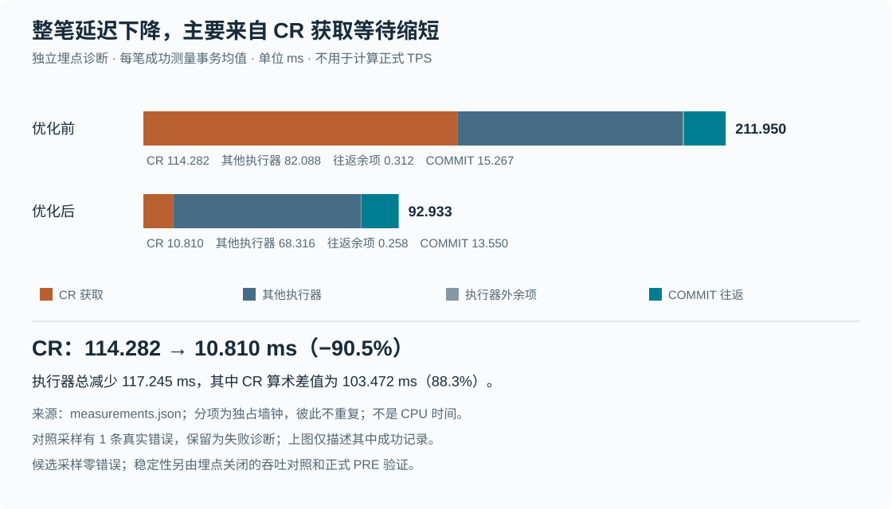
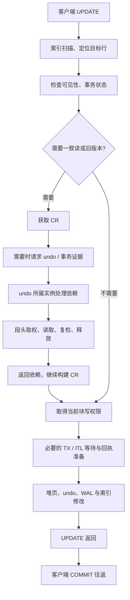
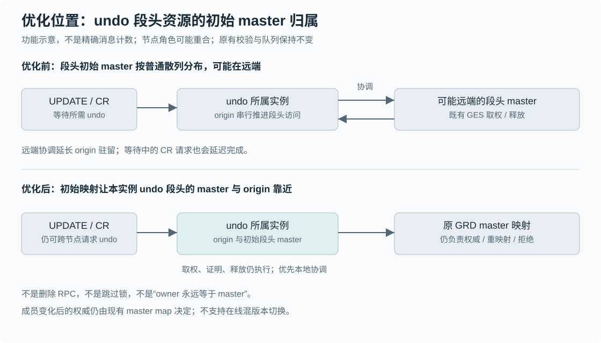
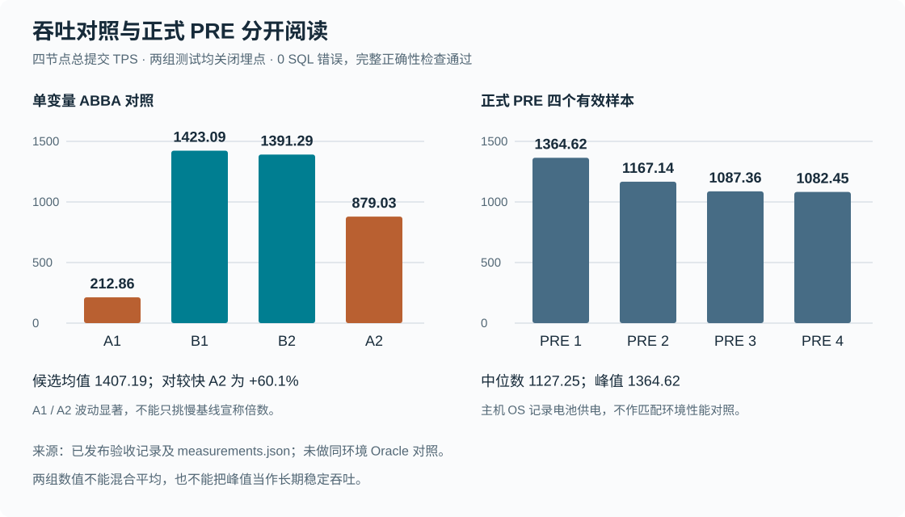

# PGRAC v0.131.0：undo 段头局部性优化与 UPDATE 全路径实测

Author: SqlRush <sqlrush@gmail.com>

证据截止：2026-09-20。PostgreSQL 基线：16.13。本文是已发布版本的功能与测量说明，不是性能承诺。

## 摘要

- **本次缩短的主要不是写 undo 的时间，而是一致读取得所需 undo 时的协调等待。** 独立埋点诊断中，每笔成功 UPDATE 的 CR 获取独占墙钟由 **114.282 ms 降至 10.810 ms**，下降 **90.5%**；整笔客户端 UPDATE＋COMMIT 由 **211.950 ms 降至 92.933 ms**。
- **关闭埋点的单变量吞吐对照确认了收益方向。** 候选两轮均值 **1407.19 TPS**，相对较快的对照轮 **879.03 TPS** 提高约 **60.1%**。对照自身波动很大，不能只挑最慢基线，也不能把这组数据当作与未修改历史稳定版的直接比较。
- **最终版本完成正式正确性 PRE 4/4。** 四轮零意外客户端/服务端错误、零强制取消，完整全行对比、健康与债务检查通过，最终四节点正常关闭。正式 PRE 中位数 **1127.25 TPS**，峰值 **1364.62 TPS**；不是“稳定超过 1200 TPS”的证明。
- **剩余时间仍值得优化，但已没有本次这样的单一占优项。** 取写权限、undo/终态查询、扫描、共享读请求和 COMMIT 分担主要耗时；“耗时大”不等于“全部可消除”。

> 重要限制：用于机制解释的**对照埋点采样出现了 1 条真实事务证明错误**，保留为失败诊断。本文该组均值仅描述其成功记录，不能当作零错误性能样本。候选埋点采样零错误；合格吞吐对照与正式 PRE 是另外两组测试。



## 1. 三组测试分别回答什么

| 证据组 | 埋点 | 用途 | 能支持的结论 | 不能支持的结论 |
|---|---|---|---|---|
| 机制诊断：对照、候选各一轮 | 开启 | 精确关联客户端、执行器、CR 与 undo 服务事件 | 哪个阶段变短、等待如何传递 | 对照整轮正确性通过、直接推算正式 TPS |
| 单变量 ABBA：对照→候选→候选→对照 | 关闭 | 在相同数据起点和公共修复底座上对比局部性改动 | 本实验中有较大吞吐收益，且四轮正确性通过 | 统计置信区间、历史版本净增幅、任意机器上的收益 |
| 最终版本正式 PRE，四个有效样本 | 关闭 | 发布前正确性资格化 | 该候选满足本次 MVP 验收条件 | 长期饱和性能、四台物理机能力、与 Oracle 的同条件胜负 |

不要把三组读数混在一起平均。诊断中的平均延迟，也不能代入 `128 / 平均延迟`，宣称得到了正式 PRE TPS：窗口边界、自然尾巴、成功记录选择和运行环境并不相同。

### 1.1 版本身份和共同条件

| 项目 | 本报告口径 |
|---|---|
| 已发布版本 | [v0.131.0](https://github.com/sqlrush/pgrac/releases/tag/v0.131.0) |
| 冻结源提交 | `83d8c5a002643581f153058b7a766afe1ffa1eb0` |
| 主干集成提交 | `7081edf0422ae04f1b3dcc28785b9d4d98e724d7`；产品树与冻结候选相同 |
| 平台 | 单台宿主机上的 Linux 虚拟机实验环境；四个数据库实例，不是四台独立物理主机 |
| 业务 | 按主键单行 UPDATE，再 COMMIT；同一百万行数据集；不以只读查询代替 UPDATE |
| 并发 | 四节点，每节点 32 个客户端，共 128 个 |
| 时间 | 每轮 5 秒 warmup、35 秒测量；自然完成和后置正确性检查另计 |
| 对照数据 | 各侧从同一份已经正常关闭的干净冷数据独立复制；不从异常退出镜像恢复 |
| 对照变量 | 两侧有同样的正确性修复和埋点支持；只有 undo 段头初始局部性不同 |
| 未改变 | 工作负载、客户端数、配置期限、磁盘格式、wire 格式、worker 数和事务槽数 |
| 构建 | `--enable-cluster --enable-tap-tests --without-icu`，本地资格化二进制未启用 `--enable-cassert`；CI 另含断言构建 |

候选 Linux 二进制 SHA-256：

```text
4cbbc0b87505453b6940e207916b8b975ff93e9cdb49373638d49d41f4ba8550
```

对照二进制 SHA-256：

```text
e02b28c3fb9b395abe7ab9b9c0a064992b21a156d100f7ee1ddd698608df910e
```

“共同修复底座”不是未修改的历史稳定标签。历史上约 500、900 或其他 TPS 读数，不能随意替换本表的对照分母。

## 2. 一条 UPDATE 为什么会等一致读

写入阶段需要当前块写权限，但找到、判断和锁定目标行之前，还需要按事务可见性读取正确版本。索引扫描、版本链判断与必要的一致读都可能出现在 UPDATE 内部。

下面是**逻辑依赖图**，不是每笔都恰好执行一次的严格串行消息图。请求可以命中缓存、重复、嵌套或走不同分支。



因此：

- CR 耗时大，不能自动解释成“CR 页面重建消耗了很多 CPU”。其中可能主要是排队、依赖和协调等待。
- UPDATE 是写业务，并不意味着 UPDATE 全程都只走 current-read 路径。
- `undo_verdict_rpc`、`r4_tx_rpc` 和 `r4_cr_fetch` 是不同埋点范围，不能只因为名称里有 undo/事务就当成同一笔 RPC。

## 3. 优化前后，产品具体做了什么



### 3.1 优化前的行为

undo 服务在所属实例处理请求，但它访问的段头 current 资源仍通过资源目录查找 master。普通散列可能把该段头资源的初始 master 放到其他实例。

此时，服务方即使是在读取本实例管理的 undo，也可能在取得、释放段头权限时进行跨实例协调。这些阶段在服务上下文中占用时间；下游 CR 请求还在等它返回依赖。

**所属实例、资源 master、当前块持有者不是同一个概念。** 该图只展示会增加协调的一种布局；不是说优化前每次都远端，也不是说网络传输本身必然很慢。

### 3.2 v0.131.0 的行为

对于符合身份条件的 undo 段头 current 资源，统一的资源散列投影选择初始归属更靠近所属实例的分片。现有资源目录的 master map 仍然决定当前 master。

最终实现可从冻结源码直接检查：

- [`cluster_grd_hash_resource()`](https://github.com/sqlrush/pgrac/blob/83d8c5a002643581f153058b7a766afe1ffa1eb0/src/backend/cluster/cluster_grd.c#L1142)：符合条件的段头资源采用初始 home affinity。
- [`cluster_grd_lookup_master()`](https://github.com/sqlrush/pgrac/blob/83d8c5a002643581f153058b7a766afe1ffa1eb0/src/backend/cluster/cluster_grd.c#L1210)：仍从资源分片的 master map 读取权威位置。
- 原有取得、释放、身份复检、成员变化后的重映射和拒绝行为继续执行。

### 3.3 没有做的事情

| 容易产生的误解 | 实际行为 |
|---|---|
| 不再需要远端 undo | 需要时依然请求远端 undo；改变的是内部段头协调局部性 |
| 本地段头不需要锁 | 仍走原有权限、互斥和证明检查 |
| owner 永远固定为 master | 只优化初始映射；成员变化后的 master 仍由原目录管理 |
| 给 CR 增加很多槽或进程 | 本次没有增加槽数或 worker 数 |
| 放宽 timeout 才变快 | 未修改配置期限 |
| 关闭一致性检查才提速 | 正确性检查与 fail-closed 保留 |
| 优化了 undo 落盘算法 | 本实验没有据此证明写盘算法是主因，也没有作这项改动 |

全体实例必须正常关闭后再同构切换二进制；不支持在线混版本切换。更多操作要求见[版本说明](../../release-notes/v0.131.0.md)。

## 4. 埋点如何覆盖整条路径

`cluster.update_trace` 默认关闭。开启时记录每个 UPDATE 的执行器范围、嵌套阶段及相关 CR/undo 服务事件；吞吐资格化时关闭。

| 观测层 | 记录什么 | 关联与计量边界 |
|---|---|---|
| 客户端 | UPDATE 开始、UPDATE 返回、COMMIT 返回、结果 | 按节点、backend PID、backend sequence 精确关联 |
| 执行器 | UPDATE 的 ExecutorRun 开始/结束、影响行数、异常结果 | 不包含整个 COMMIT 内部；不覆盖整个连接生命周期 |
| 前台阶段 | 扫描、CR、事务 RPC、Resource-X、Buffer/GES/TX/ITL、回执、堆更新、索引 | 同时有包含子调用和扣除子调用的时间 |
| CR 服务 | 请求关联、槽状态、依赖、构建与释放事件 | 槽驻留与前台等待重叠，单独分析 |
| undo origin | 阶段首次进入至转换、实际 step 调用区间、依赖请求身份 | 使用服务方自己的单调时钟；不跨节点直接相减时间戳 |

主要源码入口：

| 内容 | 冻结源码 |
|---|---|
| UPDATE 总范围 | [`execMain.c`](https://github.com/sqlrush/pgrac/blob/83d8c5a002643581f153058b7a766afe1ffa1eb0/src/backend/executor/execMain.c#L317) |
| 扫描、堆更新、索引阶段 | [`nodeModifyTable.c`](https://github.com/sqlrush/pgrac/blob/83d8c5a002643581f153058b7a766afe1ffa1eb0/src/backend/executor/nodeModifyTable.c) |
| CR / RPC / 取权、origin 阶段 | [`cluster_gcs_block.c`](https://github.com/sqlrush/pgrac/blob/83d8c5a002643581f153058b7a766afe1ffa1eb0/src/backend/cluster/cluster_gcs_block.c) |
| Buffer 锁阶段 | [`bufmgr.c`](https://github.com/sqlrush/pgrac/blob/83d8c5a002643581f153058b7a766afe1ffa1eb0/src/backend/storage/buffer/bufmgr.c) |
| 回执阶段 | [`cluster_undo_record.c`](https://github.com/sqlrush/pgrac/blob/83d8c5a002643581f153058b7a766afe1ffa1eb0/src/backend/cluster/cluster_undo_record.c) |
| 记录格式与事件 | [`cluster_update_trace.h`](https://github.com/sqlrush/pgrac/blob/83d8c5a002643581f153058b7a766afe1ffa1eb0/src/include/cluster/cluster_update_trace.h) |
| 客户端关联与慢请求选择 | [`join_update_trace.py`](https://github.com/sqlrush/pgrac/blob/83d8c5a002643581f153058b7a766afe1ffa1eb0/scripts/perf/join_update_trace.py) |

这不是“全仓每个函数都做了 CPU profile”。主要同步路径有分段墙钟；未进一步拆开的工作仍在其父阶段或未归因项中。COMMIT 尚无内部 WAL flush、调度和网络分别计时。

### 4.1 防止重复相加的公式

```text
某阶段每笔平均 ms = 本组成功测量事务的阶段独占总 ns / 成功事务数 / 1,000,000

UPDATE 执行器 = 所有独占阶段之和 + 未归因时间

客户端整笔 = UPDATE 执行器 + UPDATE 执行器外余项 + 客户端 COMMIT 往返
```

分析文件中的阶段 `mean_ns` 原本是**每次阶段调用**均值，不是每笔 UPDATE 均值。一个 UPDATE 可以多次获取 CR 或查询事务；下表统一用成功事务数作分母。

“自身工作”也仍是墙钟余项，不保证都是 CPU。父阶段的等待若已经记入子阶段，在父阶段独占列中扣除。

### 4.2 完整性与异常记录

| 项目 | 对照诊断 | 候选诊断 |
|---|---:|---:|
| 全部客户端尝试 | 25,426 | 53,880 |
| 全部成功尝试 | 25,425 | 53,880 |
| 真实失败尝试 | **1** | **0** |
| 测量窗口成功事务；主表分母 | 21,350 | 48,939 |
| 客户端与服务端身份覆盖率 | 100% | 100% |
| 客户端、UPDATE 记录、服务事件丢弃 | 0 / 0 / 0 | 0 / 0 / 0 |
| 成功事务计时不守恒 | 0 | 0 |
| 客户端最慢 20% 的关联缺口 | 0 | 0 |

对照的失败是一次远端事务证明拒绝；精确的失败取样谓词未捕获，不宣称该现场已被独立重现和修复。失败记录保留，不因成功记录覆盖率为 100% 就将整轮改成 PASS。

## 5. 全路径优化前后耗时

单位：**ms / 成功测量事务**。按业务阅读顺序排列，而非 CPU 热点排名。四舍五入可能产生约 0.001 ms 的显示差异，附件保留整数纳秒总量。

| 阶段 | 优化前 | 优化后 | 读法 |
|---|---:|---:|---|
| 扫描、定位行自身工作 | 11.810 | 11.997 | 扣除已单列的嵌套等待 |
| 读页共享请求 GCS S | 9.448 | 11.738 | 本轮没有下降，不隐藏反向变化 |
| **获取一致读 CR** | **114.282** | **10.810** | 本次主要下降项 |
| undo / 事务终态查询 RPC | 14.082 | 13.886 | 几乎未变，仍是候选剩余大项 |
| R4 事务状态 RPC | 6.542 | 0.950 | 不与上一行合并成同一 RPC |
| 获取当前块写权限 Resource-X | 18.248 | 15.434 | 优化后最大的执行器独占分项 |
| Buffer 锁等待，扣除取权等子调用 | 6.304 | 4.910 | 非整个 Buffer 锁包含时间 |
| TX 事务等待 | 3.693 | 2.195 | 平均值会掩盖少量长等待 |
| 其他 GES 等待 | 0.769 | 0.708 | 与取权分项去重 |
| undo 回执准备 | 0.158 | 0.154 | 不是全部 undo 处理耗时 |
| 堆页更新自身工作 | 10.279 | 5.661 | 扣除已单列的调用 |
| 索引维护自身工作 | 0.509 | 0.556 | 非包含全部子调用的索引耗时 |
| 其他小项与未细分部分 | 0.245 | 0.128 | 详见下表 |
| **数据库内部 UPDATE 合计** | **196.370** | **79.125** | 独占分项守恒 |
| UPDATE 执行器之外的往返等余项 | 0.312 | 0.258 | 不能全部称为网络时间 |
| 客户端 COMMIT 往返 | 15.267 | 13.550 | 不等于单独的 WAL fsync 时间 |
| **客户端整笔 UPDATE＋COMMIT** | **211.950** | **92.933** | 与客户端实测总时长守恒 |

小项展开：

| 埋点 | 优化前 ms | 优化后 ms |
|---|---:|---:|
| `r_tt_visibility_resolve` | 0.023204 | 0.020334 |
| `w_ges_enqueue`，独占 | 0.008556 | 0.014684 |
| `w_hw_extend` | 0.007990 | 0.012413 |
| `r_gcs_s_receive` | 0.002646 | 0.002782 |
| `local_undo_itl_wal`，有限埋点范围 | 0.000600 | 0.000564 |
| `i_itl_wait`，扣除嵌套等待后 | 0.000002 | 0.000005 |
| 未归因 | 0.202265 | 0.077517 |

不能用很小的 `local_undo_itl_wal` 数值宣称“全部 undo/WAL 写入几乎免费”；该项只覆盖指定调用点。同样，ITL 独占值很小，不代表没有 ITL 容量等待，其嵌套 TX 等待已经记在相应分项。

### 5.1 总量与占比交叉检查

| 成功测量事务的累计墙钟 | 对照 | 候选 |
|---|---:|---:|
| 客户端 UPDATE＋COMMIT 总秒数 | 4525.122 | 4548.069 |
| UPDATE 执行器总秒数 | 4192.509 | 3872.321 |
| CR 独占总秒数 | 2439.923 | 529.027 |
| CR / UPDATE 执行器 | 58.20% | 13.66% |
| CR / 客户端整笔累计时间 | 53.92% | 11.63% |

累计秒数是多个并发连接的时间之和，不是测试持续了几千秒。最后一行等价于每一秒已观察成功事务连接时间里 CR 所占的比例，不是以固定 `128 × 35` 作分母的整窗利用率。

从每笔均值看，CR 减少 **103.472 ms**，UPDATE 执行器减少 **117.245 ms**，前者占后者算术差值的 **88.3%**。这是本组观测的差值分解，不是对其他阶段因果效应的独立估计。

## 6. 最慢 20%：改善不只出现在平均数

先在每侧客户端成功测量事务中按整笔耗时选出最慢 20%，再按精确身份关联服务端；不先删掉缺失记录再选“慢请求”。两侧是各自的慢请求群体，不是同一批事务逐一配对。

| 指标 | 对照诊断 | 候选诊断 |
|---|---:|---:|
| 慢请求数 | 4,270 | 9,788 |
| 客户端 P80 分界，ms | 214.179 | 109.318 |
| **慢请求整笔均值，ms** | **729.141** | **228.524** |
| UPDATE 执行器均值，ms | 713.033 | 212.462 |
| CR 独占均值，ms | 486.725 | 31.723 |
| 执行器外 UPDATE 余项，ms | 0.363 | 0.311 |
| COMMIT 往返均值，ms | 15.744 | 15.751 |

慢请求整笔均值下降 **68.7%**，但 COMMIT 基本未变。不能把整条长尾改善描述成提交刷盘优化。

## 7. 向服务端追一层：到底是哪种等待变短

### 7.1 匹配 undo 依赖的 origin 驻留

此表分母是**匹配到完整服务端阶段的 undo 依赖请求**，不是 UPDATE。对照 6,819 条、候选 3,586 条；没有缺失阶段或未观察到 SEND 的依赖。

| origin 阶段 | 对照 ms / 依赖 | 候选 ms / 依赖 |
|---|---:|---:|
| 首次取得 guard 前的 `ACQUIRE_BEGIN` 驻留 | 11.879882 | 0.220473 |
| 六个取得 / 释放 `POLL` 阶段合计 | 5.290267 | 0.190852 |
| 其他阶段 | 0.105673 | 0.062012 |
| **总驻留** | **17.275823** | **0.473337** |

驻留均值下降 **97.3%**。这个结果与初始权限协调本地化的产品改动方向一致：段头服务推进更快，其前面的串行等待也缩短。

但需要保留三个边界：

1. 驻留包含阶段之间的调度等待，不是 CPU 使用时间。
2. 本表与前台 CR 等待重叠，**不能再加到 §5 的整笔耗时上**。
3. 观察到 SEND 阶段不等于单独证明网络回复已经送达；送达和事务结果有各自证据。

### 7.2 CR 槽生命周期

此表再换一个分母：**完整的已接纳 CR 槽 episode**。对照 26,335 个、候选 52,043 个；一笔 UPDATE 可以有多个 episode。

| 槽阶段 | 对照 ms / episode | 候选 ms / episode |
|---|---:|---:|
| 已接纳、等待推进 `queued` | 5.116895 | 1.462123 |
| 等待 undo 依赖 `undo_inflight` | 5.202826 | 0.304009 |
| undo 就绪后等待恢复 `undo_ready_wait` | 2.094388 | 0.056197 |
| 发送 undo 请求前等待 `undo_send_wait` | 0.466243 | 0.066976 |
| 实际构建调用 `build_call` | 0.001762 | 0.001481 |
| 发货 `shipping` | 0.014716 | 0.013784 |
| claimed 后等待 | 0.000381 | 0.000347 |
| 构建后的过渡 | 0.000237 | 0.000178 |
| terminal 等待 | 0.000186 | 0.000172 |

构建调用很短、等待阶段明显缩短，支持“主要改进在服务推进与协调等待，而非重建页面的 CPU 算法”。

所选物理请求为 **163,204 → 59,793**，其中没有完整已接纳 episode 的为 **136,869 → 7,750**。后一个数字不能全部标作“容量拒绝”或“丢包”；它涵盖未形成完整已接纳槽记录的请求，精确原因需按相应事件再分型。本组完整 episode 的不完整数和未关联数均为 0。

## 8. 零错误吞吐对照结果



| 执行顺序 | 身份 | 测量提交数 | 测量秒数 | 总 TPS | 完整正确性和正常关闭 |
|---:|---|---:|---:|---:|---|
| 1 | 对照 A1 | 7,450 | 35 | 212.857143 | PASS |
| 2 | 候选 B1 | 49,808 | 35 | 1423.085714 | PASS |
| 3 | 候选 B2 | 48,695 | 35 | 1391.285714 | PASS |
| 4 | 对照 A2 | 30,766 | 35 | 879.028571 | PASS |

两次 B 是同一候选的重复测量，不是两个不同优化版本。

```text
A 两轮均值 = 545.942857 TPS
B 两轮均值 = 1407.185714 TPS
B / A - 1 = 157.7533%
对照漂移 = |A2 - A1| / A = 122.0222%
B / max(A1, A2) - 1 ≈ 60.1%
```

这是一个有价值的工程信号：候选两轮都比两个对照轮快，且较保守地比较较快对照仍有较大提升。不过四轮样本太少，对照漂移显著，不能承诺可重复的“2.58 倍”或给出没有依据的统计置信区间。

## 9. 最终正式 PRE 与发布结果

| 正式有效样本 | 测量提交数 | 报告总 TPS | 正确性 |
|---:|---:|---:|---|
| 1 | 47,762 | 1364.62 | PASS |
| 2 | 40,850 | 1167.14 | PASS |
| 3 | 38,058 | 1087.36 | PASS |
| 4 | 37,886 | 1082.45 | PASS |

TPS 沿用原验收输出的节点汇总精度，可能与总提交数除以 35 后再次四舍五入相差 0.01。四轮中位数 **1127.25**、峰值 **1364.62**，不丢弃后两轮较低读数。

实际完成的验收包括：

- 每轮全部客户端和服务端日志零意外错误，零强制取消；128 个 worker 自然结束。
- 每轮四节点各一百万行的完整有序字节对比，不是抽样、只查 COUNT 或只比行数。
- 前后健康、状态不变量、清理与未完成债务检查通过。
- 最终全体正常关闭；四份原生控制文件均为已关闭状态，没有残留数据库进程。
- 原始客户端 RC=4、启动器 RC=1 原样保留；既有自然尾巴规则仅在上述完整正确性检查通过后接受时序性迟完成，不接受 SQL 错误、强制取消或未完成检查。
- [精确源提交 Fast CI](https://github.com/sqlrush/pgrac/actions/runs/35492033608)、[MVP Nightly CI](https://github.com/sqlrush/pgrac/actions/runs/35492033601) 与[主干 CI](https://github.com/sqlrush/pgrac/actions/runs/35492007591) 通过；发布见 [v0.131.0](https://github.com/sqlrush/pgrac/releases/tag/v0.131.0)。

主机 OS 在正式 PRE 时记录为电池供电。因此这组 PRE 用于正确性验收，不是相同供电/温度下的性能对照。早先被主机休眠打断的失败尝试保留为无效，未改判或用于凑够 4/4。

“峰值超过 1200”只是与一个数字比较；没有本轮匹配环境、匹配业务的 Oracle 实测，不能宣称本项目整体性能已经超过 Oracle。

## 10. 剩余优化空间是不是已经不大

**没有证据证明优化空间已经耗尽；但本次最集中的大项已明显缩小。** 候选的执行器 79.125 ms 中，最大的单项 Resource-X 为 15.434 ms，占约 19.5%；不再有优化前 CR 占 58.2% 的集中形态。

| 候选的较大剩余项 | ms / 整笔 | 下一步尚缺什么证据 |
|---|---:|---|
| Resource-X | 15.434 | 本地队列、远端协调、合法争用分别有多少 |
| undo / 终态查询 RPC | 13.886 | 调用次数与单次延迟；多少查询可避免或复用 |
| COMMIT 往返 | 13.550 | 持久化、调度、网络各自占比，当前尚未细分 |
| 扫描自身工作 | 11.997 | 版本链、局部操作、未细分等待各自占比 |
| GCS S 请求 | 11.738 | 请求必要性、命中、重试与服务时延 |
| CR 获取 | 10.810 | 剩余排队、依赖和发送延迟 |

仅为理解量级，可做以下**算术敏感性分析，不是收益预测**：

| 假设其他时间完全不变 | 整笔减少 | 以均值倒数计算的理想吞吐变化 |
|---|---:|---:|
| 剩余 CR 再减半 | 5.405 ms，约 5.8% | 约 +6.2% |
| 剩余 CR 全部归零，不现实上界 | 10.810 ms，约 11.6% | 约 +13.2% |
| Resource-X、undo/终态 RPC、GCS S 三项同时减半 | 20.529 ms，约 22.1% | 约 +28.4% |

公式是 `T / (T - Δ) - 1`，`T=92.933 ms`。它假设其他阶段、请求分布、并发及瓶颈都不变，而真实并发系统通常不满足全部假设。因此不能用它承诺下一版 TPS，也不能证明后三项已经有“可减半”的方案。

现在合理的结论是：**继续查最大的剩余可避免等待，仍可能有收益；不要继续把 CR 当作唯一答案，也不要为了均值很好看而取消正确性保护。** 本报告没有启动下一轮优化或测试。

## 11. 数据附件与复算方法

[measurements.json](measurements.json) 提供脱敏后的整数纳秒总量、次数、分母、吞吐提交数、异常声明和原始分析文件指纹；图与表都从这份口径复算。它不包含服务端日志、实例端点、PID、事务 ID、本地路径或私有设计文档。

从本目录复核总账，不连接数据库：

```sh
python3 - <<'PY'
import json
from pathlib import Path

d = json.loads(Path('measurements.json').read_text())
for name, arm in d['trace'].items():
    n = arm['measurement_successes']
    m = arm['measurement']
    t = m['timing_ns']
    total = sum(x['total_ns'] for x in m['exclusive_phases']) + m['unattributed_ns']
    assert total == t['server_executor_ns']
    assert total + t['outside_executor_ns'] + t['client_commit_ns'] == t['client_wall_ns']
    print(name, 'n=', n, 'client_ms=', t['client_wall_ns'] / n / 1e6)
    for phase in m['exclusive_phases']:
        print(' ', phase['phase'], phase['total_ns'] / n / 1e6)
PY
```

新采样的操作和容量限制见[短窗口 UPDATE 追踪手册](../../user-guide/update-tracing.md)。采样缓冲有界，记录丢弃、未完成区间和失败事务都必须披露；不能用工具采集成功替代数据库正确性验收。

其他可核对来源：

- [冻结源代码](https://github.com/sqlrush/pgrac/tree/83d8c5a002643581f153058b7a766afe1ffa1eb0)：实现事实。
- [发布验收 JSON](https://github.com/sqlrush/pgrac/releases/download/v0.131.0/v0.131.0-qualification.json)：正式 PRE、ABBA、构建身份与限制。
- [发布 CI JSON](https://github.com/sqlrush/pgrac/releases/download/v0.131.0/v0.131.0-ci-evidence.json)：精确提交的工作流及作业证据。
- [MVP 使用范围](../../mvp/v0.131.0/README.md)：正常关闭与同数据重启不等于崩溃恢复、生产外部 fencing 或四机共享 LUN 认证。

本文仅新增版本测量说明，不修改已发布产品、版本标签、工作负载或验收规则。
