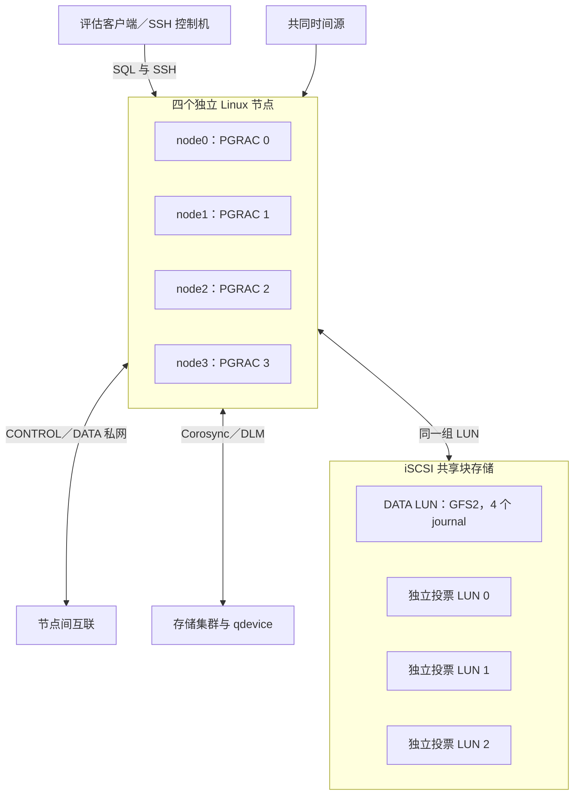

# PRE2 四节点安装手册

Author: SqlRush <sqlrush@gmail.com>

客户源码：已发布标签 `v0.133.1-pre2.1`，精确 commit `2d857abffc76a5cbfbc1b01c7d99b82ab0375f46`。本文是功能评估技术预览的安装初稿，面向隔离的 Ubuntu 24.04 ARM64 四节点环境。不要用于承载生产数据。

**当前交付边界：** 数据库源码可以从 GitHub 下载；实验室完成首次共享建库所用的 `fresh_controller.py` 配套工具尚不在这个版本的公开 `main` 中。第 6–8 节需要交付方另行提供完整工具包及本环境的输入文件。未取得这些文件时，可完成下载、编译和环境准备，不能按旧 PRE1 seed/clone 流程代替 PRE2 建库。本页不提供一个尚不存在的一键安装器。

文中每段 shell 命令均逐条检查返回值；脚本化执行时设置 `set -euo pipefail`，任一步失败就停在该步。除明确标为同一控制机会话的变量外，进入另一台节点须重新设置本机变量。所有 `REPLACE_WITH_...`、`REQUEST_ID` 和示例地址都应先替换，不能原样用于真实部署。

本文的最新实操记录来自 `c45bdc5d4392751a33659acf8dcaa2b76254e73a` 的 Linux ARM64 release 构建。两次源码之间数据库及部署入口未变化，但 **commit 和二进制验证记录仍分别记账**。该次记录完成编译、初始化、四端首次查询和数据装载，随后长时间运行失败，正常停止未通过。`2d857` 的历史有限范围验证和新的镜像验证也分开记录；不能据此宣称新镜像或完整安装链已经通过。使用范围及限制见[产品说明](product-overview.md)。

## 1. 验证标记与执行顺序

“已验证”只指已有实验室记录中的指定步骤，不保证其他硬件或本页改写后的示例已重新执行。本文将地址、目录名和账号替换为示例值，**没有重新运行整篇手册**。

| 步骤 | 实验室验证状态 |
|---|---|
| 2. 下载与编译 | **流程已验证**：`c45bd` 的 Linux ARM64 release 构建、安装及运行库检查；本文固定客户源码 `2d857`、使用 `-j4`，新构建结果须自行检查 |
| 3. 节点、时间、网络与 SSH | **已有环境使用过**：四个 4 vCPU / 8 GiB VM；本页从空操作系统安装的命令组合**未重新验证** |
| 4. iSCSI、集群服务与 GFS2 | **已有环境使用过**：共享 DATA LUN、GFS2 四端挂载；新的设备/集群必须单独验证 |
| 5. 投票盘 | **已验证**：独立新介质初始化、四端直接 I/O 读回；现有介质不得再次初始化 |
| 6. 配置 | **已验证**：实验室工具渲染与安装；工具对外获取方式**待配齐** |
| 7. 初始化及分发 | **已验证**：一次真实 cohort `initdb`，四份本地目录分别分发；不是四次独立 `initdb` |
| 8. 启动前检查与启动 | **已验证**：四端启动前检查、首次 `SELECT 1`、默认参数读回 |
| 9. 功能验证 | **部分已验证**：四端查询、装载及读写执行；本文的小表示例**未重新执行**，不代表长期运行通过 |
| 10. 停止与再次启动 | **有历史成功记录，但本次候选未通过正常停止**；仅给出正常操作和失败处置，不能承诺总能成功 |

## 2. 从 GitHub 获取并编译

### 2.1 安装编译依赖

执行位置：兼容四个节点的 Ubuntu 24.04 ARM64 Linux 构建机。使用普通账号编译；管理员安装依赖。包名来自现有 [Linux 安装说明](../user-guide/install.md)，新机器上的完整包安装组合尚未重新验证。

```bash
sudo apt-get update
sudo apt-get install -y --no-install-recommends \
  build-essential git pkg-config bison flex perl python3 \
  libreadline-dev zlib1g-dev libssl-dev libipc-run-perl
```

本文采用实验室的 OpenSSL、无 ICU 构建。不要把旧 MVP 手册中的“关闭 OpenSSL”配置套到 PRE2。其他发行版、x86_64 或额外 ICU/LZ4/Zstandard 组合不属于这份 ARM64 实操记录。

### 2.2 固定源码并构建

执行位置：Linux 构建机。以下 `SRC`、`BUILD`、`PREFIX` 为专用新目录，不覆盖现有安装。

```bash
PGRAC_SOURCE_SHA=2d857abffc76a5cbfbc1b01c7d99b82ab0375f46
git clone https://github.com/sqlrush/pgrac.git pgrac-source
git -C pgrac-source checkout --detach "$PGRAC_SOURCE_SHA"
test "$(git -C pgrac-source rev-parse HEAD)" = "$PGRAC_SOURCE_SHA"
SRC=$(realpath pgrac-source)
mkdir pgrac-build
BUILD=$(realpath pgrac-build)
PREFIX=/opt/pgrac/pre2-2d857abffc
cd "$BUILD"

"$SRC/configure" --prefix="$PREFIX" \
  --enable-cluster --enable-depend --enable-tap-tests \
  --with-ssl=openssl --without-icu
make -j4
make -j4 install DESTDIR="$BUILD/stage"

"$BUILD/stage$PREFIX/bin/postgres" --version
"$BUILD/stage$PREFIX/bin/pg_config" --configure
ldd "$BUILD/stage$PREFIX/bin/postgres"
sha256sum "$BUILD/stage$PREFIX/bin/postgres"
```

成功条件：每条命令返回 0，`ldd` 没有 `not found`，构建配置含 `--enable-cluster` 和 OpenSSL。实验室 release 构建没有启用 `--enable-cassert` 或 `--enable-debug`。`postgres --version` 不能代替源码 commit 和构建配置。

由管理员把同一个 `stage$PREFIX/` 完整目录分发到四节点的 `$PREFIX/`，保留文件权限；在控制机也安装同版本客户端。先确认目标不存在、目标节点没有使用该安装目录的数据库进程，再安装。四节点分别运行上述版本、运行库和 SHA-256 检查；分发同一产物时四个 `postgres` 的校验值应一致。源码、`scripts/deploy/` 和公开手册不由 `make install` 全部安装，应单独保留。

自行编译的二进制不要求与实验室包有同一 SHA-256，但应记录自己这次构建的实际值。领取预编译包时使用随包的 `SHA256SUMS` 校验，不套用别的 commit 或构建模式的校验值：

```bash
sha256sum --check SHA256SUMS
```

## 3. 准备四节点、网络、时间和账号

### 3.1 拓扑与容量

实验室采用四个独立 KVM/libvirt VM，每个 4 vCPU、8 GiB 内存，另有 Linux 管理/存储主机。共享内存启动检查曾读到每实例约 4639 MiB；8 GiB 是该小型配置的实验室资源，**不是通用最低配置承诺**。旧 PRE1 的 16 GiB 记录不能直接当作本次配置。



图中的管理、存储、仲裁角色可以在评估实验室共用一台管理机；这不形成四个独立故障域，也不提供数据库高可用。

本页以下统一使用示例值。开始前逐项替换并记录实际值：

| 项目 | node0 | node1 | node2 | node3 |
|---|---|---|---|---|
| 主机名 | pgrac0 | pgrac1 | pgrac2 | pgrac3 |
| `cluster.node_id` | 0 | 1 | 2 | 3 |
| 示例私网地址 | 10.20.0.10 | 10.20.0.11 | 10.20.0.12 | 10.20.0.13 |
| SQL | 5432 | 5432 | 5432 | 5432 |
| CONTROL | 6540 | 6540 | 6540 | 6540 |
| DATA（两个 LMS worker） | 6541–6542 | 6541–6542 | 6541–6542 | 6541–6542 |
| 本地 PGDATA | `/srv/pgrac/eval01/node0/data` | `/srv/pgrac/eval01/node1/data` | `/srv/pgrac/eval01/node2/data` | `/srv/pgrac/eval01/node3/data` |
| 本地日志目录 | `/var/log/pgrac/eval01/node0` | `/var/log/pgrac/eval01/node1` | `/var/log/pgrac/eval01/node2` | `/var/log/pgrac/eval01/node3` |

公共示例值：安装 `$PREFIX=/opt/pgrac/pre2-2d857abffc`，配置目录 `/etc/pgrac/eval01`，共享挂载 `/srv/pgrac-shared`，本次新数据库目录 `/srv/pgrac-shared/eval01`。所有这些目录必须与其他评估数据分开。`PREFIX` 是各节点各自 shell 的变量，进入新 SSH 会话时也需设置。

### 3.2 账号与操作系统组件

执行位置：四个数据库节点，由管理员操作。下面是包安装示例；实验室已有这些组件，但本页没有重建操作系统验证此组合。

```bash
sudo apt-get install -y openssh-server systemd-timesyncd open-iscsi \
  corosync corosync-qdevice pacemaker pcs resource-agents-extra fence-agents-virsh \
  dlm-controld gfs2-utils lvm2 lvm2-lockd libquorum5 libcmap4
sudo apt-get install -y "linux-modules-extra-$(uname -r)"
modinfo gfs2
modinfo dlm
```

安装发行版对应的内核模块包；若所用内核没有该包或 GFS2/DLM 模块，先修正内核与模块匹配，不继续挂载。另为计划下次启动的内核检查模块是否齐全。

四节点创建非 root 数据库账号 `pgrac`，使用相同数字 UID/GID。实验室为 `10001:10001`；客户环境先检查是否冲突，再选择空闲值。管理员只为新建的本次目录授权，不递归改写已有共享数据卷所有权。例如在 node0：

```bash
id pgrac
sudo install -d -o pgrac -g pgrac -m 0700 \
  /srv/pgrac/eval01 /srv/pgrac/eval01/node0 \
  /var/log/pgrac/eval01/node0 /var/log/pgrac/eval01/node0/socket
```

node1–3 使用各自编号。此时不要创建非空 PGDATA 或共享 `data`、`wal`、`undo` 子树，它们由第 7 节初始化。

### 3.3 时间、SSH 和连通性

实验室管理机运行 chrony，四节点使用 systemd-timesyncd 指向管理机。给管理机配置可信上游时间源及仅对所需私网的 NTP 服务权限；在四节点的 timesyncd 配置中设置该 NTP 地址，启动时间同步后检查。不要通过在线手动改时钟消除偏差。

例如，在节点的 `/etc/systemd/timesyncd.conf.d/pre2.conf` 中填写实际时间服务器地址（以下为示例）：

```ini
[Time]
NTP=10.20.0.20
FallbackNTP=
```

```bash
# 管理/时间服务器
sudo apt-get install -y chrony corosync-qnetd
chronyc tracking
chronyc sources -v
# 数据库节点
sudo systemctl enable --now systemd-timesyncd
timedatectl status
timedatectl show -p NTPSynchronized
timedatectl timesync-status
```

在控制机配置到四节点的管理 SSH 公钥登录，核验服务器主机公钥后保存到 `known_hosts`。不要使用自动忽略主机身份的 SSH 选项。管理账号应有部署步骤所需的明确 `sudo` 权限，数据库始终由 `pgrac` 启动。

```bash
# 在控制机；deploy 为示例管理账号，先配置已核验的 known_hosts 与专用密钥。
ssh -o BatchMode=yes -o StrictHostKeyChecking=yes deploy@pgrac0 'hostname; id; date -Is'
```

逐一检查四节点；配置稳定的名称解析、相同 MTU 和双向路由。防火墙按实际配置开放：控制机到各节点 SSH/SQL，节点间 CONTROL 6540、DATA 6541–6542，以及 Corosync/Pacemaker、qdevice/qnetd 和 iSCSI 目标所需端口。iSCSI 通常为 TCP 3260，实际以目标 portal 为准。只允许所需私网，不向公网开放 SQL、存储或集群管理端口。

## 4. iSCSI、Corosync/Pacemaker/DLM 与 GFS2

**验证状态：已有实验室环境运行过，新的从零存储部署尚需目标环境验证。** 本节由存储管理员执行。准备一块 DATA LUN 和三块不同的投票 LUN，四节点必须看到同样的 WWID；不能把四块本地盘或四份文件复制品当作共享盘。

### 4.1 接入共享块设备

在 iSCSI 目标侧为四个不同 initiator IQN 配置明确的 LUN 映射和访问权限。本文不提供覆盖现有目标配置的脚本。记录目标 portal、IQN、LUN、WWID、容量、扇区大小和缓存模式。实验室 DATA 为 16 GiB、投票 LUN 各 16 MiB；DATA 容量需按本次数据与空间增长预留，不能把 16 GiB 当长跑容量保证。

四节点上的 initiator 操作示例，替换变量后仅登录指定目标：

```bash
PORTAL=10.20.0.20:3260
TARGET_IQN=iqn.2026-10.example:pgrac-eval
sudo iscsiadm -m discovery -t sendtargets -p "$PORTAL"
sudo iscsiadm -m node -T "$TARGET_IQN" -p "$PORTAL" \
  --op update -n node.startup -v automatic
# 仅在该目标尚未登录时执行；先核对既有会话，避免重复登录。
sudo iscsiadm -m node -T "$TARGET_IQN" -p "$PORTAL" --login
sudo systemctl enable --now open-iscsi
sudo iscsiadm -m session
lsblk -b -o NAME,TYPE,SIZE,LOG-SEC,WWN,FSTYPE,MOUNTPOINTS
```

确认 `open-iscsi.service` 管理这些会话，并核对四节点的实际设备身份。后续使用 `/dev/disk/by-id/scsi-<WWID>`，不使用可能变化的 `/dev/sdX` 字母。投票 LUN 不建分区、不加入 VG、不格式化文件系统，也不挂载。

### 4.2 建立存储集群

按发行版工具配置 Corosync 四成员、Pacemaker 和 qdevice/qnetd；为 VM 设置逐节点准确的隔离映射。qdevice 必须使用 `net` 模型、`lms` 算法、`tls: required`，并完成 qnetd 与四端 qdevice 的证书配置。不要配置显式 `expected_votes`、`quorum.device.votes` 或开启 `two_node`、`auto_tie_breaker`、`last_man_standing`。以下是 `corosync.conf` 中应核对的 quorum 片段，地址需替换；它不是可覆盖整份集群配置的文件：

```conf
quorum {
    provider: corosync_votequorum
    device {
        model: net
        net {
            host: 10.20.0.20
            algorithm: lms
            tls: required
        }
    }
}
```

在四端 `/etc/corosync/uidgid.d/pgrac` 为数据库账号配置 Corosync IPC 读取权限：

```conf
uidgid {
    uid: pgrac
    gid: pgrac
}
```

在数据库尚未启动时按集群管理工具加载上述配置。正常状态下四个节点在线、qdevice 已连接、仲裁有效，DLM 在全部节点工作。实验室该配置健康时共 7 票。以下是实际使用的检查命令；`root` 能读取不代表数据库账号有 IPC 权限：

```bash
sudo corosync-quorumtool -s
sudo corosync-qdevice-tool -s
sudo -u pgrac corosync-quorumtool -s
sudo corosync-cmapctl
sudo pcs status --full
sudo pcs resource config
sudo pcs stonith config
sudo dlm_tool ls
```

记录 Corosync `totem.cluster_name` 及每个 PGRAC node ID 对应的 Corosync nodeid；它们写入第 6 节 `storage_quorum`。PGRAC 的 0–3 与 Corosync 的 1–4 是实验室映射，不能在另一套环境里凭编号猜测。

使用 Pacemaker 管理 DLM、共享卷（若采用 LVM）和文件系统的启动顺序及同节点依赖；不要另用系统自动挂载同时争用这些资源。实验室沿用已配置的 DLM/lvmlockd 集群资源；PRE2 专用 DATA LUN 直接创建 GFS2。若客户改用共享 LVM，先完成共享 VG/LV 与锁服务部署，不能直接套用裸 DATA LUN 命令。

存储隔离保持开启，使用明确的 OFF 目标；已有实验室采用 `stonith-action=off` 和 fence resource 的 `pcmk_reboot_action=off`。**不要把数据库注册成故障后自动启动的 Pacemaker 资源，也不要关闭 fencing 使挂载继续。** 具体组件准备与检查可补充阅读 [GFS2 准备说明](../deployment/pre1-storage.md) 和 [投票/隔离说明](../deployment/pre1-voting-fencing.md)。数据库故障切换不在本次评估范围。

### 4.3 仅在新 DATA LUN 上创建并挂载 GFS2

以下命令会创建文件系统，**仅对已确认没有旧数据、未挂载的本次新 DATA LUN 执行一次**。绝不能用格式化修复挂载失败。四端先核对同一 WWID、容量、无旧文件系统和正确用途，由 node0 一次创建：

```bash
DATA_DEV=/dev/disk/by-id/scsi-REPLACE_WITH_DATA_WWID
sudo lsblk -b -o NAME,TYPE,SIZE,FSTYPE,MOUNTPOINTS "$DATA_DEV"
sudo blkid -p "$DATA_DEV"
# 仅在管理员确认它是本次空 DATA LUN 后执行；pre2eval 须等于 Corosync cluster_name。
sudo mkfs.gfs2 -p lock_dlm -t pre2eval:pre2data -j 4 -J 128 -b 4096 "$DATA_DEV"
```

四节点预先创建挂载点，再通过 Pacemaker 创建 GFS2 Filesystem clone，指定相同设备与挂载点 `/srv/pgrac-shared`。以下为实验室资源命令的脱敏形状，在一个集群管理节点执行；`pre2-locking-clone` 必须替换为本环境已经正常运行的 DLM/锁服务 clone 名称：

```bash
sudo pcs resource create pre2-data-fs ocf:heartbeat:Filesystem \
  device="$DATA_DEV" directory=/srv/pgrac-shared fstype=gfs2 \
  options=noatime,rgrplvb op monitor interval=10s on-fail=fence \
  clone interleave=true
sudo pcs constraint order start pre2-locking-clone then pre2-data-fs-clone
sudo pcs constraint colocation add pre2-data-fs-clone with pre2-locking-clone
```

新集群的 DLM/lvmlockd 资源与隔离映射必须由存储管理员先配置完成；上述三条命令不负责创建它们。四节点检查：

```bash
findmnt -T /srv/pgrac-shared -o TARGET,SOURCE,FSTYPE,OPTIONS,UUID
df -h /srv/pgrac-shared
stat -c '%u:%g %a %n' /srv/pgrac-shared
sudo pcs status --full
```

结果应是同一 GFS2 UUID、正确 DATA 设备和四端已挂载；不能落在未挂载的本地根目录。不得用 `lock_nolock` 或 `localflocks`。在初始化前，用专用 scratch 目录完成跨节点写后读及锁检查，操作见 [storage probe](../deployment/pre1-storage.md)。由管理员为本次数据库用户授予新共享目录父级的精确权限。

## 5. 准备三个投票 LUN

**验证状态：实验室执行过新投票介质格式化及四端读回。** 本节只在数据库尚未建立、所有实例未启动时执行；正常重启绝不重复。

投票盘使用三块不同的 whole SCSI NAA LUN，逻辑扇区 512 字节。实验室每块 16777216 字节；不要按旧工具的最小固定区长度缩小介质，正常运行还需要后续记录空间。按 WWID 对三块设备单独赋予 `root:pgrac 0660` 权限并用精确 udev 规则持久化；不要给数据库账号整个 `disk` 组权限。

本次实验室的实际制备方式是：在 LIO 存储目标上用匹配版本的 `native_vote` 工具**独占创建三个全新文件**，再各自导出为一个 write-through iSCSI LUN。它不是在已有块设备上就地格式化。交付方需提供这个介质制备工具和准确的 LIO 映射配置；当前没有在本文声明已验证的“对任意存储阵列空 LUN 初始化”命令。

以下是已执行入口的脱敏形状，由存储管理员在目标机执行。`NATIVE_VOTE` 指交付方提供的工具，`NEW_LUN_DIR` 是本次专用的新目录；三个文件必须均不存在：

```bash
NATIVE_VOTE=/opt/pgrac-admin/native_vote
NEW_LUN_DIR=/var/lib/pgrac-storage/eval01
test ! -e "$NEW_LUN_DIR/vote0.img"
test ! -e "$NEW_LUN_DIR/vote1.img"
test ! -e "$NEW_LUN_DIR/vote2.img"
sudo "$NATIVE_VOTE" "$NEW_LUN_DIR/vote0.img" 0
sudo "$NATIVE_VOTE" "$NEW_LUN_DIR/vote1.img" 1
sudo "$NATIVE_VOTE" "$NEW_LUN_DIR/vote2.img" 2
```

由目标管理员将这三个文件分别注册为 LIO fileio backstore，使用 `write_back=false`、各自唯一的 serial/WWID，再映射到四个合法 initiator。记录每个索引与 WWID 的对应关系，不覆盖旧 backstore 或旧 LUN。目标服务重启后仍需保持这些映射；实验室已有恢复编排，不能假设临时 `targetcli` 命令已形成客户环境的持久配置。

四节点重新扫描会话、核对三盘身份/容量/权限，并对每个索引独立读回。以盘 0 为例，交付方应将同一工具装到各节点：

```bash
sudo iscsiadm -m session -R
sudo udevadm settle
VOTE0_DEV=/dev/disk/by-id/scsi-REPLACE_WITH_VOTE0_WWID
sudo lsblk -b -o NAME,MAJ:MIN,SIZE,LOG-SEC,TYPE,FSTYPE,MOUNTPOINTS "$VOTE0_DEV"
sudo udevadm info --query=property --name="$VOTE0_DEV"
stat -L -c '%a %U %G' "$VOTE0_DEV"
sudo -u pgrac /opt/pgrac-admin/native_vote --attest "$VOTE0_DEV" 0
```

三盘在四端共 12 次 `--attest` 都应成功。该命令用于新介质准备，不是对运行中投票盘的健康查询。任一错误保留设备与输出并停止，不用 PRE1 的 `format-fresh`、测试伪造记录、`dd` 或全零文件替代本次初始化。初始化、SQL 启动及正常重启都不能清空已有投票状态。设备检查的补充说明见[旧投票工具手册](../deployment/pre1-voting-fencing.md)，其中旧格式化步骤不作为本次 PRE2 入口。

## 6. 配置 pgrac.conf 与共享配置

### 6.1 准备配套部署工具和真实输入

**验证状态：实验室的工具流程已执行；当前公开源码缺少该工具目录，需交付方配齐。** 所需包应同时包含 `pre1/` 和 `pre2/lab/`，后者提供 `fresh_controller.py`、`install_guest_tools.py` 及其依赖。只有一个 `fresh_controller.py` 文件不够。不要使用同名测试桩或自行补写数据库元数据。

在控制机将完整工具包放到专用目录，并定义以下变量（全部使用实际绝对路径）：

```bash
TOOLS=/opt/pgrac-deploy-tools
LAB="$TOOLS/pre2/lab"
SRC=/absolute/path/to/pgrac-source
WORK=/var/lib/pgrac-deploy/eval01
GUEST_TOOLS=/opt/pgrac-pre2-lab-tools-eval01
mkdir -m 700 "$WORK"
test -f "$LAB/fresh_controller.py"
test -f "$TOOLS/pre1/profile.schema.json"
python3 "$LAB/fresh_controller.py" new-identity > "$WORK/identity.json"
```

为本次新数据库准备 `$WORK/request.json`。每一项来自真实环境；`new-identity` 的结果只用于这次新建，不复用旧数据库身份。请求字段如下：

| 字段 | 填写内容 |
|---|---|
| `schema_version`、`profile_id` | `1`、`pre2-gfs2-arm64-lab-v1` |
| `cluster_name`、`dataset_id` | 如 `pre2eval`、`eval01`；新命名，不覆盖旧目录 |
| `controller_addr` | 被允许连接 SQL 的控制机私网 IPv4 |
| `shared_mount`、`fs_uuid` | `/srv/pgrac-shared` 及四端实际 GFS2 UUID |
| `authority_uuid`、`storage_uuid`、`system_identifier` | `identity.json` 中的新值，保持原类型与格式 |
| `database_incarnation` | 新建为 `1` |
| `config_dir` | 四端相同绝对路径 `/etc/pgrac/eval01` |
| `direct_io` | 实验室为 `data` |
| `storage_write_cache` | 实际 write-through 时为 `{"mode":"write-through","flush_verification":null}`；不能把 write-back 设备写成 write-through |
| `memory_profile`、`guest_memory_gib` | 实验室为 `lab-8g`、`8`；更改资源需重新核对共享内存用量 |
| `storage_quorum` | 如 `{"cluster":"pre2eval","nodes":{"0":1,"1":2,"2":3,"3":4}}`，必须与真实 Corosync 配置一致 |
| `voting_wwids` | 三盘真实 WWID 字符串数组，顺序为 0、1、2 |
| `nodes` | 以下格式的四份节点记录，node ID 为 0–3 |

每份节点记录应包含：

| 字段 | 获取或填写方法 |
|---|---|
| `node_id` | 唯一的 0、1、2 或 3 |
| `vm_uuid` | 本 VM 的 `/sys/class/dmi/id/product_uuid` |
| `machine_id`、`boot_id` | `/etc/machine-id`、`/proc/sys/kernel/random/boot_id`；不能复制另一节点的身份 |
| `admin_endpoint` | `{"host":"实际地址","port":22,"user":"实际管理账号","identity_file":"控制机上的专用私钥路径"}` |
| `ssh_host_key` | 核验后的完整 `ssh-ed25519 ...` 公钥，不能填私钥 |
| `sql_addr`、`control_addr`、`data_base_addr` | 本节点真实 IPv4:port；本页示例分别为 5432、6540、6541 |
| `data_workers` | `2`，与 LMS 配置一致 |
| `uid`、`gid` | 本节点 `id pgrac` 的数字值，四端一致 |
| `install_root` | 同一版本安装目录，如 `/opt/pgrac/pre2-2d857abffc` |
| `pgdata`、`log_root` | 本节点专用的新目录，采用第 3 节的路径 |

节点字段格式参见公开 [profile.schema.json](../../scripts/deploy/pre1/profile.schema.json) 中的 `$defs.node`；这是字段格式参考，不是把整份 PRE1 profile 当 PRE2 request。请求文件和私钥只保存在受保护的管理目录，不提交到源码仓库。

在四节点安装工具，然后生成计划与配置；`POSTGRES_SHA256` 必须是第 2 节实际分发的二进制校验值：

```bash
python3 "$LAB/install_guest_tools.py" --request "$WORK/request.json" \
  --dest "$GUEST_TOOLS" --out "$WORK/tools-installed.json"
python3 "$LAB/fresh_controller.py" plan \
  --request "$WORK/request.json" --source "$SRC" \
  --binary-sha256 "$POSTGRES_SHA256" --out "$WORK/plan.json"
python3 "$LAB/fresh_controller.py" render \
  --plan "$WORK/plan.json" --request "$WORK/request.json" --source "$SRC" \
  --out-dir "$WORK/rendered"
```

要求命令成功，计划中 `creation` 为 `cohort`，配置无拒绝项，并逐项核对第 6.3 节。本地旧工具副本与实验室已安装的工具可能不同；交付方应提供与实际配置匹配的完整工具包，不仅凭目录名或旧 README 选择它。不要运行旧 `writers`/`advance` 示例来代替 cohort/distribute；也不要用 `--local-validation` 把四机检查变成单机检查。

### 6.2 检查生成的三个本地配置文件

**验证状态：实验室使用过同样的文件形状；以下路径和地址是替换后的示例。** 工具为每节点生成 `pre2-bootstrap.conf`、`pgrac.conf`、`pre2-hba.conf`。

四节点的 `pgrac.conf` 拓扑相同：

```ini
[cluster]
name = pre2eval

[node.0]
interconnect_addr = 10.20.0.10:6540
data_addr = 10.20.0.10:6541

[node.1]
interconnect_addr = 10.20.0.11:6540
data_addr = 10.20.0.11:6541

[node.2]
interconnect_addr = 10.20.0.12:6540
data_addr = 10.20.0.12:6541

[node.3]
interconnect_addr = 10.20.0.13:6540
data_addr = 10.20.0.13:6541
```

node0 的 `pre2-bootstrap.conf` 示例；其他节点只使用自己的编号和对应渲染文件：

```conf
cluster.enabled = 'on'
cluster.shared_config = 'on'
cluster.controlfile_shared_authority = 'on'
cluster.shared_data_dir = '/srv/pgrac-shared/eval01/data'
cluster.wal_threads_dir = '/srv/pgrac-shared/eval01/wal'
cluster.undo_tablespace_path = '/srv/pgrac-shared/eval01/undo'
cluster.node_id = 0
hba_file = '/etc/pgrac/eval01/pre2-hba.conf'
cluster_name = 'pre2eval_node0'
cluster.voting_disks = '/dev/disk/by-id/scsi-VOTE0_WWID,/dev/disk/by-id/scsi-VOTE1_WWID,/dev/disk/by-id/scsi-VOTE2_WWID'
```

共享配置由初始化时的配置请求生成，不是在四个 `postgresql.conf` 中各自追加一份完整参数。不要手改共享配置对象、删除本地 `postgresql.auto.conf` 来绕过冲突，或通过 `postgres -c` 覆盖共享参数。启动命令的 `-c config_file=...` 仅选择正确的本地入口文件。

生成的 HBA 是**隔离实验室策略**：本机 peer、只允许指定控制机 `/32` 的数据库管理连接，另有评估账号的 SCRAM 条目；其中管理连接使用 `trust`。只有控制机和网络完全受信时才可照用，不能扩成 `0.0.0.0/0`。面向其他用户的账号、口令和 TLS 策略需另行配置并验证；本文未将其标为已经实验室验证。

### 6.3 核对关键参数

下表区分实际实验室配置与产品默认值；不要把实验室关闭 autovacuum 的设置当作长期运行建议。

| 参数/项目 | 本流程值 | 使用说明 |
|---|---|---|
| 并发业务连接 | 每节点不超过 16 | 建议先 1 个连接做功能验证；不是要求将 `max_connections` 改成 16 |
| `max_connections` | 本次实际初始配置 `256` | 在初始化前确定，保留管理连接空间；不是产品默认，也不是已验证 256 并发 |
| `shared_buffers` | `lab-8g` 模板 `512MB` | 与模板中的集群内存表容量一起使用 |
| `cluster.lms_workers` | `2` | 产品默认；DATA 基端口及下一端口都需可达 |
| `cluster.gcs_block_retransmit_initial_backoff_ms` | `10` | 产品默认，不为掩盖错误改大超时或重试 |
| `cluster.undo_cleaner_enabled` | `on` | 产品默认，保持开启 |
| `cluster.xnode_profile`、`cluster.update_trace` | `off` | 本版默认，评估不需要打开逐事务跟踪 |
| `fsync`、`full_page_writes`、`synchronous_commit` | `on` | 保持开启 |
| 数据页校验 | `initdb -k` | 共享模式必需，启动后读回 `SHOW data_checksums` |
| `cluster.shared_config`、`shared_catalog`、`controlfile_shared_authority` | `on` | 按 PRE2 模板，不套用旧 PRE1 的 off 值 |
| `cluster.crossnode_runtime_visibility`、`cluster.undo_gcs_coherence` | `on` | 使用模板值，不用关闭检查解决 SQL 拒绝 |
| `cluster.storage_quorum_cluster`、`cluster.storage_quorum_nodes` | 实际 Corosync 名称/映射 | 四节点保持一致 |
| `debug_io_direct` | 模板 `data` | 与已经准备的存储方式一致 |
| `autovacuum` | 实验室模板 `off` | 仅短时受控评估；长期表膨胀/冻结仍是已知限制，不能据此建议长期关闭 |
| `restart_after_crash` | 模板 `off` | 不安排异常退出后自动重启或故障接管 |

除已列出的安装模板值外，保留本版本默认值。详细参数含义见[参数参考](../reference/cluster-observability/README.md)。

## 7. 初始化同一个共享数据库

**验证状态：上述 `c45bd` 实操记录已完成真实 cohort 创建与四端分发；新的 `2d857` 镜像副本待单独验证。** 所有实例应尚未启动，投票盘已准备，GFS2 正确挂载，本次共享 DATA/WAL/UNDO 和本地 PGDATA 均为新目标。

执行位置：控制机，继续使用第 6 节变量。

```bash
python3 "$LAB/fresh_controller.py" cohort \
  --plan "$WORK/plan.json" --request "$WORK/request.json" --source "$SRC" \
  --transport ssh --tools-root "$GUEST_TOOLS" --out "$WORK/cohort.json"
python3 "$LAB/fresh_controller.py" distribute \
  --plan "$WORK/plan.json" --request "$WORK/request.json" --source "$SRC" \
  --transport ssh --tools-root "$GUEST_TOOLS" --out "$WORK/distribute.json"
```

工具在 node0 以 `pgrac` 身份执行的实际生产入口形状如下，**用于核对日志，不与上面的 cohort 命令重复运行**：

```bash
"$PREFIX/bin/initdb" -D /srv/pgrac/eval01/cohort -k -A trust --no-locale \
  --pgrac-initdb-cohort \
  --pgrac-initdb-shared-config=/srv/pgrac/eval01/pre2-initial-config-REQUEST_ID.conf
```

`REQUEST_ID` 由工具产生。`-D` 在此是新建 cohort 的本地父目录，输出 `node_0`、`node_1`、`node_2`、`node_3`；共享数据及每节点独占的 WAL 线程由同一次初始化创建。分发步骤把各自的 `node_N` 原样送至对应节点的 PGDATA，不是把 node0 的运行中 PGDATA 克隆给其他节点。保留符号链接和权限，不手工改 `pg_control`、WAL、系统标识或初始化结果。

实验室此命令使用 `C` locale，读回编码为 `SQL_ASCII`。UTF-8、其他 locale 和排序规则组合未由本流程验证；需要中文或其他编码语义评估时，应在新数据库创建前安排对应配置验证，不能把本步骤当作已经验证 UTF-8。

成功条件：cohort 返回 `PASS`，distribution 为 `PGDATA_DISTRIBUTED` 且 0–3 四节点均为 `PGDATA_INSTALLED`。初始化的成功提示仍可能包含 “shared startup remains closed”；这时继续配置和四节点启动，不表示业务已经开放。失败时保留全部部分目录和输出，不对同一目标反复初始化。

接着在四节点安装 `$WORK/rendered/nodeN/` 中的三份本地配置到请求的 `config_dir`，文件归 `pgrac:pgrac`、权限 `0600`，目录 `0700`。确保 socket 目录存在且归本节点数据库账号。示例在 node0 的管理员会话中执行，`/tmp/pre2-node0` 是从控制机安全传输过来的临时配置目录：

```bash
sudo install -d -o pgrac -g pgrac -m 0700 /etc/pgrac/eval01
sudo install -o pgrac -g pgrac -m 0600 \
  /tmp/pre2-node0/pre2-bootstrap.conf /tmp/pre2-node0/pgrac.conf \
  /tmp/pre2-node0/pre2-hba.conf /etc/pgrac/eval01/
```

在安装前确认该配置目录不属于旧数据库；node1–3 分别传输自己的目录，不能把 node0 的 bootstrap 文件复制给其他节点。

## 8. 启动前检查与四节点启动

### 8.1 检查入口及共享内存

**验证状态：四端已执行成功，实验室各读回 4639 MiB。** 控制机执行：

```bash
python3 "$LAB/fresh_controller.py" bootstrap-check \
  --plan "$WORK/plan.json" --request "$WORK/request.json" --source "$SRC" \
  --transport ssh --tools-root "$GUEST_TOOLS" --out "$WORK/bootstrap-check.json"
```

成功结果为 `BOOTSTRAP_PREPARED_ALL`。这一步检查成功尚不等于数据库已经可用。它调用的单节点命令形状为：

```bash
sudo -u pgrac env LD_LIBRARY_PATH="$PREFIX/lib" \
  "$PREFIX/bin/postgres" -D /srv/pgrac/eval01/node0/data \
  -c config_file=/etc/pgrac/eval01/pre2-bootstrap.conf -C shared_memory_size
```

返回非零、配置冲突、目录身份不符或内存不足时，先解决实际输入；不要改成单机验证、跳过检查或关闭守卫。再次核对 Corosync/Pacemaker 四节点健康和 GFS2 挂载。

### 8.2 启动所有成员，再等待就绪

**验证状态：实验室使用这些 `pg_ctl` 参数启动四端，并完成首次查询。** 各节点使用自己的 PGDATA、日志和已安装配置；例如 node0：

```bash
sudo -u pgrac env LD_LIBRARY_PATH="$PREFIX/lib" \
  "$PREFIX/bin/pg_ctl" -D /srv/pgrac/eval01/node0/data \
  -l /var/log/pgrac/eval01/node0/server.log -W start \
  -o '-c config_file=/etc/pgrac/eval01/pre2-bootstrap.conf'
```

控制机尽快向四节点发出上述启动请求，全部发出后再等待。不要等 node0 单独对外服务后才启动其余节点。`-W` 表示不在本条命令里等待，RC 0 仅表示启动请求已发出。

在四节点分别检查日志与 `pg_ctl status`，然后以 `pgrac` 通过各自本地 socket 查询；node0 示例：

```bash
sudo -u pgrac "$PREFIX/bin/psql" -X -v ON_ERROR_STOP=1 \
  -h /var/log/pgrac/eval01/node0/socket -p 5432 -d postgres -c 'SELECT 1;'
```

首次启动需要等待所有成员共同就绪。若未就绪，保留四端日志和状态，不重新初始化、清空投票盘或额外运行测试用激活入口。实验室这条路径没有另一个需要手工执行的 activation 步骤。

## 9. 验证配置与小规模读写

### 9.1 四端身份、成员和参数

**验证状态：实验室已读回身份、成员、默认参数及首次查询；以下查询集合是面向用户的整理。** 四个 SQL 端点都执行：

```sql
SELECT version();
SELECT system_identifier FROM pg_control_system();
SHOW cluster.node_id;
SHOW data_checksums;
SELECT * FROM pg_cluster_nodes ORDER BY node_id;
SELECT * FROM cluster_get_membership();
SELECT * FROM pg_cluster_quorum_state;
SELECT category, key, value FROM cluster_dump_state()
 WHERE category = 'lifecycle' AND key = 'native_writer';
SELECT name, setting, source, pending_restart FROM pg_settings
 WHERE name IN ('cluster.shared_config', 'cluster.shared_catalog',
  'cluster.controlfile_shared_authority', 'cluster.lms_workers',
  'cluster.gcs_block_retransmit_initial_backoff_ms', 'cluster.undo_cleaner_enabled',
  'cluster.xnode_profile', 'cluster.update_trace', 'max_connections',
  'fsync', 'full_page_writes', 'synchronous_commit', 'autovacuum')
 ORDER BY name;
```

要求四端 system identifier 相同、自己的 node ID 正确，校验开启；四个已声明成员都正常加入，quorum 有效，共享模式与第 6 节配置相符。`pg_cluster_nodes` 只是拓扑列表，不能仅凭有四行就判断四台数据库都健康；`pg_cluster_voting_disks` 的逐盘占位输出也不能代替有效 quorum。

### 9.2 功能评估示例

**验证状态：四节点 SQL 读写已有实验室执行记录；下述用户小表示例未重新运行。** 仅在四端完成上面的检查后开始，先每节点一个连接，使用短事务和新建评估表。不做负载扫描或故障切换。

仅在 node0 创建一次表和初始数据，全部完成后再进行并行访问：

```sql
CREATE SCHEMA pre2_eval;
CREATE TABLE pre2_eval.check_rows (id integer PRIMARY KEY, payload text NOT NULL);
INSERT INTO pre2_eval.check_rows VALUES (0, 'initial'), (1, 'initial'),
                                       (2, 'initial'), (3, 'initial');
SELECT id, payload FROM pre2_eval.check_rows ORDER BY id;
```

在四个会话中同时执行各自编号对应的更新；以下为 node0，其他节点将 `id` 与文本改成自己的编号：

```sql
BEGIN;
UPDATE pre2_eval.check_rows SET payload = 'node0-committed' WHERE id = 0;
COMMIT;
```

等四个会话都确认提交后，每个节点完整查询四行，结果应一致。另用短事务 `UPDATE ...; ROLLBACK;` 验证回滚后内容保持原值。随后可逐项评估目标应用使用的 SELECT、筛选、排序、连接、聚合、INSERT、UPDATE、DELETE 与事务语义；一次选择明确、可核对预期结果的 SQL 集合。这里不代表所有 PostgreSQL 扩展或 SQL 特性均已兼容认证。

若任意语句出现 ERROR、超时、连接中断或结果不一致，停止当前评估，保留 SQL、返回码、时间与四节点日志。不能把 COMMIT 结果未知当作未提交后盲目重放。当前仅建议每节点不超过 16 个业务并发连接；32/64 并发、长跑、吞吐极限和自动故障恢复不在本手册的通过范围。

## 10. 正常停止与再次启动

### 10.1 先停止客户端，再通知全部数据库

**验证状态：历史 `2d857` 有正常停止成功记录；上述 `c45bd` 本次运行的正常停止未通过，新的 `2d857` 镜像副本尚待验证。** 先结束业务、断开评估客户端，保留所有数据和日志。控制机并行向四节点发送正常 fast shutdown，不能等一个节点完全停下后才通知其他节点。每个节点的命令形状：

```bash
# node0 示例；另外三端立即分别执行各自 nodeN 的命令。
sudo -u pgrac env LD_LIBRARY_PATH="$PREFIX/lib" \
  "$PREFIX/bin/pg_ctl" -D /srv/pgrac/eval01/node0/data -m fast -W stop
```

`-W` 仍只表示不等待，不能据此宣布停库成功。四端通知完成后分别检查：

```bash
sudo -u pgrac "$PREFIX/bin/pg_ctl" -D /srv/pgrac/eval01/node0/data status
sudo -u pgrac "$PREFIX/bin/pg_controldata" -D /srv/pgrac/eval01/node0/data
sudo -u pgrac env LD_LIBRARY_PATH="$PREFIX/lib" \
  "$PREFIX/bin/postgres" --pgrac-observe-writer \
  /srv/pgrac/eval01/node0/data /srv/pgrac-shared/eval01/data \
  /srv/pgrac-shared/eval01/wal 0
```

node1–3 替换本地 PGDATA 与最后的 node ID。必须同时确认：四个本次 postmaster 已退出；四端本次日志有正常 shutdown 完成记录；控制文件为 clean shutdown；只读 writer 输出均为 `root_phase: CLOSED`、`final_checkpoint: true`，system identifier、generation 和 root digest 一致，writer 身份与本次启动相符。只有 `pg_ctl status` 显示未运行或只有 `pg_controldata` 为 shut down 都不够。

不要把本次启动前的旧日志当作当前停机完成。存在进程提前退出、节点失联、I/O 错误、停止持续不完成或输出不一致时，记录为停止失败并保留现场。本文不提供 `kill -9`、immediate shutdown、删除 pid/投票文件或强制恢复来获得“成功”的操作。

### 10.2 保留数据与再启动

只有全部正常停止条件成立后，才在**相同二进制、相同配置、相同四节点和共享数据**上按第 8 节再次启动；不重跑 `new-identity`、cohort、投票盘格式化或初始装载。重启后先完整核对第 9 节数据，再接入业务。

上述 `c45bd` 实操未完成正常停机/重启验证；新的 `2d857` 镜像验证结果以[镜像说明的发布状态](README.md)为准。异常退出、单节点恢复、故障后自动接管和混合版本滚动升级不属于本流程。

需要关闭操作系统或存储时，先完成全部数据库正常停止，再由 Pacemaker 依次停文件系统/共享卷/锁资源，确认正常卸载，最后退出 iSCSI 会话。数据库仍在运行或停止未完成时，不先断开共享盘或卸载 GFS2。

## 11. 保留记录与问题反馈

保存源码 commit、构建配置、包校验值、四节点配置、设备映射、本次操作结果和四端日志。不要将私钥、口令、客户地址或完整环境清单上传公开仓库。反馈时提供脱敏的操作步骤、预期/实际结果、SQLSTATE、发生时间和对应版本。

已知限制包括：停机可能失败；长时间写入可能遇到空间增长、冻结/清理限制或 SQL 拒绝；不提供数据库高可用和故障切换；并发评估范围仅到每节点 16 连接。详细说明见[产品说明](product-overview.md)，镜像可用状态见[专区首页](README.md)。

补充参考：[现有编译说明](../user-guide/install.md)、[配置格式](../user-guide/configuration.md)、[存储准备](../deployment/pre1-storage.md)、[投票介质](../deployment/pre1-voting-fencing.md)、[观测参考](../reference/cluster-observability/README.md)。遇到旧文档与本页 PRE2 初始化步骤不一致时，不混用旧 seed/clone 或独立 `initdb` 流程。
