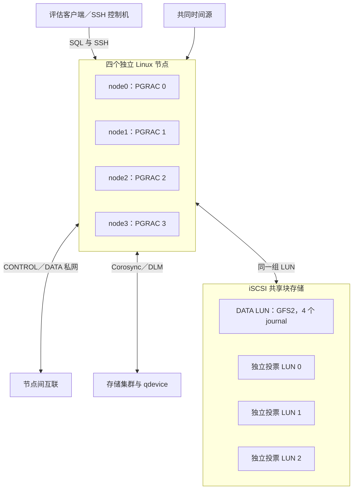

# PRE2 四节点安装手册

Author: SqlRush <sqlrush@gmail.com>

版本：**PGRAC v0.135.0（PRE2 功能评估技术预览）**。本文面向隔离的 Ubuntu 24.04 ARM64 四节点环境，只使用可重建的评估数据。源码按第 2 节下载，首次共享建库使用第 6 节的公开部署工具。

**发布现状（2026-10-10）：GitHub 尚无 `v0.135.0` 标签或 Release。** 因此第 2 节的标签下载目前不能执行，也没有该版本可核对的预编译资产或 `SHA256SUMS` 下载文件。这是文档的使用前提，不表示安装包已经交付。

文中每段 shell 命令均逐条检查返回值；脚本化执行时设置 `set -euo pipefail`，任一步失败就停在该步。除明确标为同一控制机会话的变量外，进入另一台节点须重新设置本机变量。所有 `REPLACE_WITH_...`、`REQUEST_ID` 和示例地址都应先替换，不能原样用于真实部署。

## 1. 适用环境与功能范围

**实验室验证范围：** Ubuntu 24.04 ARM64 四节点环境（每台 4 vCPU、8 GiB）中的编译、共享存储接入、新投票介质读回、配置生成、一次共享建库及四节点分发、启动、SQL 查询与数据读写、正常停止及原数据重启。该环境使用 iSCSI、GFS2、Corosync/qdevice、Pacemaker 和 DLM。本页使用通用示例地址、目录和账号；部署时按实际环境填写并逐步检查结果。

本预览用于应用连接、SQL 兼容和四节点同时读写的功能评估，**不提供高可用或故障切换**。共享模式下会被拒绝的 SQL 操作见[产品说明](product-overview.md)，配置值见第 6.3 节。启动或停机异常时，保留数据、WAL 和四节点日志，联系技术支持。

## 2. 从 GitHub 获取并编译

### 2.1 安装编译依赖

执行位置：兼容四个节点的 Ubuntu 24.04 ARM64 Linux 构建机。使用普通账号编译；管理员安装依赖。下列清单对应本文的 OpenSSL、无 ICU 配置；启用其他可选组件时，依赖也随之改变。

```bash
sudo apt-get update
sudo apt-get install -y --no-install-recommends \
  build-essential git ca-certificates pkg-config bison flex perl python3 \
  libreadline-dev zlib1g-dev libssl-dev libipc-run-perl
```

本文启用 OpenSSL，不启用 ICU。其他发行版、x86_64 或额外 ICU/LZ4/Zstandard 组合不属于本页验证范围；可选编译项见[通用编译说明](../user-guide/install.md)。

### 2.2 固定源码并构建

执行位置：Linux 构建机。以下 `SRC`、`BUILD`、`PREFIX` 为专用新目录，不覆盖现有安装。

```bash
PGRAC_VERSION=v0.135.0
git clone --branch "$PGRAC_VERSION" --depth 1 \
  https://github.com/sqlrush/pgrac.git pgrac-source
test "$(git -C pgrac-source rev-parse HEAD)" = \
  "$(git -C pgrac-source rev-parse "$PGRAC_VERSION^{commit}")"
SRC=$(realpath pgrac-source)
mkdir pgrac-build
BUILD=$(realpath pgrac-build)
PREFIX=/opt/pgrac/v0.135.0
cd "$BUILD"

"$SRC/configure" --prefix="$PREFIX" \
  --enable-cluster --enable-depend --enable-tap-tests \
  --with-ssl=openssl --without-icu
make -j4
make -j4 install DESTDIR="$BUILD/stage"

"$BUILD/stage$PREFIX/bin/postgres" --version
"$BUILD/stage$PREFIX/bin/pg_config" --configure
ldd "$BUILD/stage$PREFIX/bin/postgres"
sha256sum "$BUILD/stage$PREFIX/bin/postgres"
```

成功条件：每条命令返回 0，`ldd` 没有 `not found`，构建配置含 `--enable-cluster` 和 OpenSSL。以上命令没有启用 `--enable-cassert` 或 `--enable-debug`；`postgres --version` 不能代替源码 tag、commit 和 `pg_config --configure`。

由管理员把同一个 `stage$PREFIX/` 完整目录分发到四节点的 `$PREFIX/`，保留文件权限。先确认目标不存在、目标节点没有使用该安装目录的数据库进程，再安装。四节点分别运行上述版本、运行库和 SHA-256 检查；分发同一产物时四个 `postgres` 的校验值应一致。源码、`scripts/deploy/` 和公开手册不由 `make install` 全部安装，应单独保留。本文通过 SSH 在节点上运行 `psql`，控制机要求见第 3.1 节。

自行编译的二进制使用本次构建的 SHA-256，不混用不同构建的校验值。`v0.135.0` 当前没有已发布的二进制或 `SHA256SUMS` 资产，不能将其他 Release 正文中的包名和哈希当作本版本下载内容。[公开发布列表](https://github.com/sqlrush/pgrac/releases)是下载资产的核对入口。

## 3. 准备四节点、网络、时间和账号

### 3.1 拓扑与容量

本例使用四个独立 KVM/libvirt VM，每个 4 vCPU、8 GiB 内存，另有 Linux 管理/存储主机。8 GiB 是该小型配置的资源，**不是通用最低配置承诺**；启动前按第 8.1 节检查实际共享内存用量。



图中的管理、存储、仲裁角色可以在评估实验室共用一台管理机；这不形成四个独立故障域，也不提供数据库高可用。

本页以下统一使用示例值。开始前逐项替换并记录实际值：

| 项目 | node0 | node1 | node2 | node3 |
|---|---|---|---|---|
| 主机名 | pgrac0 | pgrac1 | pgrac2 | pgrac3 |
| `cluster.node_id` | 0 | 1 | 2 | 3 |
| 示例私网地址 | 10.20.0.10 | 10.20.0.11 | 10.20.0.12 | 10.20.0.13 |
| SQL | 5432 | 5432 | 5432 | 5432 |
| CONTROL | 6540 | 6540 | 6540 | 6540 |
| DATA（两个 LMS worker） | 6541–6542 | 6541–6542 | 6541–6542 | 6541–6542 |
| 本地 PGDATA | `/srv/pgrac/eval01/node0/data` | `/srv/pgrac/eval01/node1/data` | `/srv/pgrac/eval01/node2/data` | `/srv/pgrac/eval01/node3/data` |
| 本地日志目录 | `/var/log/pgrac/eval01/node0` | `/var/log/pgrac/eval01/node1` | `/var/log/pgrac/eval01/node2` | `/var/log/pgrac/eval01/node3` |

公共示例值：安装 `$PREFIX=/opt/pgrac/v0.135.0`，配置目录 `/etc/pgrac/eval01`，共享挂载 `/srv/pgrac-shared`，本次新数据库目录 `/srv/pgrac-shared/eval01`。所有这些目录必须与其他评估数据分开。`PREFIX` 是各节点各自 shell 的变量，进入新 SSH 会话时也需设置。

**控制机**负责保存源码和完整部署工具、生成配置并通过 SSH 操作四节点，不是第五个数据库成员。可使用 Ubuntu 24.04 的 Python 3.12；所需程序为 Python 3、Git、OpenSSH 客户端、`tar`、`sha256sum` 和 `jq`。控制机到四节点的管理地址必须可达，部署账号具备非交互安装工具、以 root 运行指定部署程序及 `sudo -u pgrac` 的权限。数据库 CLI 与 SQL 客户端在节点上执行，数据库实例始终归 `pgrac`，控制机不必安装数据库服务端。

```bash
# 在 Ubuntu 控制机安装管理依赖。
sudo apt-get install -y python3 git openssh-client tar coreutils jq
python3 --version
```

### 3.2 账号与操作系统组件

执行位置：四个数据库节点，由管理员操作。Ubuntu 24.04 的包名与其他发行版不同；例如 [fence-agents-virsh](https://packages.ubuntu.com/noble/fence-agents-virsh) 提供本文使用的 VM 隔离代理。

```bash
sudo apt-get update
sudo apt-get install -y openssh-server python3 jq systemd-timesyncd open-iscsi \
  corosync corosync-qdevice pacemaker pcs resource-agents-extra fence-agents-virsh \
  dlm-controld gfs2-utils lvm2 lvm2-lockd libquorum5 libcmap4
sudo apt-get install -y "linux-modules-extra-$(uname -r)"
modinfo gfs2
modinfo dlm
```

安装发行版对应的内核模块包；若所用内核没有该包或 GFS2/DLM 模块，先修正内核与模块匹配，不继续挂载。另为计划下次启动的内核检查模块是否齐全。

四节点创建非 root 数据库账号 `pgrac`，使用相同数字 UID/GID。示例使用 `10001:10001`；先用 `getent passwd 10001`、`getent group 10001` 检查是否已占用。如果账号尚不存在且数字 ID 空闲，在每节点执行：

```bash
sudo groupadd --gid 10001 pgrac
sudo useradd --uid 10001 --gid pgrac --create-home --shell /bin/bash pgrac
```

已有账号则核对四节点的数字 ID 一致。管理员只为新建的本次目录授权，例如在 node0：

```bash
id pgrac
sudo install -d -o pgrac -g pgrac -m 0700 \
  /srv/pgrac/eval01 /srv/pgrac/eval01/node0 \
  /var/log/pgrac/eval01/node0 /var/log/pgrac/eval01/node0/socket
```

node1–3 使用各自编号。此时不要创建非空 PGDATA 或共享 `data`、`wal`、`undo` 子树，它们由第 7 节初始化。

### 3.3 时间、SSH 和连通性

实验室管理机运行 chrony，四节点使用 systemd-timesyncd 指向管理机。给管理机配置可信上游时间源及仅对所需私网的 NTP 服务权限；在四节点的 timesyncd 配置中设置该 NTP 地址，启动时间同步后检查。不要通过在线手动改时钟消除偏差。

例如，在节点的 `/etc/systemd/timesyncd.conf.d/pre2.conf` 中填写实际时间服务器地址（以下为示例）：

```ini
[Time]
NTP=10.20.0.20
FallbackNTP=
```

```bash
# 管理/时间服务器（独立于数据库四节点）
sudo apt-get install -y chrony corosync-qnetd
chronyc tracking
chronyc sources -v
# 数据库节点
sudo systemctl enable --now systemd-timesyncd
timedatectl status
timedatectl show -p NTPSynchronized
timedatectl timesync-status
```

检查标准：时间服务器 `chronyc tracking` 的 `Leap status` 为 `Normal`；四节点 `NTPSynchronized=yes`，`timesync-status` 指向同一可信时间源并持续收到更新。记录每节点的 `Offset` 及采样时间；未同步、时间源不可达或偏差持续增大时，先修复时间服务。运行期间不手动跳变系统时间。

在控制机配置到四节点的管理 SSH 公钥登录，核验服务器主机公钥后保存到 `known_hosts`。不要使用自动忽略主机身份的 SSH 选项。管理账号应有部署步骤所需的明确 `sudo` 权限，数据库始终由 `pgrac` 启动。

```bash
# 在控制机；deploy 为示例管理账号，先配置已核验的 known_hosts 与专用密钥。
ssh -o BatchMode=yes -o StrictHostKeyChecking=yes deploy@pgrac0 'hostname; id; date -Is'
```

逐一检查四节点；配置稳定的名称解析、相同 MTU 和双向路由。防火墙按实际配置开放：控制机到各节点 SSH/SQL，节点间 CONTROL 6540、DATA 6541–6542，以及 Corosync/Pacemaker、qdevice/qnetd 和 iSCSI 目标所需端口。iSCSI 通常为 TCP 3260，实际以目标 portal 为准。只允许所需私网，不向公网开放 SQL、存储或集群管理端口。

## 4. iSCSI、Corosync/Pacemaker/DLM 与 GFS2

本节由存储管理员在新环境执行。准备一块 DATA LUN 和三块不同的投票 LUN，四节点必须看到同样的 WWID；不能把四块本地盘或四份文件复制品当作共享盘。

### 4.1 接入共享块设备

在 iSCSI 目标侧为四个不同 initiator IQN 配置明确的 LUN 映射和访问权限。记录目标 portal、IQN、LUN、WWID、容量、扇区大小和缓存模式。实验室 DATA 为 16 GiB、投票 LUN 各 16 MiB；DATA 容量需按本次数据与空间增长预留，不能把 16 GiB 当长跑容量保证。

使用 Linux LIO 作为目标时，可在**新建的隔离存储目标**上按以下示例创建 DATA backstore。四个 IQN 从各节点 `/etc/iscsi/initiatorname.iscsi` 取得且必须互不相同。目标地址只绑定存储私网，访问使用明确的 initiator ACL；本示例不配置 CHAP，隔离私网以外的部署不属于验证范围。已有阵列或 LIO 目标由存储管理员提供等价的新 LUN，不能覆盖其现有配置。[targetcli 使用说明](https://manpages.ubuntu.com/manpages/noble/man8/targetcli.8.html)包含 backstore、ACL 与持久化选项。

```bash
# 在 Linux 存储目标；本段变量也用于第 5 节追加投票 LUN。
sudo apt-get install -y targetcli-fb
TARGET_ADDR=10.20.0.20
TARGET_IQN=iqn.2026-10.example:pgrac-eval
NEW_LUN_DIR=/var/lib/pgrac-storage/eval01
INITIATOR_IQNS=(REPLACE_WITH_NODE0_IQN REPLACE_WITH_NODE1_IQN \
                REPLACE_WITH_NODE2_IQN REPLACE_WITH_NODE3_IQN)
sudo install -d -m 0700 "$NEW_LUN_DIR"
sudo test ! -e "$NEW_LUN_DIR/data.img"
DATA_SERIAL=$(cat /proc/sys/kernel/random/uuid)
sudo targetcli set global auto_add_default_portal=false auto_add_mapped_luns=false
sudo targetcli /backstores/fileio create name=pre2-data \
  file_or_dev="$NEW_LUN_DIR/data.img" size=16G write_back=false wwn="$DATA_SERIAL"
sudo targetcli /iscsi create "$TARGET_IQN"
sudo targetcli "/iscsi/$TARGET_IQN/tpg1/portals" create "$TARGET_ADDR" 3260
sudo targetcli "/iscsi/$TARGET_IQN/tpg1" set attribute \
  generate_node_acls=0 authentication=0 demo_mode_write_protect=1
sudo targetcli "/iscsi/$TARGET_IQN/tpg1/luns" create /backstores/fileio/pre2-data lun=0
for iqn in "${INITIATOR_IQNS[@]}"; do
  sudo targetcli "/iscsi/$TARGET_IQN/tpg1/acls" create "$iqn"
  sudo targetcli "/iscsi/$TARGET_IQN/tpg1/acls/$iqn" create 0 0
done
sudo targetcli /backstores/fileio/pre2-data info
sudo targetcli saveconfig
sudo systemctl enable rtslib-fb-targetctl
```

保存生成的 serial 和配置文件 `/etc/rtslib-fb-target/saveconfig.json`。从 initiator 读到的 SCSI WWID 以 `udevadm info` 和 `/dev/disk/by-id/` 为准，不直接用 backstore serial 字符串代替它。先确认目标服务已启用保存配置的恢复服务，再让四节点接入；数据库运行期间不重置或重建这些导出。

四节点上的 initiator 操作示例，替换变量后仅登录指定目标：

```bash
PORTAL=10.20.0.20:3260
TARGET_IQN=iqn.2026-10.example:pgrac-eval
sudo iscsiadm -m discovery -t sendtargets -p "$PORTAL"
sudo iscsiadm -m node -T "$TARGET_IQN" -p "$PORTAL" \
  --op update -n node.startup -v automatic
# 仅在该目标尚未登录时执行；先核对既有会话，避免重复登录。
sudo iscsiadm -m node -T "$TARGET_IQN" -p "$PORTAL" --login
sudo systemctl enable --now open-iscsi
sudo iscsiadm -m session
lsblk -b -o NAME,TYPE,SIZE,LOG-SEC,WWN,FSTYPE,MOUNTPOINTS
```

确认 `open-iscsi.service` 管理这些会话，并核对四节点的实际设备身份。后续使用 `/dev/disk/by-id/scsi-<WWID>`，不使用可能变化的 `/dev/sdX` 字母。投票 LUN 不建分区、不加入 VG、不格式化文件系统，也不挂载。

### 4.2 建立存储集群

本节示例使用 Ubuntu 24.04 的 `pcs`，只用于**尚未建立 Corosync/Pacemaker 集群的新节点**。已有集群先核对配置和隔离映射，不重新执行 `cluster setup`。命令格式见 [Ubuntu pcs 手册](https://manpages.ubuntu.com/manpages/noble/man8/pcs.8.html)。

四个数据库节点分别启用 `pcsd`，为 `hacluster` 设置管理口令；口令在交互提示中输入，不写入命令或仓库：

```bash
sudo systemctl enable --now pcsd
sudo passwd hacluster
```

在独立的 qnetd 主机（示例 `10.20.0.20`）执行：

```bash
sudo apt-get install -y pcs corosync-qnetd
sudo systemctl enable --now pcsd
sudo passwd hacluster
sudo pcs qdevice setup model net --enable --start
```

在 node0 管理会话中认证并创建四节点集群，然后加入 qdevice；`pcs` 负责生成和分发所需的 TLS 证书：

```bash
sudo pcs host auth pgrac0 pgrac1 pgrac2 pgrac3 -u hacluster
sudo pcs cluster setup pre2eval \
  pgrac0 addr=10.20.0.10 pgrac1 addr=10.20.0.11 \
  pgrac2 addr=10.20.0.12 pgrac3 addr=10.20.0.13 --enable --start
sudo pcs host auth 10.20.0.20 -u hacluster
sudo pcs quorum device add model net host=10.20.0.20 algorithm=lms tls=required
sudo pcs quorum config
```

qdevice 必须使用 `net` 模型、`lms` 算法、`tls: required`。配置中不得有显式 `expected_votes`、`quorum.device.votes`，也不启用 `two_node`、`auto_tie_breaker`、`last_man_standing`。以下是生成后应核对的 `corosync.conf` 片段；它不是可覆盖整份文件的配置：

```conf
quorum {
    provider: corosync_votequorum
    device {
        model: net
        net {
            host: 10.20.0.20
            algorithm: lms
            tls: required
        }
    }
}
```

在四端 `/etc/corosync/uidgid.d/pgrac` 为数据库账号配置 Corosync IPC 读取权限：

```conf
uidgid {
    uid: pgrac
    gid: pgrac
}
```

在数据库尚未启动时按集群管理工具加载上述配置。正常状态下四个节点在线、qdevice 已连接、仲裁有效，DLM 在全部节点工作。实验室该配置健康时共 7 票。以下是实际使用的检查命令；`root` 能读取不代表数据库账号有 IPC 权限：

```bash
sudo corosync-quorumtool -s
sudo corosync-qdevice-tool -s
sudo -u pgrac corosync-quorumtool -s
sudo corosync-cmapctl
sudo pcs status --full
sudo pcs resource config
sudo pcs stonith config
sudo dlm_tool ls
```

记录 Corosync `totem.cluster_name` 及每个 PGRAC node ID 对应的 Corosync nodeid；它们写入第 6 节 `storage_quorum`。PGRAC 的 0–3 与 Corosync 的 1–4 是实验室映射，不能在另一套环境里凭编号猜测。

接着配置**逐节点隔离**。以下 `fence_virsh` 示例仅适用于受 libvirt 管理的四台 VM；其他平台使用该平台的真实隔离代理。先在每个节点安装专用 SSH 密钥并核验宿主机公钥，确保 `fenceadmin` 只能通过所需权限管理准确的 VM。`plug` 必须是实际 libvirt domain 名称，不能将数据库节点名直接当作已核对的 VM 身份。代理参数说明见 [Ubuntu fencing 文档](https://ubuntu.com/server/docs/explanation/high-availability/pacemaker-fence-agents/)。

```bash
# 在 node0；先把下面地址、账号、密钥路径和四个 domain 名改成本环境实际值。
HYPERVISOR=10.20.0.20
FENCE_USER=fenceadmin
FENCE_KEY=/etc/pacemaker/pre2-fence-ed25519
VM_NAMES=(pre2-vm0 pre2-vm1 pre2-vm2 pre2-vm3)
sudo pcs property set stonith-enabled=true stonith-action=off
for n in 0 1 2 3; do
  sudo pcs stonith create "pre2-fence$n" fence_virsh \
    ip="$HYPERVISOR" login="$FENCE_USER" identity_file="$FENCE_KEY" \
    plug="${VM_NAMES[$n]}" pcmk_host_list="pgrac$n" \
    ssh=true use_sudo=true pcmk_reboot_action=off
  sudo pcs constraint location "pre2-fence$n" avoids "pgrac$n"
done
sudo pcs stonith config
```

在创建数据库之前由存储管理员确认上述映射及隔离能力。隔离配置缺失或不能正确关闭目标节点时，不继续挂载共享文件系统。本手册不包含在运行中的数据库上做故障注入。

本例直接在 DATA LUN 上创建 GFS2，不使用共享 LVM。在 node0 创建 DLM clone，固定命名为 `pre2-locking-clone`，供第 4.3 节引用：

```bash
sudo pcs property set no-quorum-policy=freeze
sudo pcs resource create pre2-dlm ocf:pacemaker:controld \
  op monitor interval=30s on-fail=fence \
  clone pre2-locking-clone interleave=true
sudo pcs status --full
```

要求 DLM 在四个节点均为 `Started`。DLM 与 GFS2 的依赖说明见 [GFS2 集群配置文档](https://docs.redhat.com/en/documentation/red_hat_enterprise_linux/9/html/configuring_gfs2_file_systems/assembly_configuring-gfs2-in-a-cluster-configuring-gfs2-file-systems)；若另选共享 LVM，还须配置 `lvmlockd` 和共享 VG/LV，这不属于下面的裸 DATA LUN 示例。文件系统只由 Pacemaker 管理，不同时配置另一套自动挂载。数据库本身不注册为自动重启的 Pacemaker 资源；本预览不提供数据库故障切换。

### 4.3 仅在新 DATA LUN 上创建并挂载 GFS2

以下命令会创建文件系统，**仅对已确认没有旧数据、未挂载的本次新 DATA LUN 执行一次**。绝不能用格式化修复挂载失败。四端先核对同一 WWID、容量、无旧文件系统和正确用途，由 node0 一次创建：

```bash
DATA_DEV=/dev/disk/by-id/scsi-REPLACE_WITH_DATA_WWID
sudo lsblk -b -o NAME,TYPE,SIZE,FSTYPE,MOUNTPOINTS "$DATA_DEV"
sudo blkid -p "$DATA_DEV"
# 仅在管理员确认它是本次空 DATA LUN 后执行；pre2eval 须等于 Corosync cluster_name。
sudo mkfs.gfs2 -p lock_dlm -t pre2eval:pre2data -j 4 -J 128 -b 4096 "$DATA_DEV"
```

四节点分别执行 `sudo mkdir -p /srv/pgrac-shared` 创建空挂载点，再在 node0 通过 Pacemaker 创建 GFS2 Filesystem clone。此处继续使用上面的 `DATA_DEV`，DLM clone 已在第 4.2 节创建：

```bash
sudo pcs resource create pre2-data-fs ocf:heartbeat:Filesystem \
  device="$DATA_DEV" directory=/srv/pgrac-shared fstype=gfs2 \
  options=noatime,rgrplvb op monitor interval=10s on-fail=fence \
  clone interleave=true
sudo pcs constraint order start pre2-locking-clone then pre2-data-fs-clone
sudo pcs constraint colocation add pre2-data-fs-clone with pre2-locking-clone
```

四节点分别检查：

```bash
findmnt -T /srv/pgrac-shared -o TARGET,SOURCE,FSTYPE,OPTIONS,UUID
df -h /srv/pgrac-shared
stat -c '%u:%g %a %n' /srv/pgrac-shared
sudo pcs status --full
```

结果应是同一 GFS2 UUID、正确 DATA 设备和四端已挂载；不能落在未挂载的本地根目录。不得用 `lock_nolock` 或 `localflocks`。在初始化前，用专用 scratch 目录完成跨节点写后读及锁检查，操作见 [storage probe](../deployment/pre1-storage.md)。由管理员为本次数据库用户授予新共享目录父级的精确权限。

## 5. 准备三个投票 LUN

本节只在数据库尚未建立、所有实例未启动时执行；正常重启绝不重复。

投票盘使用三块不同的完整 SCSI NAA LUN，逻辑扇区 512 字节，每块 16777216 字节。按 WWID 对三块设备单独赋予 `root:pgrac 0660` 权限并用精确 udev 规则持久化；数据库账号不加入权限过大的 `disk` 组。

本流程在 LIO 存储目标上使用 `native_vote` **独占创建三个全新文件**，再导出为 write-through iSCSI LUN。工具来自公开源码 [native_vote.c](../../src/test/cluster_tap/pre2/native_vote.c)，是本隔离评估流程使用的离线测试工具，不是通用生产 SAN 格式化器。它拒绝覆盖已有文件；本手册没有对现有阵列 LUN 就地初始化的替代步骤。

在第 2 节相同架构的 Linux 构建机，用同版本已安装的头文件和库编译该工具；以下继续使用当时的 `SRC`、`BUILD`、`PREFIX`：

```bash
INSTALL="$BUILD/stage$PREFIX"
cc -D_GNU_SOURCE -ffunction-sections -fdata-sections \
  -I "$INSTALL/include/server" -I "$SRC/src/include" \
  "$SRC/src/test/cluster_tap/pre2/native_vote.c" \
  "$SRC/src/backend/cluster/cluster_voting_disk_io.c" \
  "$INSTALL/lib/libpgport.a" -Wl,--gc-sections -o "$BUILD/native_vote"
```

将生成的工具安装到同架构存储目标和四节点的 `/opt/pgrac-admin/native_vote`，由 root 持有、权限 `0755`。不同架构的存储目标需使用相同源码为其单独编译。下面由存储管理员在目标机执行；三个文件必须均不存在：

```bash
NATIVE_VOTE=/opt/pgrac-admin/native_vote
NEW_LUN_DIR=/var/lib/pgrac-storage/eval01
sudo test ! -e "$NEW_LUN_DIR/vote0.img"
sudo test ! -e "$NEW_LUN_DIR/vote1.img"
sudo test ! -e "$NEW_LUN_DIR/vote2.img"
sudo "$NATIVE_VOTE" "$NEW_LUN_DIR/vote0.img" 0
sudo "$NATIVE_VOTE" "$NEW_LUN_DIR/vote1.img" 1
sudo "$NATIVE_VOTE" "$NEW_LUN_DIR/vote2.img" 2
```

继续使用第 4.1 节存储目标会话中的 `TARGET_IQN` 和 `INITIATOR_IQNS`；投票索引 0、1、2 分别映射为 LUN 1、2、3，LUN 0 保留给 DATA。为三盘分别生成并保存唯一 serial：

```bash
for n in 0 1 2; do
  serial=$(cat /proc/sys/kernel/random/uuid)
  lun=$((n + 1))
  sudo targetcli /backstores/fileio create "name=pre2-vote$n" \
    "file_or_dev=$NEW_LUN_DIR/vote$n.img" write_back=false "wwn=$serial"
  sudo targetcli "/iscsi/$TARGET_IQN/tpg1/luns" \
    create "/backstores/fileio/pre2-vote$n" "lun=$lun"
  for iqn in "${INITIATOR_IQNS[@]}"; do
    sudo targetcli "/iscsi/$TARGET_IQN/tpg1/acls/$iqn" create "$lun" "$lun"
  done
  sudo targetcli "/backstores/fileio/pre2-vote$n" info
done
sudo targetcli saveconfig
```

四节点重新扫描会话，核对三盘身份和容量，再设置权限。以盘 0 为例：

```bash
sudo iscsiadm -m session -R
sudo udevadm settle
VOTE0_DEV=/dev/disk/by-id/scsi-REPLACE_WITH_VOTE0_WWID
sudo lsblk -b -o NAME,MAJ:MIN,SIZE,LOG-SEC,TYPE,FSTYPE,MOUNTPOINTS "$VOTE0_DEV"
sudo udevadm info --query=property --name="$VOTE0_DEV"
```

将每盘 `udevadm info` 输出中的准确 `ID_SERIAL` 写入四节点 `/etc/udev/rules.d/99-pgrac-votes.rules`，以下三个占位值必须替换为各盘实际值：

```udev
SUBSYSTEM=="block", ENV{DEVTYPE}=="disk", ENV{ID_SERIAL}=="REPLACE_WITH_VOTE0_SERIAL", OWNER="root", GROUP="pgrac", MODE="0660"
SUBSYSTEM=="block", ENV{DEVTYPE}=="disk", ENV{ID_SERIAL}=="REPLACE_WITH_VOTE1_SERIAL", OWNER="root", GROUP="pgrac", MODE="0660"
SUBSYSTEM=="block", ENV{DEVTYPE}=="disk", ENV{ID_SERIAL}=="REPLACE_WITH_VOTE2_SERIAL", OWNER="root", GROUP="pgrac", MODE="0660"
```

每节点加载规则并仅触发这三块盘；以盘 0 为例，再对盘 1、2 分别执行并替换索引：

```bash
sudo udevadm control --reload-rules
sudo udevadm trigger --action=change "/sys$(udevadm info --query=path --name="$VOTE0_DEV")"
sudo udevadm settle
stat -L -c '%a %U %G' "$VOTE0_DEV"
# 期望：660 root pgrac
sudo -u pgrac /opt/pgrac-admin/native_vote --attest "$VOTE0_DEV" 0
```

三盘在四端共 12 次 `--attest` 都应成功。该命令用于新介质准备，不是对运行中投票盘的健康查询。任一错误保留设备与输出并停止，不用 PRE1 的 `format-fresh`、测试伪造记录、`dd` 或全零文件替代本次初始化。初始化、SQL 启动及正常重启都不能清空已有投票状态。设备检查的补充说明见[旧投票工具手册](../deployment/pre1-voting-fencing.md)，其中旧格式化步骤不作为本次 PRE2 入口。

## 6. 配置 pgrac.conf 与共享配置

### 6.1 准备配套部署工具和真实输入

配套工具位于公开仓的 [scripts/deploy/pre2/lab/](../../scripts/deploy/pre2/lab/README.md)，入口为 `fresh_controller.py`、`install_guest_tools.py`；同仓 `scripts/deploy/pre1/` 是运行依赖，必须一并保留。以下单独固定工具代码，`SRC` 则始终指向第 2 节所构建数据库的源码目录。工具负责检查、配置生成、整体初始化和节点目录分发，不创建 VM、格式化 DATA 或启动数据库。

在控制机下载完整工具代码，并设置专用的新工作目录。将 `SRC` 替换为本机保存的实际数据库源码路径；生成的请求和输出留在源码树之外：

```bash
DEPLOY_REF=86a31bcad480517a8cbdd7397199bf0a4aa5269e
git clone https://github.com/sqlrush/pgrac.git pgrac-deploy-tools
git -C pgrac-deploy-tools checkout --detach "$DEPLOY_REF"
DEPLOY_SRC=$(realpath pgrac-deploy-tools)
TOOLS="$DEPLOY_SRC/scripts/deploy"
LAB="$TOOLS/pre2/lab"
SRC=/absolute/path/to/pgrac-source
WORK="$HOME/pre2-deploy/eval01"
GUEST_TOOLS=/opt/pgrac-pre2-lab-tools-eval01
umask 077
mkdir -p "${WORK%/*}"
mkdir -m 700 "$WORK"
test -f "$LAB/fresh_controller.py"
test -f "$TOOLS/pre1/profile.schema.json"
python3 "$LAB/fresh_controller.py" new-identity > "$WORK/identity.json"
```

为本次新数据库准备 `$WORK/request.json`。每一项来自真实环境；`new-identity` 的结果只用于这次新建，不复用旧数据库身份。请求字段如下：

| 字段 | 填写内容 |
|---|---|
| `schema_version`、`profile_id` | `1`、`pre2-gfs2-arm64-lab-v1` |
| `cluster_name`、`dataset_id` | 如 `pre2eval`、`eval01`；新命名，不覆盖旧目录 |
| `controller_addr` | 被允许连接 SQL 的控制机私网 IPv4 |
| `shared_mount`、`fs_uuid` | `/srv/pgrac-shared` 及四端实际 GFS2 UUID |
| `authority_uuid`、`storage_uuid`、`system_identifier` | `identity.json` 中的新值，保持原类型与格式 |
| `database_incarnation` | 新建为 `1` |
| `config_dir` | 四端相同绝对路径 `/etc/pgrac/eval01` |
| `direct_io` | 实验室为 `data` |
| `storage_write_cache` | 实际 write-through 时为 `{"mode":"write-through","flush_verification":null}`；不能把 write-back 设备写成 write-through |
| `memory_profile`、`guest_memory_gib` | 实验室为 `lab-8g`、`8`；更改资源需重新核对共享内存用量 |
| `storage_quorum` | 如 `{"cluster":"pre2eval","nodes":{"0":1,"1":2,"2":3,"3":4}}`，必须与真实 Corosync 配置一致 |
| `voting_wwids` | 三盘 `/dev/disk/by-id/scsi-...` 文件名中 `scsi-` 后的完整值，顺序为 0、1、2；本工具接受以 `3` 开头的 17 或 33 位小写十六进制串，不填完整路径、`naa.` 或 `0x` 前缀 |
| `nodes` | 以下格式的四份节点记录，node ID 为 0–3 |

每份节点记录应包含：

| 字段 | 获取或填写方法 |
|---|---|
| `node_id` | 唯一的 0、1、2 或 3 |
| `vm_uuid` | 本 VM 的 `/sys/class/dmi/id/product_uuid` |
| `machine_id`、`boot_id` | `/etc/machine-id`、`/proc/sys/kernel/random/boot_id`；不能复制另一节点的身份 |
| `admin_endpoint` | `{"host":"实际地址","port":22,"user":"实际管理账号","identity_file":"控制机上的专用私钥路径"}` |
| `ssh_host_key` | 核验后的完整 `ssh-ed25519 ...` 公钥，不能填私钥 |
| `sql_addr`、`control_addr`、`data_base_addr` | 本节点真实 IPv4:port；本页示例分别为 5432、6540、6541 |
| `data_workers` | `2`，与 LMS 配置一致 |
| `uid`、`gid` | 本节点 `id pgrac` 的数字值，四端一致 |
| `install_root` | 同一版本安装目录，如 `/opt/pgrac/v0.135.0` |
| `pgdata`、`log_root` | 本节点专用的新目录，采用第 3 节的路径 |

节点字段格式参见公开 [profile.schema.json](../../scripts/deploy/pre1/profile.schema.json) 中的 `$defs.node`；这是字段格式参考，不是把整份 PRE1 profile 当 PRE2 request。请求文件和私钥只保存在受保护的管理目录，不提交到源码仓库。

先读回实际分发的二进制校验值，确认四节点一致，再安装工具和生成配置。以下在控制机执行，`PREFIX` 是节点上的统一安装路径：

```bash
ADMIN=deploy
PREFIX=/opt/pgrac/v0.135.0
POSTGRES_SHA256=$(ssh -o BatchMode=yes -o StrictHostKeyChecking=yes \
  "$ADMIN@pgrac0" sha256sum "$PREFIX/bin/postgres" | awk '{print $1}')
[[ "$POSTGRES_SHA256" =~ ^[0-9a-f]{64}$ ]]
for n in 1 2 3; do
  observed=$(ssh -o BatchMode=yes -o StrictHostKeyChecking=yes \
    "$ADMIN@pgrac$n" sha256sum "$PREFIX/bin/postgres" | awk '{print $1}')
  test "$observed" = "$POSTGRES_SHA256"
done
python3 "$LAB/install_guest_tools.py" --request "$WORK/request.json" \
  --dest "$GUEST_TOOLS" --out "$WORK/tools-installed.json"
python3 "$LAB/fresh_controller.py" plan \
  --request "$WORK/request.json" --source "$SRC" \
  --binary-sha256 "$POSTGRES_SHA256" --out "$WORK/plan.json"
python3 "$LAB/fresh_controller.py" render \
  --plan "$WORK/plan.json" --request "$WORK/request.json" --source "$SRC" \
  --out-dir "$WORK/rendered"
```

要求命令成功，计划中 `creation` 为 `cohort`，配置无拒绝项，并逐项核对第 6.3 节。整个流程使用同一份工具代码，始终执行真实四节点检查；第 7 节的 `cohort`、`distribute` 是本手册使用的创建与分发入口。

### 6.2 检查生成的三个本地配置文件

工具为每节点生成 `pre2-bootstrap.conf`、`pgrac.conf`、`pre2-hba.conf`。以下是对应的示例配置。

四节点的 `pgrac.conf` 拓扑相同：

```ini
[cluster]
name = pre2eval

[node.0]
interconnect_addr = 10.20.0.10:6540
data_addr = 10.20.0.10:6541

[node.1]
interconnect_addr = 10.20.0.11:6540
data_addr = 10.20.0.11:6541

[node.2]
interconnect_addr = 10.20.0.12:6540
data_addr = 10.20.0.12:6541

[node.3]
interconnect_addr = 10.20.0.13:6540
data_addr = 10.20.0.13:6541
```

node0 的 `pre2-bootstrap.conf` 节选如下；实际安装使用工具生成的完整文件，其他节点各自使用自己的渲染文件：

```conf
cluster.enabled = 'on'
cluster.shared_config = 'on'
cluster.controlfile_shared_authority = 'on'
cluster.shared_data_dir = '/srv/pgrac-shared/eval01/data'
cluster.wal_threads_dir = '/srv/pgrac-shared/eval01/wal'
cluster.undo_tablespace_path = '/srv/pgrac-shared/eval01/undo'
cluster.node_id = 0
hba_file = '/etc/pgrac/eval01/pre2-hba.conf'
cluster_name = 'pre2eval_node0'
cluster.voting_disks = '/dev/disk/by-id/scsi-VOTE0_WWID,/dev/disk/by-id/scsi-VOTE1_WWID,/dev/disk/by-id/scsi-VOTE2_WWID'
```

共享配置由初始化时的配置请求生成，不是在四个 `postgresql.conf` 中各自追加一份完整参数。不要手改共享配置对象、删除本地 `postgresql.auto.conf` 来绕过冲突，或通过 `postgres -c` 覆盖共享参数。启动命令的 `-c config_file=...` 仅选择正确的本地入口文件。

生成的 HBA 是**隔离评估环境策略**：本机使用 peer；远程仅允许指定控制机 `/32` 以 `pgrac` 连接 `postgres` 数据库，认证方式为 `trust`。只有控制机和网络完全受信时才可照用，不能扩成 `0.0.0.0/0`。面向其他用户的账号、口令和 TLS 策略需另行配置并验证。

### 6.3 核对关键参数

下表列出本部署模板值与产品默认值，生成配置后逐项核对。

| 参数/项目 | 本流程值 | 使用说明 |
|---|---|---|
| 并发业务连接 | 每节点不超过 16 | 在客户端连接池中设置 |
| `max_connections` | `lab-8g` 模板 `100` | 初始化前确定 |
| `shared_buffers` | `lab-8g` 模板 `512MB` | 与模板中的集群内存表容量一起使用 |
| `cluster.lms_workers` | **必须为 `2`** | DATA 6541–6542 均须可达 |
| `cluster.gcs_block_retransmit_initial_backoff_ms` | `10` | 产品默认，不为掩盖错误改大超时或重试 |
| `cluster.undo_cleaner_enabled` | `on` | 产品默认，保持开启 |
| `cluster.xnode_profile`、`cluster.update_trace` | `off` | 本版默认，评估不需要打开逐事务跟踪 |
| `fsync`、`full_page_writes`、`synchronous_commit` | `on` | 保持开启 |
| 数据页校验 | `initdb -k` | 共享模式必需，启动后读回 `SHOW data_checksums` |
| `cluster.shared_config`、`shared_catalog`、`controlfile_shared_authority` | `on` | 按 PRE2 模板，不套用旧 PRE1 的 off 值 |
| `cluster.crossnode_runtime_visibility`、`cluster.undo_gcs_coherence` | `on` | 使用模板值，不用关闭检查解决 SQL 拒绝 |
| `cluster.storage_quorum_cluster`、`cluster.storage_quorum_nodes` | 实际 Corosync 名称/映射 | 四节点保持一致 |
| `debug_io_direct` | 模板 `data` | 与已经准备的存储方式一致 |
| `autovacuum` | 模板 `off` | 保持模板值 |
| `restart_after_crash` | 模板 `off` | 保持模板值 |

下列 **8 项必须在建库输入中确定**，当前不能在建库后随意改动；与创建记录不一致会被启动检查拒绝：`max_connections`、`max_worker_processes`、`max_wal_senders`、`max_prepared_transactions`、`max_locks_per_transaction`、`wal_level`、`wal_log_hints`、`track_commit_timestamp`。需要另一组值时，使用新建的评估库，不手改控制文件。其他共享参数也不能只凭 `pg_settings.context='sighup'` 就按可热加载处理；具体生效方式见[参数参考](reference/parameters.md)。除本模板明确指定的值外，保留本版本默认值。

## 7. 初始化同一个共享数据库

所有实例应尚未启动，投票盘已准备，GFS2 正确挂载，本次共享 DATA/WAL/UNDO 和本地 PGDATA 均为新目标。`cohort` 表示一次初始化同一个数据库的四个节点目录，不是四次独立建库。

执行位置：控制机，继续使用第 6 节变量。

```bash
python3 "$LAB/fresh_controller.py" cohort \
  --plan "$WORK/plan.json" --request "$WORK/request.json" --source "$SRC" \
  --transport ssh --tools-root "$GUEST_TOOLS" --out "$WORK/cohort.json"
python3 "$LAB/fresh_controller.py" distribute \
  --plan "$WORK/plan.json" --request "$WORK/request.json" --source "$SRC" \
  --transport ssh --tools-root "$GUEST_TOOLS" --out "$WORK/distribute.json"
```

工具在 node0 以 `pgrac` 身份执行的实际生产入口形状如下，**用于核对日志，不与上面的 cohort 命令重复运行**：

```bash
"$PREFIX/bin/initdb" -D /srv/pgrac/eval01/cohort -k -A trust --no-locale \
  --pgrac-initdb-cohort \
  --pgrac-initdb-shared-config=/srv/pgrac/eval01/pre2-initial-config-REQUEST_ID.conf
```

`REQUEST_ID` 由工具产生。`-D` 在此是新建 cohort 的本地父目录，输出 `node_0`、`node_1`、`node_2`、`node_3`；共享数据及每节点独占的 WAL 线程由同一次初始化创建。分发步骤把各自的 `node_N` 原样送至对应节点的 PGDATA，不是把 node0 的运行中 PGDATA 克隆给其他节点。保留符号链接和权限，不手工改 `pg_control`、WAL、系统标识或初始化结果。

实验室此命令使用 `C` locale，读回编码为 `SQL_ASCII`。UTF-8、其他 locale 和排序规则组合未由本流程验证；需要中文或其他编码语义评估时，应在新数据库创建前安排对应配置验证，不能把本步骤当作已经验证 UTF-8。

成功条件：cohort 返回 `PASS`，distribution 为 `PGDATA_DISTRIBUTED` 且 0–3 四节点均为 `PGDATA_INSTALLED`。初始化的成功提示仍可能包含 “shared startup remains closed”；这时继续配置和四节点启动，不表示业务已经开放。失败时保留全部部分目录和输出，不对同一目标反复初始化。

接着在四节点安装 `$WORK/rendered/nodeN/` 中的三份本地配置到请求的 `config_dir`，文件归 `pgrac:pgrac`、权限 `0600`，目录 `0700`。确保 socket 目录存在且归本节点数据库账号。示例在 node0 的管理员会话中执行，`/tmp/pre2-node0` 是从控制机安全传输过来的临时配置目录：

```bash
sudo install -d -o pgrac -g pgrac -m 0700 /etc/pgrac/eval01
sudo install -o pgrac -g pgrac -m 0600 \
  /tmp/pre2-node0/pre2-bootstrap.conf /tmp/pre2-node0/pgrac.conf \
  /tmp/pre2-node0/pre2-hba.conf /etc/pgrac/eval01/
```

在安装前确认该配置目录不属于旧数据库；node1–3 分别传输自己的目录，不能把 node0 的 bootstrap 文件复制给其他节点。

## 8. 启动前检查与四节点启动

### 8.1 检查入口及共享内存

控制机执行；共享内存用量以本次实际渲染配置和二进制读数为准：

```bash
python3 "$LAB/fresh_controller.py" bootstrap-check \
  --plan "$WORK/plan.json" --request "$WORK/request.json" --source "$SRC" \
  --transport ssh --tools-root "$GUEST_TOOLS" --out "$WORK/bootstrap-check.json"
```

成功结果为 `BOOTSTRAP_PREPARED_ALL`。这一步检查成功尚不等于数据库已经可用。它调用的单节点命令形状为：

```bash
PREFIX=/opt/pgrac/v0.135.0
sudo -u pgrac "$PREFIX/bin/postgres" -D /srv/pgrac/eval01/node0/data \
  -c config_file=/etc/pgrac/eval01/pre2-bootstrap.conf -C shared_memory_size
```

返回非零、配置冲突、目录身份不符或内存不足时，先解决实际输入；不要改成单机验证、跳过检查或关闭守卫。再次核对 Corosync/Pacemaker 四节点健康和 GFS2 挂载。

### 8.2 启动所有成员，再等待就绪

在控制机的 **Bash** 会话中并行发出四节点启动请求，各任务等待自己节点的 SQL 就绪。第 3 节的 SSH 主机身份核验和非交互部署权限应已完成。下例使用专用的新记录目录；一次启动或重启使用一个新目录，保留先前记录。

```bash
set -euo pipefail
ADMIN=deploy
PREFIX=/opt/pgrac/v0.135.0
RUN_DIR="$HOME/pre2-operations/$(date -u +%Y%m%dT%H%M%SZ)"
umask 077
mkdir -p "${RUN_DIR%/*}"
mkdir "$RUN_DIR"
pids=()
for n in 0 1 2 3; do
  ssh -o BatchMode=yes -o StrictHostKeyChecking=yes -o ConnectTimeout=10 \
    "$ADMIN@pgrac$n" sudo -n -u pgrac bash -s -- "$n" "$PREFIX" \
    > "$RUN_DIR/node$n-start.log" 2>&1 <<'REMOTE' &
set -euo pipefail
n=$1
prefix=$2
data="/srv/pgrac/eval01/node$n/data"
log="/var/log/pgrac/eval01/node$n/server.log"
socket="/var/log/pgrac/eval01/node$n/socket"
date -u +%FT%TZ
"$prefix/bin/pg_ctl" -D "$data" -l "$log" -W start \
  -o '-c config_file=/etc/pgrac/eval01/pre2-bootstrap.conf'
deadline=$((SECONDS + 180))
until "$prefix/bin/pg_isready" -h "$socket" -p 5432 -d postgres -t 1; do
  if (( SECONDS >= deadline )); then
    echo "SQL not ready within observation window" >&2
    exit 1
  fi
  sleep 1
done
"$prefix/bin/pg_ctl" -D "$data" status
"$prefix/bin/psql" -X -v ON_ERROR_STOP=1 -h "$socket" -p 5432 \
  -d postgres -c 'SELECT 1;'
REMOTE
  pids+=("$!")
done
rc=0
for pid in "${pids[@]}"; do
  if ! wait "$pid"; then rc=1; fi
done
test "$rc" -eq 0
```

`pg_ctl -W` 返回 0 只表示启动请求已发出。成功要求四个任务都完成，`pg_isready` 报 `accepting connections`，`SELECT 1` 返回一行 `1`，本次服务端日志出现 `database system is ready to accept connections`。180 秒是本示例的就绪观察窗口，不改变服务器参数；超过窗口或出现异常时，保留数据、WAL、四节点日志和本次 `RUN_DIR`，联系技术支持。启动过程由四个成员共同完成，没有额外的手工开库命令。

## 9. 验证配置与小规模读写

### 9.1 四端身份、成员和参数

四个 SQL 端点都执行以下一次性检查：

```sql
SELECT version();
SELECT system_identifier FROM pg_control_system();
SHOW cluster.node_id;
SHOW data_checksums;
SELECT * FROM pg_cluster_nodes ORDER BY node_id;
SELECT * FROM pg_cluster_membership ORDER BY node_id;
SELECT * FROM pg_cluster_quorum_state;
SELECT category, key, value FROM cluster_dump_state()
 WHERE category = 'lifecycle' AND key = 'native_writer';
SELECT name, setting, source, pending_restart FROM pg_settings
 WHERE name IN ('cluster.shared_config', 'cluster.shared_catalog',
  'cluster.controlfile_shared_authority', 'cluster.lms_workers',
  'cluster.gcs_block_retransmit_initial_backoff_ms', 'cluster.undo_cleaner_enabled',
  'cluster.xnode_profile', 'cluster.update_trace', 'max_connections',
  'fsync', 'full_page_writes', 'synchronous_commit', 'autovacuum')
 ORDER BY name;
```

期望结果：

| 检查 | 期望值 |
|---|---|
| `pg_control_system().system_identifier` | 四节点相同，且与本次建库记录一致 |
| `cluster.node_id` | 当前节点分别为 0、1、2、3 |
| `data_checksums` | `on` |
| `pg_cluster_membership` | 4 行，node ID 为 0–3，每行 `state='member'` 且未标记移除 |
| `pg_cluster_quorum_state` | `in_quorum = t` |
| `lifecycle.native_writer` | 可解析的 JSON，不能是 `unavailable`；`writer.node` 为本节点 |
| 关键参数 | 与第 6.3 节的本次建库输入一致；`cluster.lms_workers=2` |

`pg_cluster_nodes` 只是拓扑列表，不能仅凭四行判断四台数据库都健康；`pg_cluster_voting_disks` 的逐盘占位输出也不能代替有效 quorum。`cluster_dump_state()` 会生成完整诊断结果，SQL 的 `WHERE` 不会使底层只采集该一项，因此这里只做一次记录，不把它作为高频就绪轮询。

为第 10 节停机比对保存本次运行的 writer 身份；继续使用第 8.2 节的控制机会话变量。在每个节点运行查询并将结果保存在控制机：

```bash
for n in 0 1 2 3; do
  ssh -o BatchMode=yes -o StrictHostKeyChecking=yes "$ADMIN@pgrac$n" \
    sudo -n -u pgrac bash -s -- "$n" "$PREFIX" \
    > "$RUN_DIR/node$n-running.json" <<'REMOTE'
set -euo pipefail
n=$1
prefix=$2
"$prefix/bin/psql" -X -At -v ON_ERROR_STOP=1 \
  -h "/var/log/pgrac/eval01/node$n/socket" -p 5432 -d postgres \
  -c "SELECT value FROM cluster_dump_state() WHERE category='lifecycle' AND key='native_writer';"
REMOTE
  jq -e --argjson n "$n" 'type == "object" and .writer.node == $n' \
    "$RUN_DIR/node$n-running.json"
done
```

### 9.2 功能评估示例

仅在四节点完成上面的检查后开始，先每节点一个连接，使用短事务和新建评估表。此例用于功能检查，不包含负载扫描或故障切换。

仅在 node0 创建一次表和初始数据，全部完成后再进行并行访问：

```sql
CREATE SCHEMA pre2_eval;
CREATE TABLE pre2_eval.check_rows (id integer PRIMARY KEY, payload text NOT NULL);
INSERT INTO pre2_eval.check_rows VALUES (0, 'initial'), (1, 'initial'),
                                       (2, 'initial'), (3, 'initial');
SELECT id, payload FROM pre2_eval.check_rows ORDER BY id;
```

在四个会话中同时执行各自编号对应的更新；以下为 node0，其他节点将 `id` 与文本改成自己的编号：

```sql
BEGIN;
UPDATE pre2_eval.check_rows SET payload = 'node0-committed' WHERE id = 0;
COMMIT;
```

等四个会话都确认提交后，每个节点完整查询四行，结果应一致。另用短事务 `UPDATE ...; ROLLBACK;` 验证回滚后内容保持原值。随后可逐项评估目标应用使用的 SELECT、筛选、排序、连接、聚合、INSERT、UPDATE、DELETE 与事务语义；一次选择明确、可核对预期结果的 SQL 集合。这里不代表所有 PostgreSQL 扩展或 SQL 特性均已兼容认证。

若任意语句出现 ERROR、超时、连接中断或结果不一致，停止当前评估，保留 SQL、返回码、时间、数据、WAL 与四节点日志，联系技术支持。不能把 COMMIT 结果未知当作未提交后盲目重放。

## 10. 正常停止与再次启动

### 10.1 先停止客户端，再通知全部数据库

先结束业务、断开评估客户端。继续使用第 8.2 节的控制机变量和本次 `RUN_DIR`，并行发送四节点的 fast shutdown，每个后台任务等待自己的节点退出：

```bash
pids=()
for n in 0 1 2 3; do
  ssh -o BatchMode=yes -o StrictHostKeyChecking=yes -o ConnectTimeout=10 \
    "$ADMIN@pgrac$n" sudo -n -u pgrac "$PREFIX/bin/pg_ctl" \
    -D "/srv/pgrac/eval01/node$n/data" -m fast -w -t 180 stop \
    > "$RUN_DIR/node$n-stop.log" 2>&1 &
  pids+=("$!")
done
rc=0
for pid in "${pids[@]}"; do
  if ! wait "$pid"; then rc=1; fi
done
test "$rc" -eq 0
```

`-w -t 180` 只让 `pg_ctl` 等待最多 180 秒，不强制杀进程，也不延长服务端期限。四个任务返回 0 后，继续检查本次日志、控制文件及关闭记录。预期本次四节点日志都有 `database system is shut down`，并且没有异常退出；历史日志中的同名行不算本次结果。启动或停机异常时，保留数据、WAL 和日志，联系技术支持。

在确认四个 postmaster 均已退出后，从控制机采集各节点的离线信息：

```bash
for n in 0 1 2 3; do
  ssh -o BatchMode=yes -o StrictHostKeyChecking=yes "$ADMIN@pgrac$n" \
    sudo -n -u pgrac "$PREFIX/bin/pg_controldata" \
    -D "/srv/pgrac/eval01/node$n/data" > "$RUN_DIR/node$n-control.txt"
  ssh -o BatchMode=yes -o StrictHostKeyChecking=yes "$ADMIN@pgrac$n" \
    sudo -n -u pgrac "$PREFIX/bin/postgres" --pgrac-observe-writer \
    "/srv/pgrac/eval01/node$n/data" /srv/pgrac-shared/eval01/data \
    /srv/pgrac-shared/eval01/wal "$n" > "$RUN_DIR/node$n-closed.json"
  jq -e --argjson n "$n" --slurpfile running "$RUN_DIR/node$n-running.json" '
    .root_phase == "CLOSED" and .final_checkpoint == true and
    .members == [0,1,2,3] and .writer.node == $n and
    ([.writer.node, .writer.thread, .writer.incarnation,
      .writer.wal_generation, .writer.boot] ==
     [$running[0].writer.node, $running[0].writer.thread,
      $running[0].writer.incarnation, $running[0].writer.wal_generation,
      $running[0].writer.boot])
  ' "$RUN_DIR/node$n-closed.json"
done
jq -s -e 'map({system_identifier, database_incarnation, generation, root_digest, members})
  | unique | length == 1' "$RUN_DIR"/node[0-3]-closed.json
```

`--pgrac-observe-writer` 输出**单行 JSON**；成功关闭的字段是 `"root_phase":"CLOSED"` 和 `"final_checkpoint":true`。上面的检查将 `writer` 的节点、线程、incarnation、WAL generation 和 boot 身份与第 9.1 节本次运行记录逐项对照；它们不是拿旧日志推定的值。四份关闭输出的 `system_identifier`、`database_incarnation`、`generation`、`root_digest` 和成员集合应一致；`root_digest` 是共享控制记录的摘要，不是业务表内容校验值。另核对 system identifier 与建库输入相同，并检查各 `nodeN-control.txt` 中 `Database cluster state: shut down`。

分别核对四节点进程退出、正常日志、控制状态和关闭 JSON，全部符合后再进行下一步。遇到异常时，保留数据、WAL 和日志，联系技术支持；不以强制退出或删除控制文件代替正常关闭。

### 10.2 保留数据与再启动

只有全部正常停止条件成立后，才在**相同二进制、相同配置、相同四节点和共享数据**上按第 8 节再次启动；不重跑 `new-identity`、cohort、投票盘格式化或初始装载。重启后先完整核对第 9 节数据，再接入业务。

需要关闭操作系统或存储时，先完成全部数据库正常停止，再由 Pacemaker 依次停文件系统/共享卷/锁资源，确认正常卸载，最后退出 iSCSI 会话。数据库仍在运行或停止未完成时，不先断开共享盘或卸载 GFS2。

## 11. 保留记录与问题反馈

保存源码 commit、构建配置、包校验值、四节点配置、设备映射、本次操作结果和四端日志。不要将私钥、口令、客户地址或完整环境清单上传公开仓库。反馈时提供脱敏的操作步骤、预期/实际结果、SQLSTATE、发生时间和对应版本。

功能范围及共享模式下的 SQL 操作要求见[产品说明](product-overview.md)。启动或停机异常时，保留数据、WAL 和日志，联系技术支持。

补充参考：[现有编译说明](../user-guide/install.md)、[配置格式](../user-guide/configuration.md)、[存储准备](../deployment/pre1-storage.md)、[投票介质](../deployment/pre1-voting-fencing.md)、[参数参考](reference/parameters.md)、[视图与命令参考](reference/commands.md)。遇到旧文档与本页 PRE2 初始化步骤不一致时，以本页的共享建库步骤为准。
