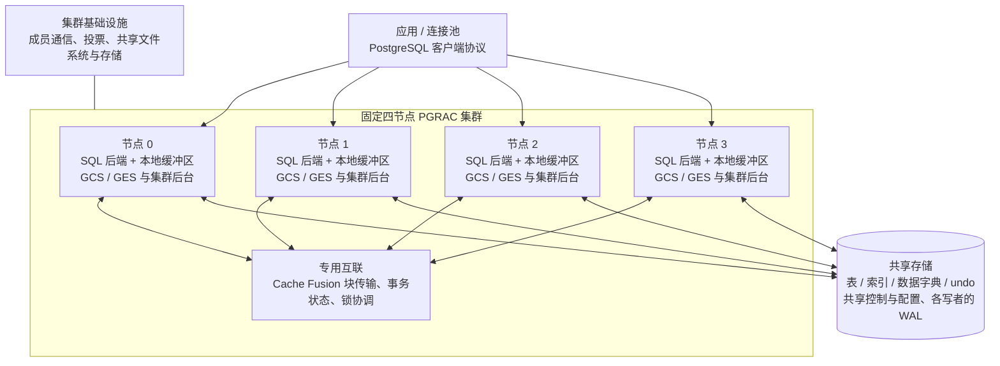

# PGRAC v0.135.0 PRE2 产品概览

Author: SqlRush <sqlrush@gmail.com>

> 文档目标版本：**v0.135.0（待发布）**。功能评估技术预览，更新于 2026-10-10。本文介绍 PRE2 共享模式的架构、功能范围和使用方法。安装与启停步骤见[安装手册](install.md)。

**发布状态：** 2026-10-10 核查时，`v0.135.0` 的 tag 和 GitHub Release 尚未发布。本文不表示该版本的二进制、源码包或校验和文件已经可下载；实际资产及构建类型须以发布后的文件清单为准。

PGRAC 在 PostgreSQL 上提供共享存储、多实例读写和跨实例缓冲区协同。多个节点访问同一份数据库数据，应用可以连接不同节点执行 SQL。PRE2 基于 PostgreSQL **16.13**，采用**固定四节点、相同版本**的部署配置。

PRE2 用于评估应用连接、基本 SQL、共享数据字典和跨节点读写。**本预览不提供高可用和自动故障切换**；在线成员变更、滚动升级及故障节点在线重新加入不在功能范围内。

## 1. 核心架构

每个节点运行自己的 PostgreSQL 实例，具有独立的进程、内存缓冲区和本地启动目录。表、索引和共享控制信息位于共享存储；节点之间通过专用互联交换缓存块、事务状态信息和锁消息。



**共享存储。** 四个节点使用同一份表和索引，不需要由应用把数据按节点切成四份。各节点的 `PGDATA` 仍分别管理，不能把一个普通 PostgreSQL 数据目录交给多个 postmaster 同时启动。首次建库需要配套的共享集群初始化步骤，不能只在四台机器上分别执行普通 `initdb`。

**Cache Fusion。** 节点可以从另一节点的缓冲区取得数据块或一致读镜像。GCS（Global Cache Service）协调块的访问权限；GES（Global Enqueue Service）协调跨节点锁及等待。当前预览在转移写权限前仍要求将修改过的块写入共享存储，**并非所有块传输都能省去数据文件写入**。

**事务与恢复记录。** PostgreSQL SQL 事务接口保留；集群增加事务状态、undo 和跨节点一致读处理。WAL 按写者分别记录，共享控制文件及 checkpoint 协调共同参与启动和持久化。共享存储不等于取消 WAL、checkpoint 或正常停机要求。

**部署后端。** 使用 Linux、TCP 互联和 `cluster_fs` 共享文件后端，配合 GFS2/DLM 及直接 I/O。各节点按安装手册使用一致的存储视图和配置。

## 2. 后台进程做什么

下面按运行角色介绍进程。数据库后台名称使用 `pg_stat_activity.backend_type` 对应的名称；`postmaster` 是实例主进程，不作为该视图中的客户端或后台记录。实际可见的进程取决于配置与阶段；启动、退出或恢复期间的进程集合可能不同。

| 进程或角色 | 作用 |
|---|---|
| `postmaster` | 管理本实例的连接、子进程及启动、关闭流程。 |
| `startup` | 启动期间读取控制信息、执行需要的恢复并参与开库流程；通常不常驻于正常服务阶段。 |
| `client backend` | 执行一个客户端会话的 SQL、事务、缓存访问和锁请求。 |
| `lmon` | 处理集群成员和重配置协调，并承担相关控制消息的发送与处理。 |
| `cssd` | 处理数据库侧节点心跳及对端状态。它与操作系统集群服务配合，不替代外部存储和节点隔离设施。 |
| `qvotec` | 处理投票、法定多数与存储服务资格检查。 |
| `lms` / `lms worker` | 处理跨节点块访问、块镜像及事务状态请求。 |
| `lmd` | 处理分布式锁等待图、死锁检测及相应取消工作。 |
| `lck` | 锁辅助进程的生命周期、就绪和状态管理；不能据其存在推断所有锁操作都在该进程执行。 |
| `sinval broadcaster` | 接收并应用跨节点共享缓存失效通知，供数据字典等缓存保持一致。 |
| `undo cleaner` | 清理可回收的 undo、事务表及相关残留事务引用。 |
| `cluster stats` | 汇集集群运行统计，供诊断视图使用。 |
| `diag` | 执行集群诊断与长等待采样。 |
| `checkpointer` / `background writer` | 执行 checkpoint、写回脏缓冲区，并参与共享模式下的持久化处理。 |
| `walwriter` | 将 WAL 缓冲内容写向日志文件；事务所需的持久提交仍按提交设置执行。 |
| `autovacuum launcher` / `autovacuum worker` | 调度和执行 PostgreSQL 表维护任务。 |
| `logger` / `archiver` | 按配置收集日志或归档 WAL。 |
| `cluster recovery worker` | 在启用并进入相应恢复路径时处理恢复任务。 |
| `cluster thread recovery` / `cluster hw remaster` | 恢复或资源管理节点变更期间可能出现的后台，分别处理写者恢复和空间分配状态接管。 |

Corosync、Pacemaker、DLM、qdevice 和共享存储服务属于数据库之外的部署组件，不能用数据库后台进程状态代替它们的健康检查。

## 3. 功能与 SQL 兼容范围

PRE2 保留 PostgreSQL 的 SQL 解析器、执行器和客户端协议，同时提供共享存储、事务状态和缓存协调。共享模式的功能范围以下表为准，不能直接按原生单实例 PostgreSQL 的全部功能推定支持。

| 能力 | 本预览的使用边界 |
|---|---|
| 多节点访问同一数据库 | 固定四节点可分别建立业务连接，读写共享表；不提供自动会话迁移承诺。 |
| 普通 SQL | 以普通 heap 表、B-tree 索引上的 `SELECT`、`INSERT`、`UPDATE`、`DELETE` 和简单事务为主要评估范围。 |
| 事务控制 | 使用 `BEGIN`、`COMMIT`、`ROLLBACK`；建议先以短事务、默认 `READ COMMITTED` 验证应用。其他隔离级别和复杂并发组合需专项验证。 |
| 共享数据字典与 DDL | 提供共享模式的数据字典与常用建表、建索引、角色管理等路径。大型 DDL、复杂对象依赖和并发 DDL/DML 应先在评估库验证，不按原生 PG 的全部 DDL 场景推定支持。 |
| 锁和一致读 | 跨节点协调块权限、事务可见性及相关全局锁；无法可靠判断状态时会返回错误，而不会把未知事务当作已提交。 |
| 客户端 | 使用配套 `psql` 或 PostgreSQL 协议驱动，例如 libpq、JDBC；驱动的连接、重试及故障处理需按应用验证。 |
| 参数管理 | 使用配套共享配置和安装手册中的修改、重启流程；不能只修改某一节点就假定全体生效。 |
| 初始化与启停 | 按安装手册执行固定成员的整体初始化、启动、全停和原数据再启动流程。 |
| 两阶段事务 | 共享模式拒绝 `PREPARE TRANSACTION`、`COMMIT PREPARED` 和 `ROLLBACK PREPARED`，不支持 XA/2PC 集成。SQL `PREPARE` 预备语句不是两阶段事务。 |
| 扩展与存储访问方法 | 共享模式拒绝 `CREATE EXTENSION` / `DROP EXTENSION`；第三方 TableAM、页检查工具和 C ABI 不在本预览的兼容承诺内。 |
| 复制、备份及升级 | 不把原生单实例流复制、PITR、逻辑解码或 `pg_upgrade` 直接等同为共享集群可用方案；本预览不承诺其端到端兼容性。 |

### 共享模式明确拒绝的操作

以下 SQL 操作或参数设置在共享模式下会被拒绝，不能通过重新编译扩展或重复执行来启用。不要关闭共享模式检查来绕过限制。

| 类别 | 明确拒绝的操作或设置 |
|---|---|
| 数据库与表空间 | `CREATE DATABASE` / `DROP DATABASE`；`CREATE TABLESPACE` / `DROP TABLESPACE`；`ALTER TABLE ... SET TABLESPACE`。 |
| 扩展与自定义对象 | `CREATE EXTENSION` / `DROP EXTENSION`；自定义类型（含复合类型、domain、enum、range），自定义 operator、opclass、opfamily 的相关 DDL。 |
| 表对象 | 物化视图；分区和继承关系的建立、附加或分离（如 `PARTITION OF`、`ATTACH/DETACH PARTITION`、`INHERITS/INHERIT`）；`UNLOGGED` 表。 |
| 表维护与重写 | `CLUSTER`、`VACUUM FULL`，以及需要重写表的 `ALTER TABLE`。 |
| 索引 | `REINDEX`；`CREATE INDEX CONCURRENTLY` / `DROP INDEX CONCURRENTLY`；非 B-tree 索引。 |
| 逻辑复制与日志 | `CREATE SUBSCRIPTION`、replication origin 操作、逻辑消息；`wal_level=logical`、`track_commit_timestamp=on`。 |
| 两阶段事务 | `PREPARE TRANSACTION`、`COMMIT PREPARED`、`ROLLBACK PREPARED`。 |

PGRAC 采用 Cache Fusion 架构，不意味着兼容 Oracle SQL、PL/SQL、Oracle 驱动或 Oracle 管理工具。

## 4. 一个跨节点功能检查

先按[安装手册](install.md)完成整个固定成员集群的初始化和启动，确认各节点均可接受业务连接。四端均连接**初始化时已经创建的同一个数据库**，例如 `postgres`，使用有建表权限的用户。共享模式不支持 `CREATE DATABASE`，不要为本例另建数据库。下面的节点 0、节点 1 指本次部署中的不同实例。

在节点 0 的连接中执行：

```sql
CREATE TABLE pre2_example (
    id integer PRIMARY KEY,
    value integer NOT NULL
);
INSERT INTO pre2_example VALUES (1, 10);
```

在节点 1 的连接中执行并提交：

```sql
BEGIN;
UPDATE pre2_example SET value = value + 1 WHERE id = 1;
COMMIT;
```

再在节点 0 的一个新语句中读回：

```sql
SELECT id, value FROM pre2_example WHERE id = 1;
-- 预期：1, 11
```

先完成应用需要的功能检查，再接入业务连接池。各节点的连接池分别设置并发上限，使用下文的部署配置。

## 5. 与原生 PostgreSQL 的主要差异

| 原生 PostgreSQL 单实例使用习惯 | PRE2 共享模式 |
|---|---|
| 一个实例管理一个数据目录 | 每节点有独立启动目录和进程，访问一份共享数据库；需要整体初始化与配置。 |
| 本地缓冲区和锁管理 | 跨节点读写可能产生块传输、事务状态查询及全局锁等待。 |
| 原生 heap 页、事务状态文件 | 存在集群扩展的页和事务状态内容；不能直接用普通 PG 二进制打开 PRE2 数据。 |
| 单实例 WAL/checkpoint 与启停 | 各写者的 WAL 与共享控制信息需要协调，正常全停应执行集群流程。 |
| 按 PostgreSQL 版本升级或复制 | 需要 PGRAC 对应版本的明确迁移、备份与恢复支持，不能直接套用原生操作。 |

## 6. 部署配置与日常操作

### 配置要求

| 项目 | 设置 |
|---|---|
| 部署拓扑 | 固定四节点，软件版本和配置一致。 |
| 互联 | TCP。 |
| `cluster.shared_storage_backend` | `cluster_fs`。 |
| `cluster.lms_workers` | `2`。 |
| 业务连接池 | 每节点并发连接不超过 16。 |

完整参数及修改方法见[参数参考](reference/parameters.md)。共享模式下，按安装手册统一管理配置和启停。

### 启停与异常处理

按[安装手册](install.md)执行集群启动；停机时同时向四节点发出正常停机请求，确认全部节点正常停止后再操作共享存储。

**启动或停机异常时，保留四节点的数据、WAL 和日志，联系技术支持。** 在取得处理建议前，不重新初始化或删除原数据。

SQL 执行异常时，记录操作步骤、SQLSTATE、节点、时间和对应日志。断连后提交结果不确定时，不要盲目重放非幂等业务。相关操作说明见[跨节点事务安全](../reference/cluster-transaction-safety.md)。
